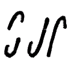

# Alfabet SteMi

System stenograficzny Ste*Mi* wywodzi się z alfabetów, czyli piszemy w nim literkami. Jednak należy pamiętać, że obowiązuje podejście fonetyczne, a właściwie*[fonologiczne](https://pl.wikipedia.org/wiki/Fonologia)*, tj. dane znaki oddają **brzmienie** i nie obowiązują piszącego znane ze szkoły zasady ortografii.
:::{important}
Brak ścisłych reguł ortograficznych wynika z faktu, że nie zwracamy uwagi na pochodzenie i związki pomiędzy wyrazami, które stanowią podstawę polskiej ortografii. Najważniejsze jest oddanie słowa w jego brzmieniu, LUB zastosowanie niewątpliwego ZNACZNIKA.
:::

Brak ortografii nie oznacza, że nie obowiązują żadne reguły. Ze względu na priorytety w systemie stenograficznym, lepiej ich sens oddaje słowo *metody*. W rzeczywistości im więcej metod skracania, tym szybciej można pisać.

:::{note}
Ste*Mi* nie jest systemem sztywnym. Służy przede wszystkim wygodzie piszącego. Zatem to od niego zależy, które reguły/metody znajdą u niego zastosowanie. Piszący może też tworzyć własne reguły/metody, jeżeli dostrzeże taką potrzebę. A jeżeli uzna, że mogą one być przydatne ogółowi użytkowników systemu, najlepiej, gdyby wysłał ich opracowanie na adres *[flamenco108@stenografia.pl](mailto:flamenco108@stenografia.pl)*.
:::

Podstawowe znaki SteMi dzielą się na samogłoskowe oraz spółgłoskowe.

:::{important}
Samogłoski piszemy **generalnie** *wznosząco*, a spółgłoski piszemy **generalnie** *opadająco*.
:::

## Samogłoski

Samogłoski SteMi mogą występować w różnych wariantach, które mają swoje zastosowanie. Zostanie to omówione dalej.

```{figure} img/alfabet/samogloski-litery.png
:align: center

Od lewej: A Y E Ę I O Ą U \
Litery *I*, *O*, *Ą*, *U* występują w różnych wariantach.
```


:::{figure} img/kurs_old/samogloski_old2.png
:align: center

Samogłoski pisane są generalnie wznosząco: \
A Y ,  E Ę ,  U ,  O ,  Ą ,  I(j)
:::


### Obraz samogłosek z fontu

Dla lepszego zobrazowania wyglądu podstawowych znaków przedstawiam poniżej obraz znaków z fontu *SteMi*.

:::{figure} img/fonty/samogloski.png
:align: center

Znaki samogłoskowe z czcionki SteMi: \
A , Y , E , Ę , O , Ą , U , I(j)
:::


## Spółgłoski

:::{figure} img/alfabet/spolgloski-litery.png
:align: center

K ki/k'  / G gi/g' / P pi/p' / B bi/b' / H hi/h' / M  mi/m' / F  fi/f' / W wi/w'  / N ni/ń \
S Z L / C DZ Ł / CZ DŻ / SZ Ż/RZ / Ś Ź / Ć DŹ / T D / R
:::

Znaki spółgłoskowe zostały skomponowane w taki sposób, aby dźwięki podobne pisane były podobnie. Oczywiście wszystkie te reguły należy traktować z przymrużeniem oka.


:::{figure} img/kurs_old/spolgloski_old2.png
:align: center

Spółgłoski piszemy generalnie opadająco: \
K G ,  P B ,  H M ,  F W ,  S Z L ,  R \
S D ,  Ś Ź ,  Ć DŹ,  SZ Ż ,  CZ DŻ ,  C DZ Ł
:::

### Obraz spółgłosek z fontu

Dla lepszego zobrazowania wyglądu podstawowych znaków przedstawiam poniżej obraz znaków z fontu *SteMi*.

:::{figure} img/fonty/spolgloski01.png
:align: center
Znaki spółgłoskowe z czcionki SteMi, grupa 01: \
K Ki G Gi T D Ti Di P Pi B Bi H Hi M Mi N Ni F Fi W Wi
:::

:::{figure} img/fonty/spolgloski02.png
:align: center
Znaki spółgłoskowe z czcionki SteMi, grupa 02: \
S Z L C Dz Ł R Cz Dż Ć Dź Sz Ż Szcz Ś Ź Ść
:::


## Litery przegląd

|    |    |    |    |    |    |    |
|:--:|:--:|:--:|:--:|:--:|:--:|:--:|
| a | y | e | ę | i/j | o | u |
| {h=80px} | {h=80px} | {h=80px} | {h=80px} | {h=80px} | {h=80px} | {h=80px} |
|    |    |    |    |    |    |    |
| k | ki | g | gi | p | pi | r |
| {h=80px} | {h=80px} | {h=80px} | {h=80px} | {h=80px} | {h=80px} | {h=80px} |
|    |    |    |    |    |    |    |
