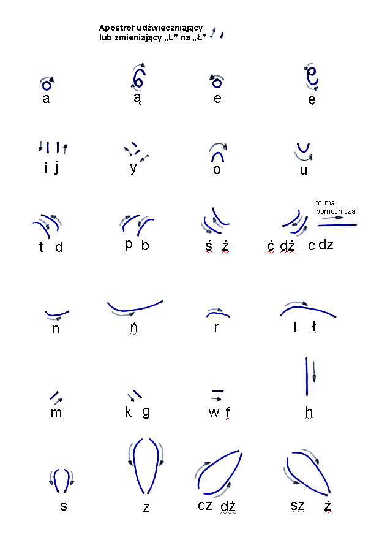

Na stronie w menu jest co prawda link do całego rozdziału nazwanego
NPSS, ale może niektórzy czytelnicy z wrodzonej nieśmiałości tam nie
zajrzą. A może też tak być, że aktualnie zamieszczone tam materiały nie
objaśniają, o co chodzi. Zatem tutaj mogę w formie swobodniejszej podać
kilka podstawowych informacji. 

**[NPSS - Nowy Polski System
Stenograficzny](http://sites.google.com/a/stenografia.pl/stenografia/npss)**  
Moja fascynacja stenografią zaowocowała
~~posiąściem/posiądnięciem/zaposiadniem?~~  wejściem w posiadanie
licznych podręczników do przeróżnych polskich systemów stenograficznych.
Niektóre z nich udało mi się przenieść na cyfrę i [opublikować na
stronie](http://sites.google.com/a/stenografia.pl/stenografia/pliki).
Jednak nie od razu tak się stało. Najsampierw była, i to długo, bolesna
świadomość, że nie ma współczesnych podręczników do polskiej
stenografii. W związku z tym, jakiś rok temu, zacząłem pracować nad
własnym systemem. Wkrótce okazało się, że czeka mnie poważne zadanie,
jako że zbudowanie metody szybkiego pisania wymaga
~~posiąścia/posiądnięcia/zaposiadnia?~~ opanowania sporego bloku wiedzy
o języku, szczególnie o częstotliwości występowania
liter/głosek/sylab/słów itp. Choć wydaje się niewątpliwe, że takie
badania zostały dla polskiego wykonane i to zapewne nie raz, w końcu
tylu studentów co rok kończy polonistykę, jednakowoż w Internecie takich
informacji nie znajdziesz. W każdym razie ja ze zdziwieniem najsampierw
znalazłem, chrome i bez zrozumienia polskiego, badania wykonane w
Wielkiej Brytanii. Dopiero później trafiłem na pasjonacką stronę
poświęconą polskiej gramatyce (i nie
tylko): <http://grzegorj.w.interia.pl/>. Wreszcie zrozumiałem, że trzeba
będzie jednak wiele obliczeń wykonać samemu. W związku z tym 
[złożyłem zapytanie na forum](http://www.fahrenheit.net.pl/forum/viewtopic.php?p=257093&sid=982a4f2835e54bb230405b5c7abf07d7#257093),
w którym ~~legular/relugar/~~regularnie uczestniczę. Ponieważ od razu
pojawiły się pytania **a-po-co-ci-to**, zarumieniony jak pensjonarka
wystukałem odpowiedź. [Reakcja była natychmiastowa](http://www.fahrenheit.net.pl/forum/viewtopic.php?p=257184#257184).

I tak powstał zespół dwóch geeków-zapaleńców, którzy od wielu miesięcy
tracą swój wolny czas na dyskusje mailowe i okazjonalne spotkania, ale
przede wszystkim badają i ćwiczą dostępne możliwości stworzenia nowego
systemu stenograficznego. Na stronie można przeczytać zatem, do czego
doszliśmy, kiedy rozważaliśmy nasze zasadnicze cele (a w miarę
~~posiąściąścia/posiądnięciania/zaposiadania?~~ rozwijania naszej wiedzy
o istniejącej stenografii mogliśmy je doprecyz~~owyw~~owywać), metody i
środki, czyli kim jesteśmy, skąd przyszliśmy i dokąd zmierzamy. Z całą
pewnością nie chcemy stworzyć **CZEGOŚ ZUPEŁNIE INNEGO I CAŁKIEM NOWEGO,
AMEN**. Interesuje nas funkcjonalność, czyli możliwość pisania szybko i
dużo.  

W skrócie, bo reszta jest na stronie, podzieliliśmy system
stenograficzny na dwie części: układ znaków, czyli alfabet, któremu
nadaliśmy nazwę ***Lewiskrypt*** oraz metodę zapisu skrótowego, którą
nazwaliśmy ***Brewiskryptem***.  

Po wielu miesiącach, kiedy No-qanek pisał skrypty w
[php](http://pl.wikipedia.org/wiki/PHP), a ja ryłem przez Internet oraz
(wreszcie odkrytą, no do głowy mi to nie przyszło, a to przecież takie
oczywiste!) Bibliotekę Narodową w poszukiwaniu cudzych osiągnięć,
wreszcie dorobiliśmy się NPSS w wersji 1.0:

[

A oto próbka pisania tą metodą:

To jest zapis praktycznie bez skrótów, bo Brewiskrypt na razie
odłożyliśmy *ad calendas graecas*, nie da się robić wszystkiego na raz.
Osiągnęliśmy tempo pisania równe pisaniu odręcznemu i przeżyliśmy chwile
zachwytu, że stenografia naprawdę przynosi korzyść, choć nie tylko tę,
którą zwykle się wskazuje, czyli szybkie pisanie: **stenograficznie
można pisać więcej**. Bo ręka się mniej męczy wykonując mniej ruchów,
żeby napisać to samo słowo. A następnie wróciliśmy do badań.

CDN.
