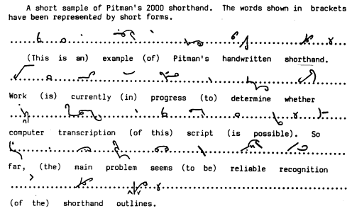

I tu się zaczęły kłopoty. W toku żonglowania głoskami wyszło, że zbytnie
uproszczenie zbioru głosek prowadzi do poważnych trudności w odczycie.
Zachodzi paradoks: bez trudu moge pisac nie uzywajac tzw polskich
znakow, albo inaczej mowiac - ogonkow i kazdy bez trudu, powtarzam, bez
trudu, odczyta to, co napisalem. W ukladzie takim znakow mam tylko:
***abcdefghijklmnoprstuwz = 22***. Ale kiedy zamienie litery lacinskie na
jakies uproszczone, czyli stenograficzne, zeby reka miala mniej roboty,
to dla mozgu juz jest za duzo. Znika całkowicie komfort czytania. Nie
dość, że musimy trudzić się nad "dołożeniem" w locie ogonków do tekstu,
to jeszcze musimy odcyfrować ten tekst z alfabetu, który został
maksymalnie uproszczony, czyli każdy błąd, każde odchylenie kreski, może
zmienić brzmienie wyrazu, lub wręcz zamienić go w bełkot. Pamiętajmy, że
tylko na początku "odcyfrowujemy" wyrazy. Później nasz umysł rozpoznaje
każdy wyraz jak obrazek, dany układ znaków jest niepowtarzalny i
jednolity dla każdego wyrazu.

[

Zatem jeżeli upraszczamy schemat znaków, nie możemy sobie pozwolić na
uproszczenie schematu głosek. W innym wypadku, niestety, grozi nam
odejście od naszych szczytnych ideałów, do których należy **prostota i
łatwość uczenia się systemu**. O wiele łatwiej nauczyć się trochę
większej liczby znaków niż przyswoić sobie skomplikowane reguły odczytu
niewielkiej liczby. Mniejsza liczba znaków pozwala szybciej nauczyć się
**pisać**, a zatem szybciej też **osiągnąć dużą prędkość pisania**. Ale
stenografia, jak powiada profesor 
[Waldir Cury](http://www.taquigrafia.emfoco.nom.br/) 
z Brazylii, jest tylko
środkiem, a nie celem. 
**Ostatecznie tekst zapisany stenograficznie musi zostać odczytany**.

CDN. (Jeżeli nastąpi)
