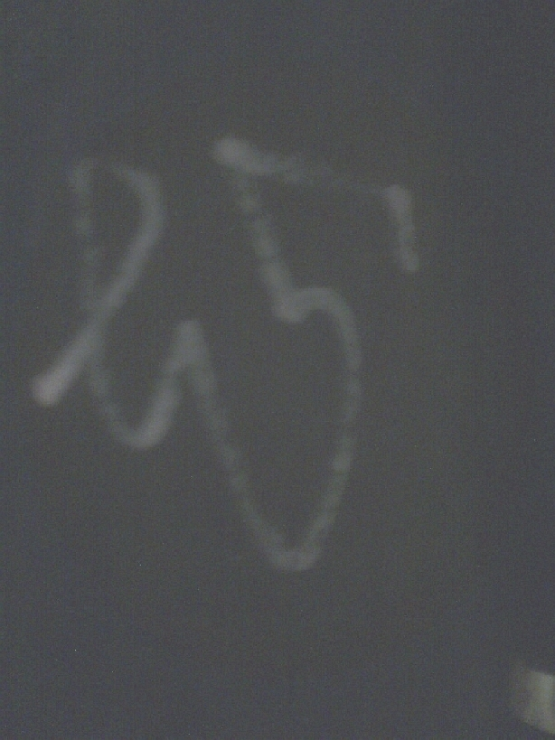
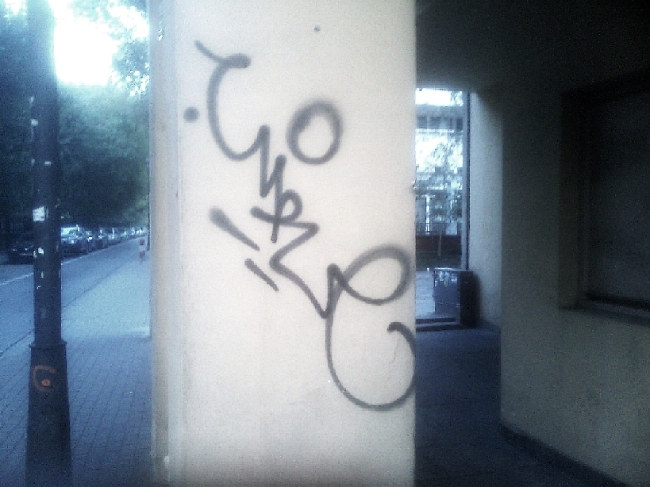
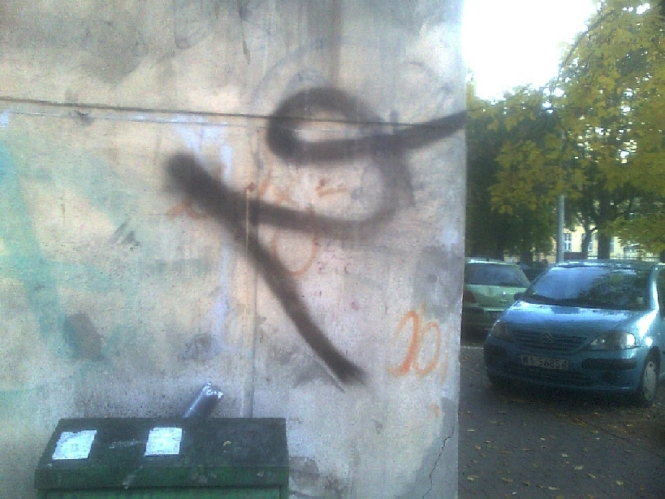
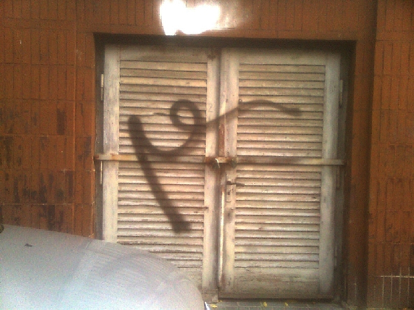
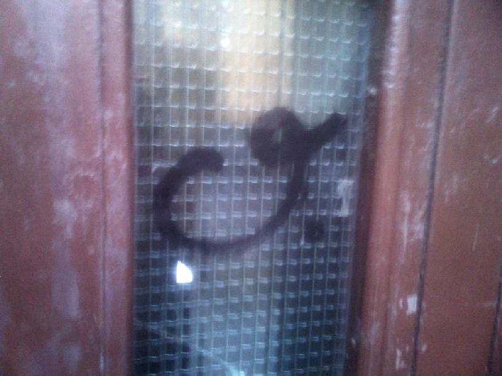

Tworzeniem nowego systemu stenograficznego od wiosny zajmujemy się we
dwóch. Ostatnio nasze drogi się rozeszły, zaczęliśmy różnić się w
koncepcjach - ja przepraszam się z systemami kursywnymi, No-qanek wciąż
drąży metodę geometryczną. Ostatnio przez długi czas milczał, aż
wreszcie przysłał mi krótki opis swojej koncepcji, z którego zrozumiałem
tylko tyle, że zainspirował się piśmiennictwem graficiarzy.

Co prawda nie potrafię nic z tego odczytać, ale może dlatego, że dla
niektórych jestem już tylko starym zgredem?

Może to naprawdę coś znaczy? Z całą pewnością te zgrabne łuczki są
ładne, jeżeli pominąć, kto, czym i na czym je namalował. Nie chcę tutaj
popadać w relatywizm.

Młodzi ludzie, kiedy wreszcie oderwą się od telewizora, mają silną
potrzebę coś sprofanować, zanieczyścić, znieważyć. Jak już splugawią
toaletę, zatrują swój język przecinkami i wyrzucą niedopałki po skrętach
do przedszkolnego ogródka, co im jeszcze pozostaje? Mogą najwyżej nabyć
szpreja i wykrzyczeć swoją burzę hormonalną przez sztukę. Czasem trochę
abstrakcyjną.

Konia z rzędem temu, kto to przeczyta.

Nie ma wątpliwości, że do narysowania tych linii, które być może coś
znaczą, graficiarz nie wysilał nadgarstka. Jeżeli No-qanek znajdzie dość
graficznego tworzywa, żeby stworzyć system - tylko się cieszyć.

