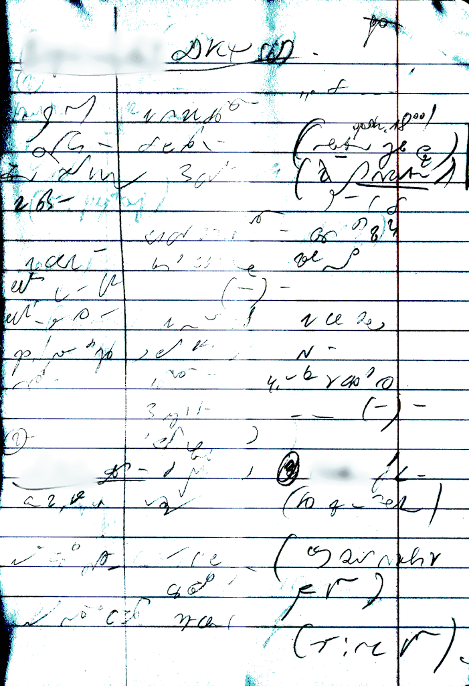
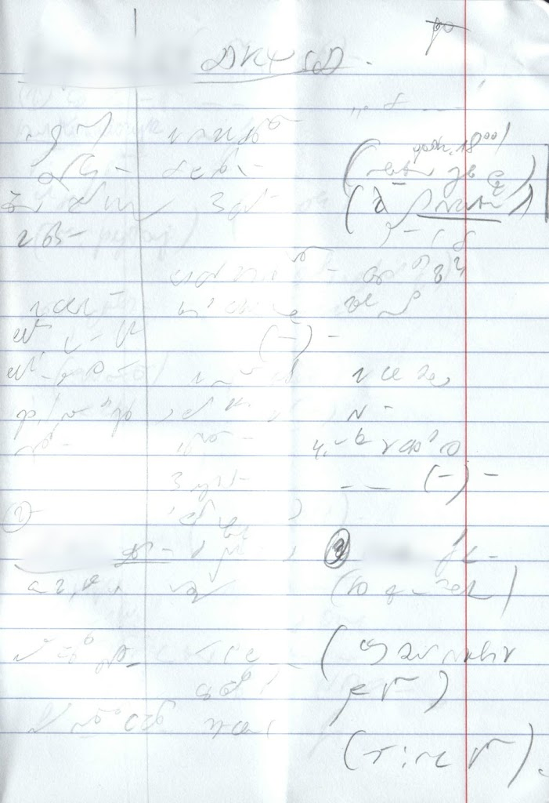

Ciekawscy o zacięciu detektywistycznym zapewne już zdążyli sobie
pomyśleć: *w linkowanych podręcznikach stenografia przedstawiona jest w
formie czyściutkiej, bez omyłek, specjalnie dla uczniów. A jak to
wygląda naprawdę?* 
 
Oto pierwsza prezentacja prawdziwego stenogramu, prościutko z polskiego
Senatu. Współcześnie tak zwane zapisy stenograficzne posiedzeń
komisyjnych i plenarnych obu izb polskiego parlamentu są nagrywane
prosto z mikrofonów umieszczonych na mównicach oraz tu i ówdzie na sali.
Nagrania po drucie wędrują prosto do biur stenograficznych, gdzie na
gorąco są przeklepywane przez zespoły maszynistek i redagowane. 

~~[Więcej na ten temat na stronach parlamentu.](http://www.senat.gov.pl/senatrp/noty/diariusz.pdf)~~[^1]

[^1]: Ww. link zaginął w czeluściach internetu. 
[Zatem wklejam inny, chyba na temat](https://senat.edu.pl/historia/diariusze/). Może przetrwa?

Jednak
często się zdarza, częściej niż wskazywałoby znaczenie słowa "zdarza
się", więc trzeba by powiedzieć, że każdemu mówcy inni posłowie przerwą
przemówienie i to nie raz, nie podchodząc wcale do mikrofonu. Ich
wypowiedzi nie zostaną utrwalone przez aparaturę. A przecież są częścią
procesu legislacyjnego, który to jest podstawowym i oficjalnie jedynym
powodem, dla którego posłowie się zbierają. A do tego nie raz też bywa,
że mówca do takiej wypowiedzi wypowiedzianej w powietrze (a przecież nie
na wiatr), zamiast, jak się godzi, do mikrofonu, zechce się odnieść,
odpowiedzieć, czy też odpyskować. Mikrofon wtedy zapisze tylko połowę
tej wymiany zdań i arcyważnych stanowisk, a to przecież żywa historia.
Więc nadal na posiedzeniach potrzebni są wykwalifikowani stenografowie,
którzy, dzięki lepszemu wyposażeniu w postaci uszu połączonych z
mózgiem, potrafią na gorąco odfiltrować proces legislacyjny od szumu tła
i go zapisać. Stenograficznie.

Zatem jak wygląda taki stenogram? Otóż zdziwicie się. Tak:

Aby dało się coś zobaczyć na tym skanie, musiałem go trochę "podkręcić".
W rzeczywistości kartka zapisana jest ołówkiem, bez silnego nacisku,
zatem linie są cienkie i delikatne, czasami ledwo widoczne.

Taki skan otrzymałem.

Zwracam uwagę na pionowe linie dzielące kartkę na cztery części:
pierwsza z lewej jest nakreślona szybko ołówkiem, druga jest wynikiem
zgięcia całego zeszytu na pół wzdłuż. Trzecia to wydrukowany standardowo
margines - to jest zwykły zeszyt szkolny. Stenograf (pani stenograf)
pisała w trzech wąskich kolumnach, na jakie podzielona jest szersza
część kartki. Pole za marginesem to "pas lądowania", żeby ręka nie
wyleciała za papier.

Nie, proszę państwa. Nie da się tego przeczytać. Treść tej kartki to
słodka tajemnica stenografa. W krajach anglosaskich układano systemy
stenograficzne na wzór pisma powszechnego, zatem odpowiednio wprawni
stenografowie mogli nawzajem odczytywać swoje zapiski. Brało się to z
mnóstwa standardowych skrótów, które dostępne były w formie słowników i
pomocy dydaktycznych już na etapie początkowym nauki. Dzięki temu np.
George Bernard Shaw mógł pracować w taki sposób, że stenografował sobie
jadąc pociągiem do Londynu, gdzie spotykał się z wykwalifikowaną
stenotypistką potrafiącą czytać system Pitmana. Ona przepisywała jego
wypociny na maszynie i tak powstawał gotowynp.  scenariusz kolejnej
sztuki teatralnej. 

W Polsce nigdy nie doszło do zbudowania tak wyrafinowanych systemów.
Stenograf, po osiągnięciu odpowiedniej prędkości pisania, zostawał
wypuszczony na szerokie wody - poza podstawowym bagażem skrótów i metod
nie posiadał nic. Zatem szybko układał własne skróty, nie tylko na
słowa, ale też na związki frazeologiczne i nawet całe zdania. Takie
skróty nazywają się "frazeogramy". Typowym przykładem będzie znany
wszystkim, którzy jeszcze kiedyś wysyłali papierowe listy przy pomocy
poczty znaczek "W.P.", którym poprzedzało się imię i nazwisko adresata.
Tak czy owak, każdy zawodowy stenograf dysponował własnym zapasem
skrótów, dopasowanym do branży, w której pracował najczęściej. Strzegł
ich pilnie i z nikim się nie dzielił. Dzięki temu tylko on mógł odczytać
swój stenogram. 

I co? I stenografia w Polsce umarła, zanim ktoś ją zauważył, a w
Commonwealth, Rosji, Brazylii, USA, Kanadzie, Australii, Chinach, Japonii, Niemczech... Tam ma się nieźle. W każdym razie - w porównaniu.

