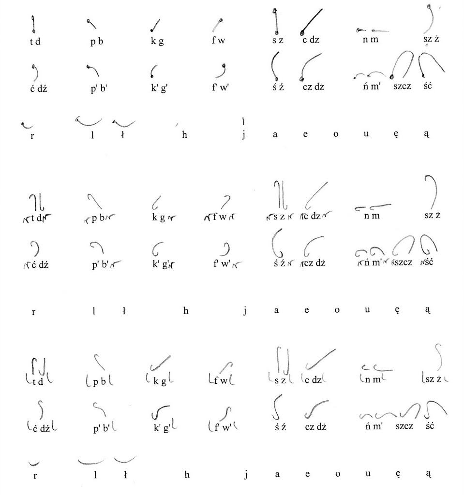
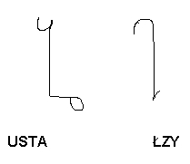
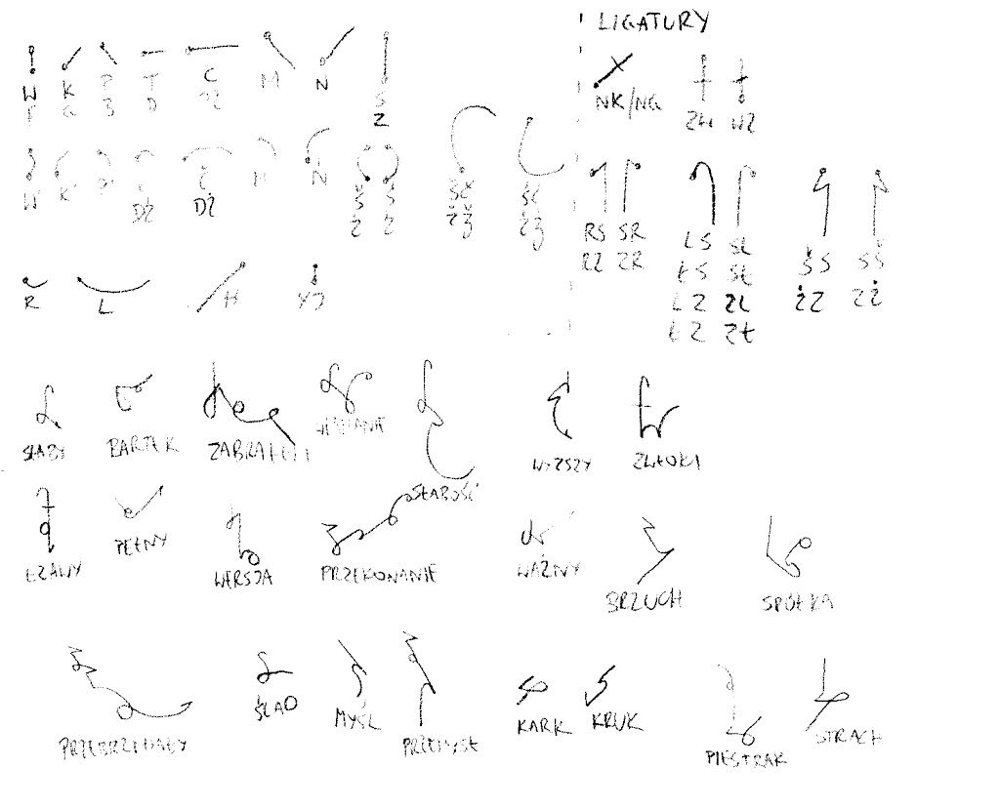

Intensywne prace zwolniły bieg. Zagadnienie, niby proste, okazało się
trudniejsze, niż się spodziewaliśmy. Dla mnie czas powodzi okazał się
najpoważniejszą przeszkodą - nowe zajęcie w postaci domu do odbudowy,
użerania się z ubezpieczycielami i pielęgnowania złości na winnych
zaniedbań - żeby nie zapomnieć o nich, kiedy już sytuacja się unormuje -
zmniejszyła liczbę godzin w tygodniu, które mogłem poświęcić
stenografii. Przełączyłem zatem rozważania w tryb pracy w tle - umysł
ludzki potrafi tak pracować, trzeba mu tylko zaufać. Najprostsza metoda,
to przespać się z problemem. Jak mówi przysłowie: "noc przynosi radę".  
Wyjazd do Kielc na kilkudniowy wypoczynek (i najlepszą pizzę, jaką
jedliśmy) przyniósł pierwsze wyniki podświadomych przemyśleń.  
Najpierw pojawiła się mała przeróbka dotychczasowej pracy:

Ale zaraz wylał się nowy pomysł - pracy z di- i trifonemami. Znaleźć te
najbardziej "klejkie" spółgłoski, które występują w związku z największą
liczbą innych spółgłosek i nadać im oznaczenie w formie małego znaczna,
zadziorka, podczas gdy pozostałe niech będą dłuższe.

Byłem wtedy pod wrażeniem 
[stenografii Pitmana](http://en.wikipedia.org/wiki/Pitman_shorthand), 
gdzie
spółgłoski oznaczone są kreskami, a samogłoski diakrytykami, które
wstawia się wyłącznie wtedy, kiedy ich brak może zagrozić czytelności.
Oczywiście, w angielskim podział spółgłosek na dźwięczne i bezdźwięczne
to cała trudność, z jaką się mogą zetknąć. Setki lat gromadzenia wiedzy
stenograficznej także nie pozostaje bez znaczenia. Dla języka polskiego
trudności są trochę inne. Notatki pisane na kolanie przybrały formę
skanu:

Jak widać system miał wszelkie cechy podejścia logicznego: proste kreski
to spółgłoski twarde, łukowate (prawoskrętnie) to spółgłoski miękkie.
Niektóre spółgłoski występują jako haczyki lub zadziorki na początku
znaku, podczas gdy na końcu znaku zarezerwowano miejsce dla samogłosek.
Samogłoski roboczo zostały wzięte z pierwszej wersji systemu.  
Pisanie takie już wyglądało lepiej, tak mi się zdawało - nawet
wielosylabowe wyrazy nie robiły wrażenia szczególnie skomplikowanych.
No-qankowi jednak system się nie spodobał, nawet zważywszy, że to
dopiero wstępna faza projektowania. W zasadzie bagatelizował znaczenie
grup spółgłoskowych, które mnie się wydawały zasadniczym problemem. Do
dziś widzę to tak, że grupa spółgłoskowa, to w pewnym sensie spółgłoska,
jakby językowi zależało na tym, żeby nie tworzyć zbyt trudnych brzmień.
Raczej chodzi o to, że tak rodzą się nowe głoski - ze złożeń kilku
starych.

Na koniec odcinka wyjaśnienie pojęcia ***grupa spółgłoskowa***:
wyodrębniona arbitralnie (np. z powodu częstości występowania) grupa
spółgłosek występujących razem, nie rozdzielonych samogłoską, 
np. *sk, skr, skrz, st, str, strz, sp, spr, sprz* itp.

CDN (O ile będzie jeszcze jakiś ciąg dalszy)