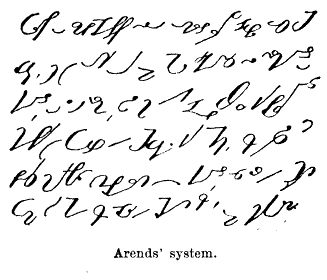

Witam w ten piękny, słoneczny, przedpołudniowy, początkowotygodniowy
poranek. Dla rozruszania dodałem do menu strony www.stenografia.pl
kolejny dział pt.
"[Różności](https://www.stenografia.pl/roznosci/)". Mam zamiar w nim
zamieszczać różne historyjki związane ze światową stenografią, mogą to
być także tłumaczenia wcześniej zlinkowanych miejsc z Internetu. Na
razie pierwsza opowieść - 
[o Dostojewskim i Snitkinie](../../roznosci/dostojewski_snitkina/).  
Oprócz tego zamieściłem na podstronie 
[strony głównej](../../stenografia/)
cały wpis z 
[Encyklopedyji Samuela Orgelbrandta nt. stenografii.](../../roznosci/orgelbrandt/)

Zapraszam do lektury.
