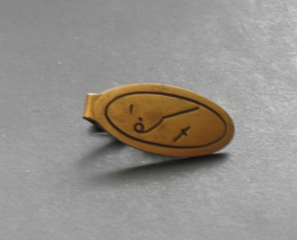
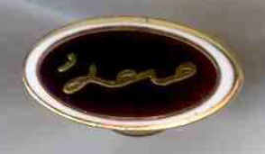
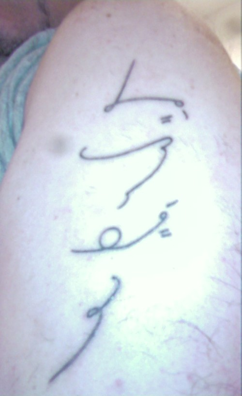
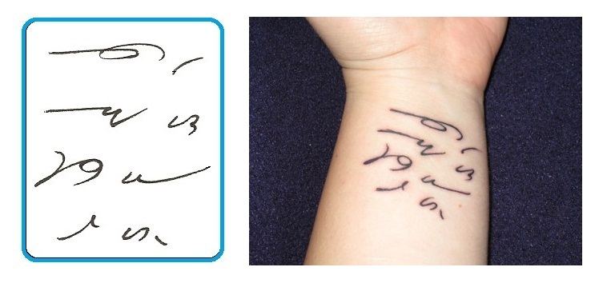

Jak każdy system piśmienniczy w przeszłości i dziś, stenografia również
trafiła w ręce ludzi o otwartych i kreatywnych umysłach przekraczając
granice narzędzia, a wkraczając w dziedzinę sztuki.

------------------------------------------------------------------------

Spinka do krawata. Nie wiem, co na niej jest napisane. Coś jak "*hild*",
"*held*", albo "*helm*", ewentualnie "*handm*", lub "*handmn*", czyli
"*handman*", a z przodu i z tyłu jakieś skróty. Problem z odczytem
wynika też z braku ustalonej linii pisma, nie tylko z powodu mojej
nieznajomości tego języka i systemu stenograficznego ;-).

------------------------------------------------------------------------

Odznaka Supersekretarki. Napis brzmi prawdopodobnie: *Super
Secretary*.Pierwszy znaczek zapewne jest skrótem słowa "*super*", choć
na liście "Brief forms" go nie znalazłem.

------------------------------------------------------------------------

Tatuaże. Ten tutaj brzmi: *Jimmy loves Nandy forever*. Ewentualnie
*Jacky loves Nandy forever*.

------------------------------------------------------------------------

A tutaj napis brzmi: *Make the most of yourself, for that is all there
is of you*. \
Transkrybcja: *Mak \[the\] most ofyrslf fthats ol \[there\]s ou*.

------------------------------------------------------------------------
