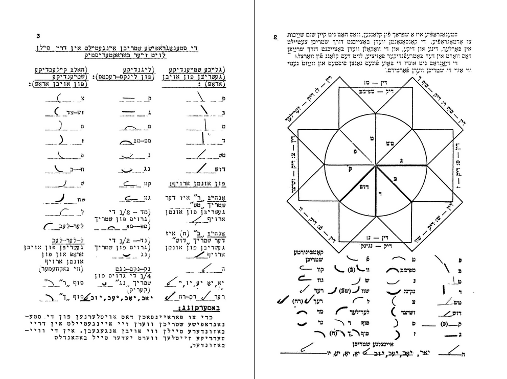

Prezentuję tutaj [**hebrajską stenografię**](https://www.archive.org/stream/nybc208198#page/n0/mode/2up) 
nie dlatego, że wnosi ona coś szczególnie istotnego do ogólnej wiedzy o
stenografii - przykład wydaje się być jałowym pod tym względem
całkowicie. Jednakowoż to niezwykle interesujące przeglądać książkę z
rysunkami i wykresami, którą należy czytać od prawej do lewej...

Po pewnym czasie miałem wrażenie, jakby całe moje ciało skręciło się
lewoskrętnie w korkociąg. Ot, ciekawostka, jaka jest siła nawyku.
