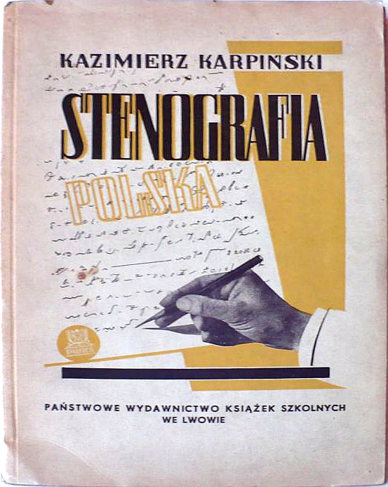

Dotarł do mnie wreszcie podręcznik do niegdyś najpopularniejszego
systemu stenograficznego w Polsce. Digitalizacja nie była prosta i
sprawiła, że rozwiązałem parę problemów na przyszłość. Teraz mogę
składać podręczniki w pliki o wiele mniejsze.

[OTO LINK DO PODRĘCZNIKA](https://stenografia.pl/podreczniki/polinski/Stenografia_polinski-karpinski.pdf).

System Polińskiego. Na podstawie Gabelsbergera, utworzony przez
profesora Uniwersytetu Lwowskiego, Józefa Polińskiego (1828-1901), po
raz pierwszy opublikowany w 1861 roku. Od tamtej pory stale ulepszany,
poprawiany i dostosowywany do zmieniającego się słownictwa polskiego i
zastosowań stenografii. Ostatnie podręczniki ukazywały się jeszcze w
latach 80-tych XX wieku.

Prezentowana książka stanowi kompletny materiał do nauki stenografii,
zapraszam do sprawdzenia się na tym polu. W wypadku tego systemu macie
to szczęście, że wciąż można dotrzeć do praktyków, którzy w razie czego
zdołają Wam pomóc i rozstrzygnąć Wasze wątpliwości, lub udzielić
wskazówek, które skrócą, lub ułatwią proces uczenia się.
