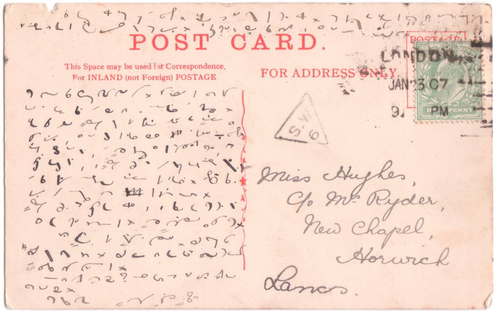
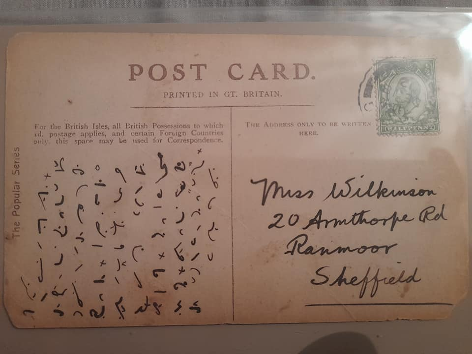
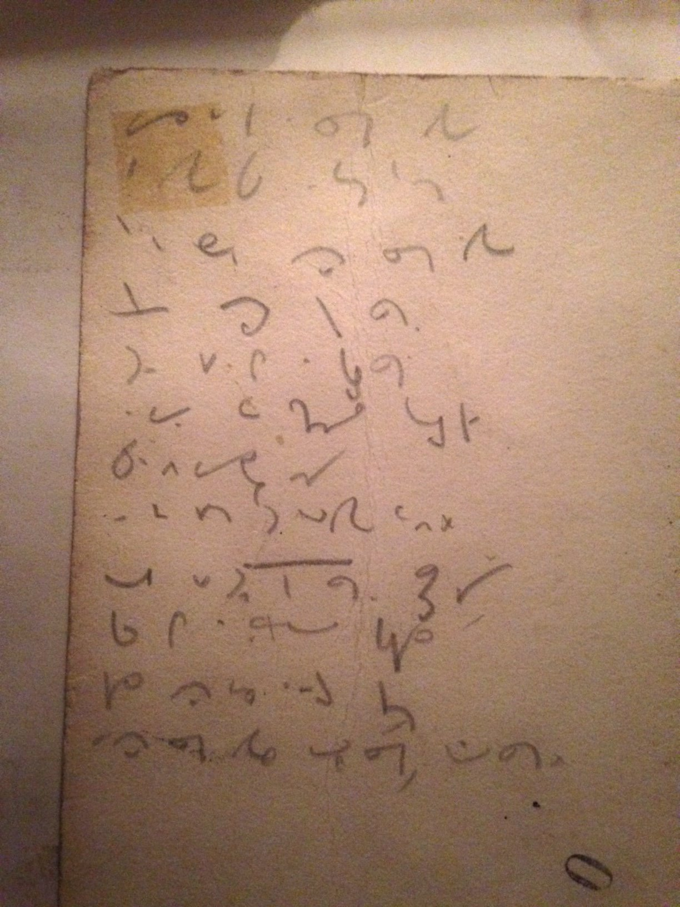

Mam przerwę w regularnym zasilaniu tego miejsca we wpisy, bo głowę
zaprząta mi większy projekt:  
piszę podręcznik do NPSS wersja SuchMir. Wygląda na to, że system jest
już na tyle dojrzały, żeby go ująć w formalne ramy i zaprezentować.
Niestety, okazuje się to pracą ciężką i wymagającą dużej dyscypliny.
Ponieważ mogę się w nią angażować tylko w wolnych chwilach, podręcznik
nie pojawi się tak szybko, jak sam bym chciał. W końcu przecież
chciałbym nauczyć się mojego własnego systemu, a do tego potrzebuję
podręcznik, nieprawdaż?

Dziś zatem mała prezentacja zdjęcia pocztówki, którą znalazłem na (sic!)
Facebooku, gdzie pewien pasjonat systemu Pitmana założył konto na rzecz
shorthand, ale tylko dla stenografii angielskiej, więc nie piknąłem w
"Lubię to!":

~~~~

~~Pojawił się nawet ktoś, kto potrafił to przeczytać, co nawet dla starego~~
~~pisma odręcznego może przecież stanowić problem (co widać w polu adresu~~
~~tej kartki pocztowej):~~

~~> Is not~~
~~> this a pretty spot darling? To walk .... the drive ...... I have just~~
~~> come down to the office with Jack but I am going to put this in their~~
~~> letter. It is a beautiful day, not nearly as warm as it was in ...."~~
~~> We are going up the line this afternoon, I shall take/check dinner(on)~~
~~> with (Chris)... (have no idea what the last few words are, possibly~~
~~> "will leave for .... or love for ....)~~

-----

## Poprawka 2021-05-28

Powyższy materiał jest już chyba niedostępny. Zatem wrzucę tu na pocieszenie inny z grupy [Shorthand Transcription Service](https://www.facebook.com/Shorthand-Transcription-Service-170154106370178), z 20 grudnia 2015 roku, w którym chodzi o to samo (trzykropki w miejscach, gdzie tłumaczka nie zdołała rozczytać):

> It is fearfully cold here today and yesterday. I do not know that I remember it so cold. It may be that I feel much more as I am getting old. I expect you have had ways of …. It was trying to snow this morning but has not come to anything yet.

> Very many thanks for your lovely long letter. I will answer it more ….. in a few days and send you the …. and directions. I have just rung Stanley up on the telephone and find that Uncle is still away and has not been at office since a fortnight ago yesterday. Auntie has been in bed and Miss …. has had ulcerated throat and all the children have been bad, but Stanley says all are better now except baby and this delay expecting Uncle at the office. Suppose it is the way weather which keeps me at home now. Stanley says all the children have colds, but does not think they are so bad as they try to make out. Miss ….. is still there. I met Jenny at the ballet last night. She is pretty well and asked to be remembered to you. She is glad you have found something so quickly and hopes you will like it.

> Can you read my shorthand? Because if you can't I won't write any more in shorthand.

> Very best love. Mary ….. Hughes. 

Sporo dało się napisać na połowie kartki pocztowej...

Obszerne epistoły na kartkach pocztowych nie były rzadkością w czasach popularności stenografii.

<!--  -->

Następnie, jak pisze tłumaczka poniżej, znalezione na odwrocie starej fotografii. Tekst piosenki Doris Day z 1953 roku, z [filmu Calamity Jane](https://en.wikipedia.org/wiki/Calamity_Jane_(film)).

> *Found on the back of an old photograph. These are the lyrics to a Doris Day song from the 1953 film. Calamity Jane.*

> Once I had a secret love,\
> That lived within the heart of me,\
> All too soon my secret love,\
> Became impatient to be free.

> So I told a friendly star,\
> The way that dreamers often do,\
> Just how wonderful you are,\
> And why I'm so in love with you.

> Now I shout it from the highest hills,\
> Even told the golden daffodils.\
> At last my heart's an open door,\
> And my secret love's no secret any more.



----

## Internet to potęga.

Jak wiele takich zapisków leży gdzieś w szufladach naszych babć i nikt
nie ma nadziei, że kiedykolwiek zostaną przetłumaczone? Jeżeli coś
takiego znajdziecie, przyślijcie próbkę na 
[adres kontaktowy](mailto:flamenco108@stenografia.pl?subject="Próbka stenografii"), 
może zdołamy pomóc.
