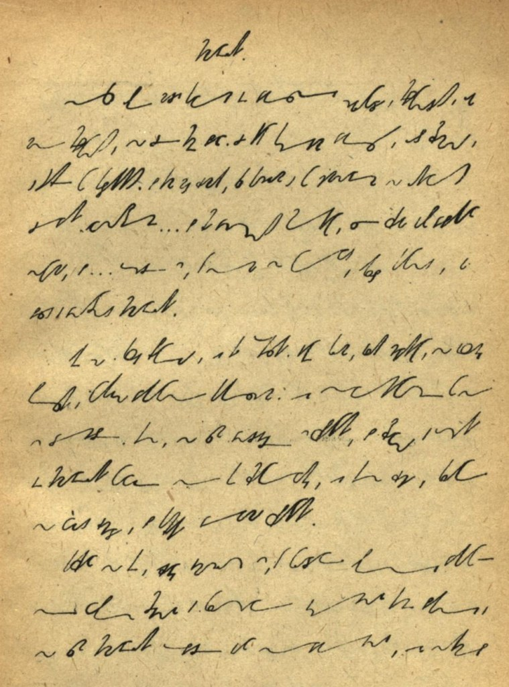
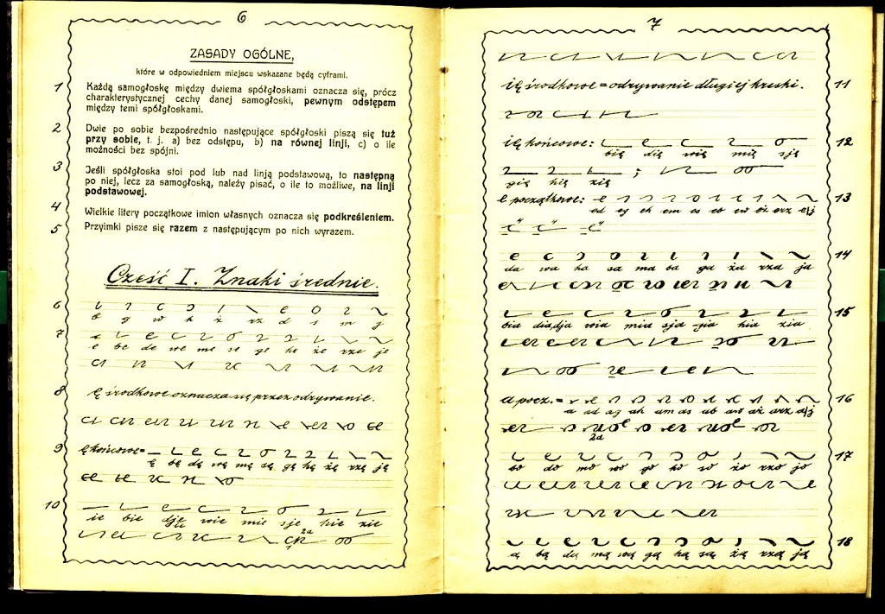

Zajęć sporo. Rozpracowałem technikę pisania podręcznika, więc wkrótce
odważę się zaprezentować pierwsze fragmenty. A tymczasem  znowu
zarzuciłem wędkę w Narodowej i połowiłem trochę materiałów.  
Np. [nowelka Bolesława Prusa pt. "Kamizelka"](https://podreczniki.stenografia.pl/balczynska/KAMIZELKA.pdf) zapisana systemem 
[Barbary Balczyńskiej Nowa Stenografia Polska](https://podreczniki.stenografia.pl/balczynska/balczynska-NOWA_STENOGRAFJA.pdf).

<!--  -->



Albo cały system stenograficzny autorstwa Pawła Kina (przed odzyskaniem
niepodległości pisał się Paul Kuehn, ale co to komu przeszkadza?) z roku
1919. Bardzo ciekawy, ale przede wszystkim bardzo ładnie autografowany.

<!--  -->


Jak tylko go dobrze obrobię, czyli odchudzę ze zbędnego materiału,
wrzucę do Repozytorium. A na razie można podziwiać
piękne znaczki, szkoda tylko, że to kolejny system, w którym stosowano
pogrubienie dla "A"...

