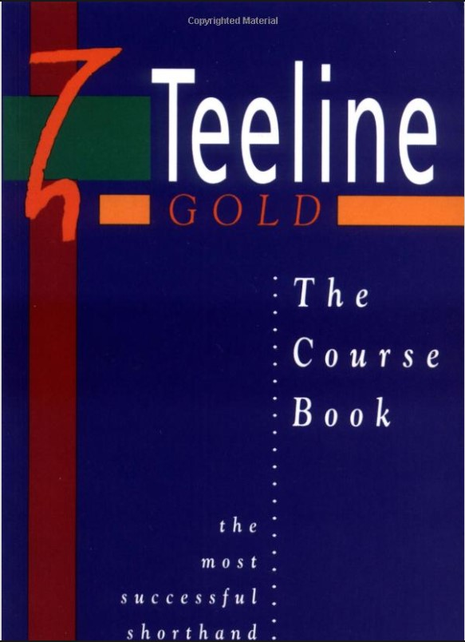

Ha. Ha. Ha.  

Nie spodziewałem się tego. Właśnie postanowiłem rozszerzyć
przeszukiwarkę na Allegro, co mi co rano przysyła odłowione aukcje i
wtedy to nagle mi wyskoczyło. Prosto w oczy. Rzuciło się niespodziewanie
jak pitbull na małą dziewczynkę i rozszarpało. Musiałem to kupić. "Ale
co?" - zapytacie. 

Otóż to:
[Teeline Gold Coursebook - the most successful shorthand system](https://www.amazon.co.uk/Teeline-Gold-Course-Book-Bk/dp/043545353X)

[Tutaj wglądówka, czyli pierwszych ileś tam stron.](https://www.amazon.co.uk/gp/reader/043545353X/ref=sib_dp_pt#reader-link) 

Tak
się powinno pisać podręczniki stenografii. Prosto i jasno. Mam nadzieję,
że niedaleko odbiegnę od wzorca, choć Anglicy mają doświadczenie w
kreowaniu systemów stenograficznych już niemal od pół tysiąclecia. A
Polacy w zasadzie mogą liczyć dwieście lat. Jest jakaś różnica. Poza tym
u nich stenografia jest ciągle żywa, a u nas?
