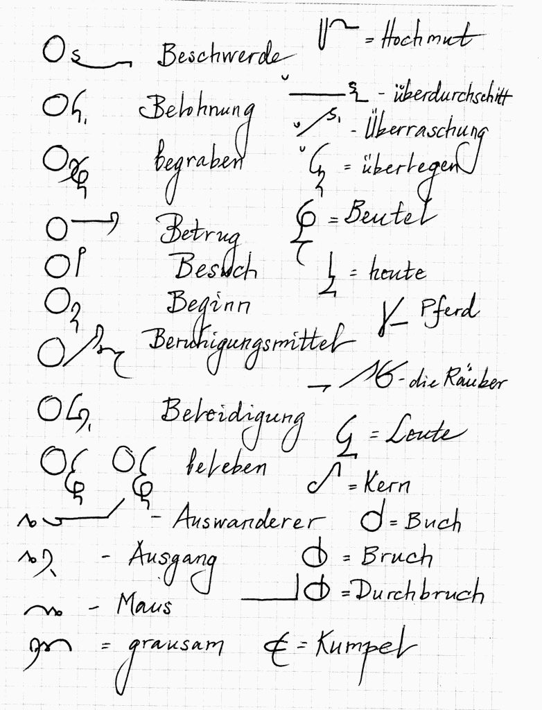
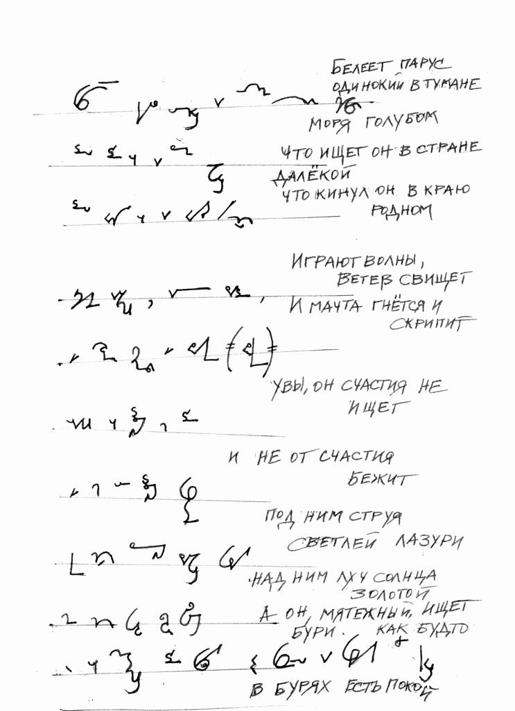
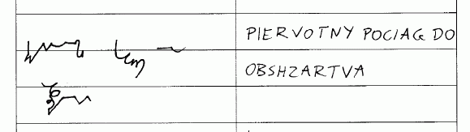
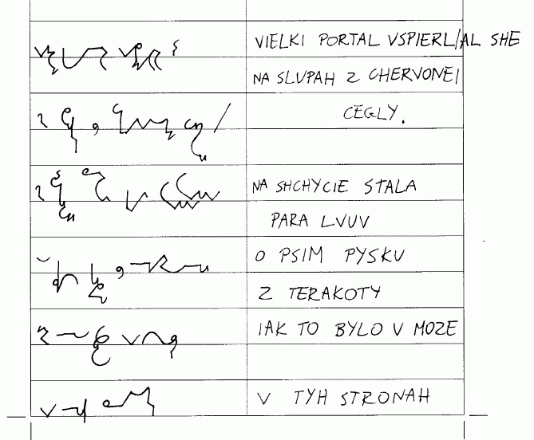

Czy możliwe jest ułożenie systemu stenograficznego podobnego do
[Teeline](http://en.wikipedia.org/wiki/Teeline_Shorthand), ale
dopasowanego do polskiego? Jak już wspominałem chyba, polski jest chyba
najtrudniejszym językiem na świecie. Równocześnie występuje w nim 45
samogłosek (z dokładnością do kilku, zależnie od szkoły), niesłychana
mnogość reguł gramatycznych, typowa dla języków słowiańskich oraz
niesamowita elastyczność polegająca na zdolności do natychmiastowej
adaptacji wyrazów z innych języków.  

<!-- 

  Niemieckie Teeline  -->
  

  
[Link do oryginału](https://www.ipernity.com/doc/38906/8931431)
  

My nie musimy, jak Niemcy, tworzyć nowych słów na nowe pojęcia, bierzemy
je od sąsiadów, gotowe, dopracowane, i w ciągu jednego pokolenia
zamieniamy w swój wyraz. Wyjątki można znaleźć w zasadzie dwa: 
*kakao i radio*. 
Jeśli chodzi o kakao, to sam od dziecka słowo to odmieniam, choć
Narzędnik nie brzmi zbyt wyjściowo: *kakale*. Ale słowo *radio* już tak
miło się nie odmienia, więc, jak to Polacy, mamy tendencję do okrężnego
rozwiązywania tego problemu, co po angielsku o wiele mądrzej brzmi:
*workaround*. 
 
Ale odbiegłem od tematu.

Toczyłem ongi (i liczę, że wrócimy do tematu) dyskusję z 
[Eugeniuszem Lazianem](https://www.google.pl/search?hl=pl&tbo=p&tbm=bks&q=inauthor:%22Eugene+Yenovk+Lazian%22), internacjonalnym Ormianinem, pisarzem, poliglotą, esperantystą (czyli krótko mówiąc: niezłym geekiem), który używa Teeline nie tylko do
angielskiego, ale też do niemieckiego, a nawet do rosyjskiego. Na swoich
stronach ma też opublikowane 
[teksty piosenek Beatlesów w oryginale](https://www.ipernity.com/doc/38906/8969820) oraz 
[przymiarki innych Niemców (?) do tego systemu](https://www.ipernity.com/doc/38906/8931429).

Oto przykład transkrybcji na Teeline słynnego wiersza Lermontowa
"Bieliejet parus adzinokij" czyli "Bieleje samotny żagiel". Kto jeszcze
liznął w szkole rosyjski, ma szansę odcyfrować, co tu na tym obrazku
zostało napisane... Jak widać, Eugeniusz nieźle sobie radzi.

<!--  [

  Bieliejet parus  -->
  

  
[Link do oryginału](https://www.ipernity.com/doc/38906/9213008)

Zachęcony przez Laziana, spróbowałem swoich sił w Teeline po polsku. Nie
łudźcie się, nie od razu się to udaje, trzeba trochę postudiować.
Podręcznik bardzo się przydaje.
[Angielska wersja darmowa dostępna jest np. tutaj](https://www.4shared.com/file/240456572/afc721d6/Teeline_Complete.html), 
[albo tutaj](https://dokumen.tips/documents/teeline-complete-pdf-library.html). 

Trudno
mi ocenić, jak to wyszło, moim zdaniem nie najlepiej. Żeby pisać w
Teeline, trzeba najsampierw dokonać jakiegoś skrótu - a tu ja osobiście
odczuwam opór i zgłaszam sprzeciw. *Polska język trudna język est*. Nie
uczą nas skrótować, zatem nie ma standardu, który np. w Anglii buduje się
już kilkaset lat.

<!--  -->



Zatem od początku uważałem, że system stenograficzny dla języka
polskiego powinien w swojej długiej, podstawowej formie pozwolić na
pełny zapis słów, bez przymusowych skrótów. Tymczasem Teeline jest
systemem opartym o znaki blokowe (po naszemu mówi się "drukowanymi") i
zgodnie z angielskimi normami ma bardzo ograniczone tworzywo graficzne.
Zatem, choć wydaje się ładny, pytanie, czy jest przekładalny bez dużych
poprawek na język polski? Moim zdaniem - wykluczone.

Prawie sto lat temu pewien pan o nazwisku Sabowski dokonał porównania
liczby wyrazów o danej liczbie sylab między niemieckim i polskim:
wyszło, że począwszy od wyrazów dwusylabowych, w polskim mamy tym więcej
wyrazów, im więcej jest w nich sylab. Wiadomo, że podobny stosunek
występuje między niemieckim i angielskim, z tym że to angielski tym
razem jest bardziej oszczędny.

Zatem przeniesienie Teeline "żywcem" na polski, czy też wprowadzenie do
systemu niewielkich, kosmetycznych poprawek, moim zdaniem nie przyniesie
zadowalających rezultatów. Aby stenografia po polsku stała się
rzeczywiście szybka i oszczędna, wymaga, niestety, więcej pracy, niż po
angielsku. Wyobrażam to sobie tak: po opanowaniu pewnych podstaw student
zostaje zachęcony do używania systemu w praktyce. Robi to w ten sposób,
że używa stenografii wszędzie tam, gdzie może, a gdzie mu wiedzy
brakuje, wstawia słowa pismem długim. W miarę, jak rośnie jego wprawa,
rośnie też potrzeba, by zastosować więcej sprytnych sztuczek, które
oszczędzą pracy przy pisaniu. To skłania do opanowania kolejnych
rozdziałów podręcznika. W ten sposób, stopniowo, można opanować
wszystkie niezbędne skróty i złożenia.

Jak tylko skończę robić pierwszy system, na bazie doświadczeń zabiorę
się za polskie Teeline...
