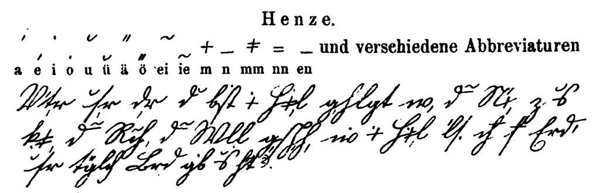

Chciałbym tu zwrócić uwagę, że stenografia nie jest celem, a jedynie
środkiem do celu, jakim jest skuteczny zapis. Skuteczny, czyli pełny,
przekazujący wszystkie istotne treści, odfiltrowane z szumu, lecz także
czytelny, czyli pozwalający te dane odzyskać z nośnika z powrotem do
umysłu.  
W połowie XIX wieku w wielu krajach podjęto się ustalenia standardu
kaligraficznego, który miał być nauczany w szkołach. Zwracam uwagę na
korelację czasową między popularyzacją nowoczesnej stenografii i tychże
standardów - oczywiście wybuchła intensywna dyskusja, czemużby w ogóle
nie odejść od pracochłonnych liter postłacińskich na rzecz stenografii,
podczas gdy alfabetycznie pisać uczyliby się ludzie potrzebujący
kontaktować się z innymi narodami - abecadło jako uniwersalny nośnik
wymiany międzynarodowej. Pomysł dobry jak każdy inny, niby dlaczego
uważać to, co mamy teraz, za najlepsze rozwiązanie? Przecież na rynku
magnetowidów też nie najlepszy zwyciężył.  

<!-- 

Pismo uproszczone - uproszczenie przez [abrewiatury](https://pl.wikipedia.org/wiki/Abrewiatura) - propozycja Henze -->



<!--   [{width="320" height="136"}]({filename}/wp-images/uploads/2010/11/kurrentschrift-thormin.png)
  Pismo uproszczone - samogłoski pisane oddzielnie - propozycja Thormina \*) -->



Profesorowie, specjaliści od różnistych alfabetów i od stenografii, jak
np. Karl Faulmann, autor wielu prac na temat przeróżnych systemów
piśmiennych, w tym monumentalnego "Das Buch der Schrift", "Księga
pisma", w której zaprezentował wszelkie znane alfabety i metody zapisu,
włącznie z alfabetem Morse'a i Braille'a, jednak wypowiedzieli się [^1].
Konkluzja brzmiała tak, że skutecznej stenografii wyuczyć się mogą tylko
ludzie o jakimś tam minimalnym poziomie procesora przetwarzającego dane.
Dla wielu opanowanie systemu znakowego zawierającego setki skrótów i
symboli będzie zwyczajnie zbyt trudne, a na dobrą sprawę - również
niepotrzebne. Będą obcować z podstawowymi dokumentami, ostatecznie co
jakiś czas będą musieli napisać list do rodziny lub podanie urzędowe - i
to wszystko.  

[^1]: Treść przedstawionych przykładów to po niemiecku Modlitwa Pańska
czyli Ojczenasz:

	*Vater unser, der du bist im Himmel, geheiligt werde dein Name, zu uns
komme dein Reich, dein Wille geschehe wie im Himmel also auch auf Erden,
unser täglich Brod gib uns heute. *

<!--  [{width="320" height="84"}]({filename}/wp-images/uploads/2010/11/kurrentschrift-huepfscher.png)
  Pismo uproszczone - wyraźnie inspirowane stenografią - propozycja Huepschera \*) -->



Zatem w kroku drugim rozważań rzucono pomysł stworzenia pisma
uproszczonego, czyli opierając się o znaki łacińskiego alfabetu
opracować ich wersje uproszczone, czyli szybsze w zapisie. Do tego
zestawu dodać znaki dla głosek złożonych czyli dwuznaków (w polskim np.
rz, sz, cz itp.), kilkanaście symboli dla najczęściej występujących grup
spółgłoskowych (w polskim np. st, ść, krz, prz itp.) i mamy alfabet
składający się z około 50-60 znaków, zaopatrzony w parę podstawowych
reguł ortograficznych, zdatny do opanowania dla każdego, kto w ogóle
zdolen jest pisać. A za to szybszy około dwukrotnie, co w czasach, kiedy
praktycznie wszystkie dokumenty produkowano odręcznie było korzyścią
niebagatelną.  
Przedstawiam tutaj trzy abecadła, które zaproponowano prawie 100 lat
przed Teeline, kiedy Anglikom jeszcze nie śniło się o tworzeniu systemu
stenografii czysto notatkowej, możliwie prostej i dla każdego.  
Czy dziś takie podejście miałoby jeszcze sens?

