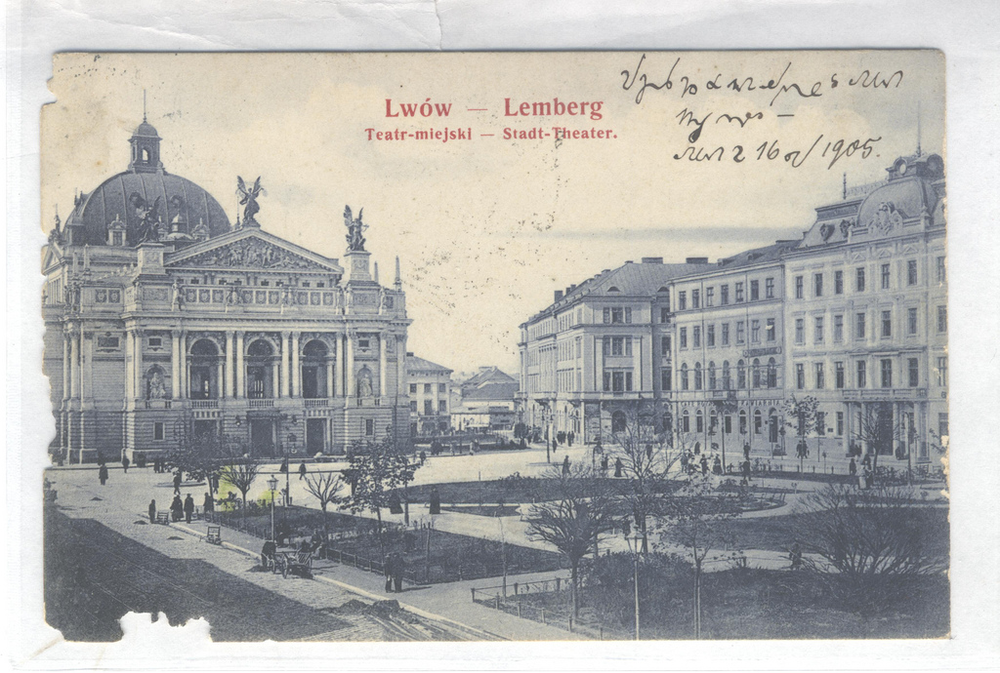

Smerfując po necie niezupełnie przypadkiem, ale całkiem nieumyślnie
trafiłem na portal <http://www.unilang.org/>, gdzie jakiś Pan z Polski
opowiedział, jak to podczas zwiedzania Lwowa zakupił sobie taką oto
staroć:

Właściciel kartki zwierza się, że najsampierw myślał, że kartka zapisana
jest po armeńsku. Mógłbym tu wyrzekać na słabą świadomość istnienia
stenografii w narodzie, gdyby nie oryginalność skojarzenia - w XVI wieku
[opat Trithemius](https://en.wikipedia.org/wiki/Johannes_Trithemius),
jeden z prekursorów badań odkrywających dla Europy ponownie 
[noty tyrońskie](https://en.wikipedia.org/wiki/Tironian_notes), znalazł
słowniczek symboli tyrońskich skatalogowany w bibliotece klasztornej
jako "Psałterz Armeński". A że znaki systemu Gabelsbergera, które można
oglądać na tej pocztówce, jak i na odwrocie:

... powstały drogą m.in. badań nad notami tyrońskimi Franciszka Xawerego
Gabelsbergera, skojarzenie po prostu było oczywiste i musiałem to tutaj
pokazać.

Cóż, pocztówka ta jest także świadectwem powszechności stenografii w
wieku poprzednim. Niesie również dementi dla twierdzenia, że
stenografia, szczególnie gabelsbergerowska, jest tak osobista, że
praktycznie niemożliwa do odczytania dla drugiej osoby.

Wszyscy wiemy, że odczytać długie pismo kogoś innego wcale nie jest
łatwo. Ale po pierwsze, w tamtych czasach zdarzało się to o wiele
częściej. Po drugie, tutaj mamy przykład stenografii tzw. notatkowej,
lub korespondencyjnej (właśnie!), czyli bez dużej liczby skrótów, które,
jeżeli były używane, znaczy znajdowały się w standardzie systemu.

Ja oczywiście odczytać tego nie mogę, ponieważ nie znam stenografii
Gabelsbergera (odcyfrowanie zajęłoby mi parę dni), ale też nie znam
niemieckiego na tyle, żeby mógł mi tutaj pomóc. Może ktoś zdoła odczytać
i w ten sposób [ucieszy właściciela
widokówki](http://www.unilang.org/viewtopic.php?f=118&t=31235)?

EDIT: Zacząłem pisać ten wpis jakiś czas temu. Okazuje się, że już ktoś
się znalazł i zaprezentował pierwszy fragment 19-go listopada 2010 roku,
czyli dzień po tym, jak zacząłem edycję:

> \[line 1\] Hochgeehrter Herr Hirschmüller! \
> \[translation\] *Most honorable Mr. Hirschmüller!* \
> \[przekład\] Wielce szanowny Panie Hirschmueller!
>
> \[line 2\] Entschuldigen Sie mir, dass ich so lange an Sie nicht
> geschrieben habe. Erste heute bin ich in der Lage, an Sie diese Karte
> zu schreiben \
> \[translation\] *Excuse me for not writing to you such a long time. I
> was not able to write to you this card until today.* \
> \[przekład\] Proszę o wybaczenie, że nie pisałem do Pana od tak dawna.
> Dziś wreszcie mam okazję napisać do Pana kartkę.
>
> \[line 3\] Ich bin hier schon sehr mit dem Lehren beschäftigt und lese
> viele gute Bücher. Jeden Tag schaue ich über das Fenster zum großen
> Seminar \
> \[translation\] *I'm already very busy teaching here and read a lot of good books. Every day I look over the window to the large seminar* \
> \[przekład\] Jestem tutaj bardzo zajęty nauczaniem i czytaniem wielu
> dobrych książek. Każdego dnia wyglądam przez okno na główną aulę
> seminarium
>
> \[line 4\] und denke an Sie. Sehr angenehm wäre es mir, wenn Sie schon
> da wären. Deshalb bat ich Sie \
> \[translation\] *and think of you. I would be very happy if you were already there. That is why .* \
> \[przekład\] i myślę o Panu. Byłoby bardzo miło, gdyby Pan już tu
> zjechał. Oto dlaczego
>
> \[line 5\] höflichst, mir Kunde zu geben, ob Sie aufgenommen sind. \
> \[translation\] *I politely asked you to tell me whether you have been accepted*  \
> \[przekład\] uprzejmie proszę o informację, czy został Pan przyjęty.

> CDN. 

Cóż, Lwów wtedy nazywał się Lemberg i był znacznym miastem peryferyjnej
prowincji Cesarstwa Austro-Węgier, miał słynny uniwersytet... Liczę na
to, że w dalszych częściach tłumaczenia dowiemy się, z jakiejże to
dziedziny panowie byli naukowcami. Jak widać, stenografia pozwalała im
zawrzeć mnóstwo treści na niewielkiej kartce pocztowej. Zatem nie tylko
mogli pisać szybciej, ale i więcej.

Czekamy na dalsze fragmenty.
