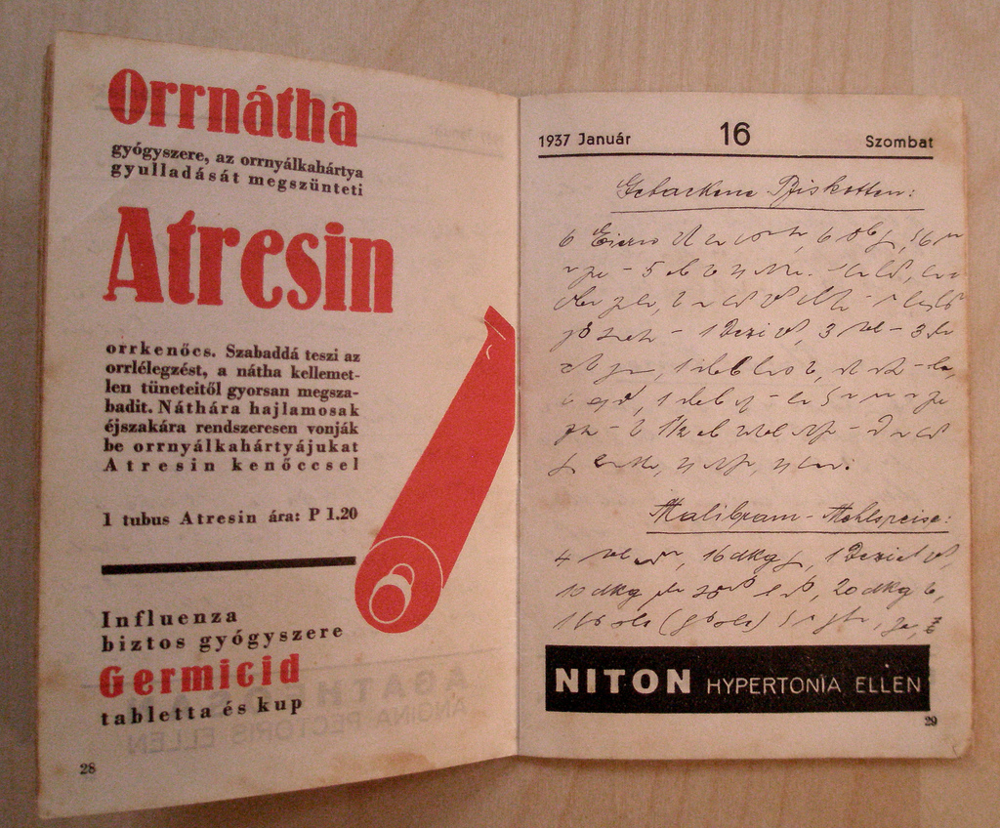
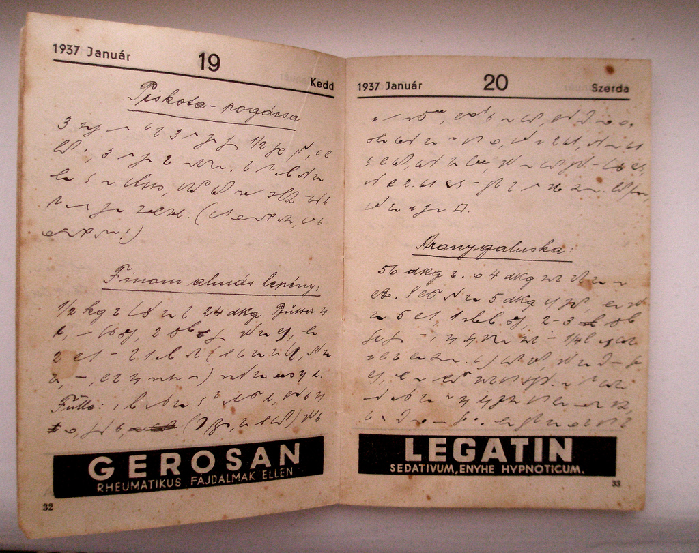

John Robert Gregg, pod koniec życia, kiedy osiągnął już właściwie
wszystko, co mógł (stenografii Gregga nauczano na wszystkich
uniwersytetach i w większości szkół średnich w USA, dokonano wielu
przekładów na różne języki), dalej narzekał: a dlaczego gospodynie
domowe nie chcą się uczyć stenografii (czytaj: kupować podręczników
wydawanych przez  Gregg Publishing)? Przecież notowanie tak szybką
metodą wydatnie skróciłoby czas, który musiałyby spędzać w kuchni. Cóż
Amerykanki jakoś nie miały ochoty ćwiczyć pisania w zamian za mniej
stania przy garach. Ale Węgierki widocznie same wpadły na ten pomysł:

 Podobnie jak wysokim czynownikom IBM kiedyś wydawało się absurdalne, że
można używać tak wyrafinowanego sprzętu, jak komputery, żeby
przechowywać w nich przepisy kulinarne, z pewnością niektórzy autorzy
systemów stenograficznych również byliby zdumieni, a może i oburzeni, że
ktoś ośmielił się tak prozaicznie wykorzystać ich wysoką sztukę.

Tylko zapewne żaden z nich nie był autorem tego węgierskiego derywatu
systemu Gabelsbergera, którym pewna pani w 1937 roku spisała swoje
ulubione przepisy kulinarne...
