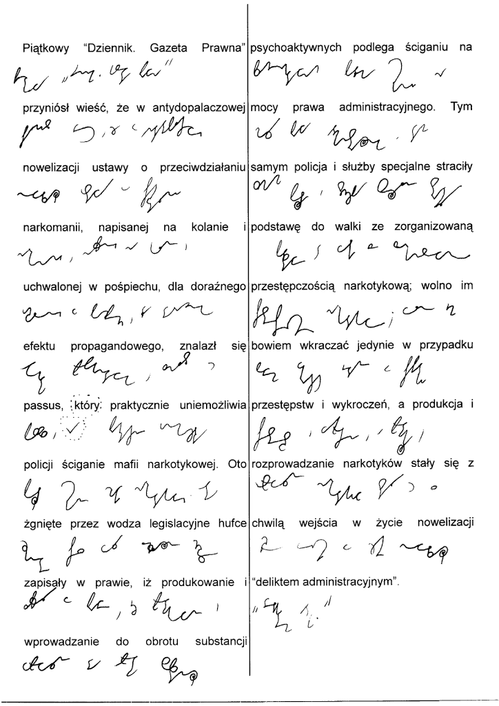

Minęło parę dni w milczeniu, a wszystko przez to, że przed Wigilią
chciałbym zobaczyć podłogę w swoim domu rozwalonym tegoroczną powodzią,
której ofiary nasz M.N.P. Prezydent "miał przyjemność odwiedzać".

Na przeprosiny za milczenie publikuję niżej moje wypracowanko, jeden
akapit [z tekstu Rafała Ziemkiewicza "Sanepid w walce z
mafią"](http://blog.rp.pl/ziemkiewicz/2010/12/12/sanepid-w-walce-z-mafia/).
Można się nie zgadzać z jego poglądami, to wolny kraj. Ale nie można
lekceważyć jego bogatej polszczyzny, której od dawna używam, jako
doskonałego probierza i trenażera dla mojego systemu stenograficznego.

Poniższy zapis prowadzony był w podstawowym SteMi, czyli praktycznie bez
skrótów i znaczników. 

Liczba słów: 99. \
Liczba znaków (alfabetycznych): 772. \
Liczba sylab (w rozumieniu stenograficznym): 259 \
Czas: 5:26 \
Średnia prędkość: \~18wpm (słów na minutę), lub \~47spm (sylab na
minutę), lub 140lpm (liter na minutę). \
**Ciągle dwa razy wolniej niż klepię w klawiaturę komputera... Choć już
prędkość znacznie większa, niż przy odręcznym piśmie. System działa.**

Jaki z tego wniosek?

1.  Ćwiczyć więcej
2.  Ułożyć program ćwiczeń, czyli podręcznik
3.  Opanować więcej znaczników, niż tylko jeden, zaznaczony na obrazku
    kropeczkami, bo to znacznie przyspieczy pisanie.

