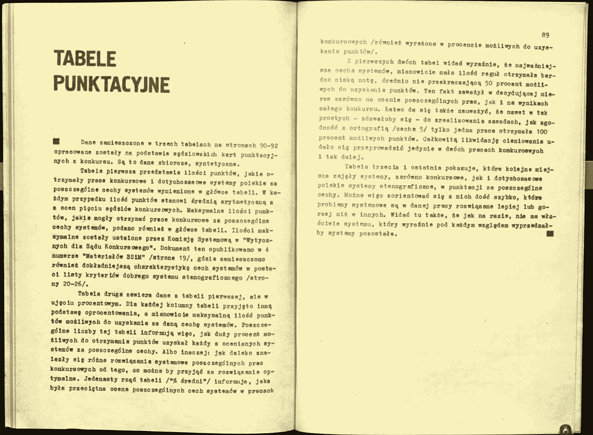
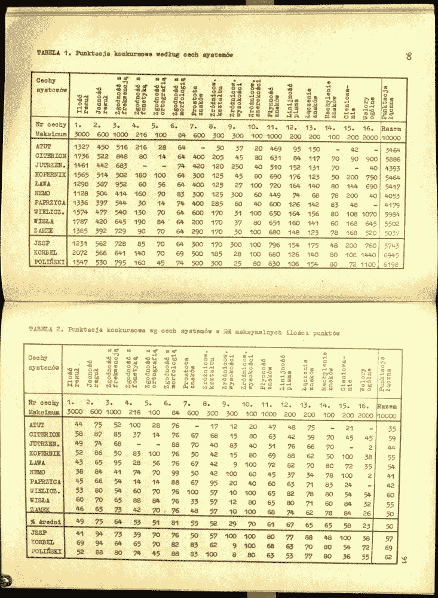
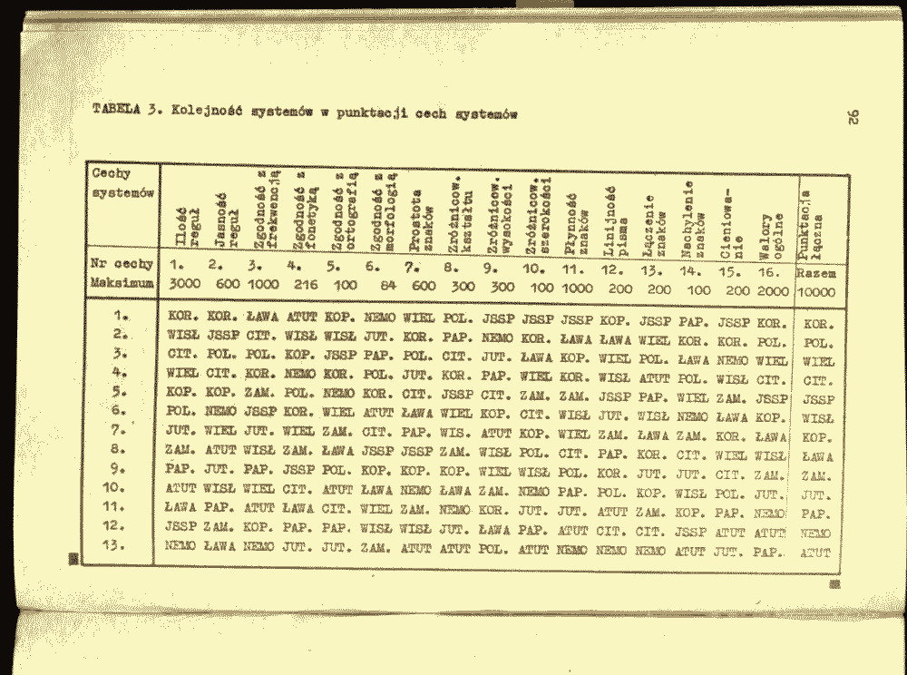

W roku (chyba) 1976 Stowarzyszenie Stenografów, Maszynistek i Sekretarek
złożyło pokłon przeszło odwiecznym staraniom swoich antenatów o
ustanowienie jednolitego i jedynego, doskonałego systemu
stenograficznego. W tym celu ogłosiło konkurs na tenże. W założeniu
oczywiście miały przyjść propozycje przewyższające dotychczas istniejące
systemy. A panowały wtedy praktycznie dwa, choć zdarzali się
stenografowie-indywidualiści, którzy profanowali ten szlachetny zawód,
czy to używaniem jakichś historycznych, niesłusznych, czy to wręcz
wymyślaniem własnych! I oto właśnie dla takich niepokornych ułożono ten
konkurs.  

Czas na wytworzenie systemu wynosił rok. Nadesłano kilkanaście prac,
które sukcesywnie tutaj będę przedstawiał, może któryś system komuś się
spodoba i zechce go sobie użyć. Szczególnie, że prezentowane są na
uproszczonej tablicy systemowej, czyli można takie abecadło ogarnąć
jednym rzutem oka.  

Nie będę ukrywał przed szanownymi czytelnikami, jaki był wynik konkursu:
wygrał jedyny słuszny system Polińskiego (POL). No, o z grzywy-włos
przegrywając z systemem Korbla (KOR), ale razem zdystansowali rywali, że
hoho! W związku z tym, po rozdaniu nagród (pierwszej nie przyznano) i
sporządzeniu stosownych protokołów nic się w tej materii nie zmieniło.

O.

