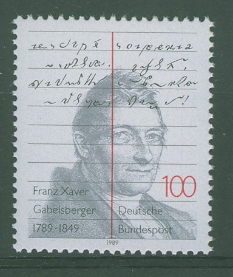
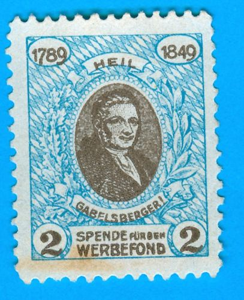
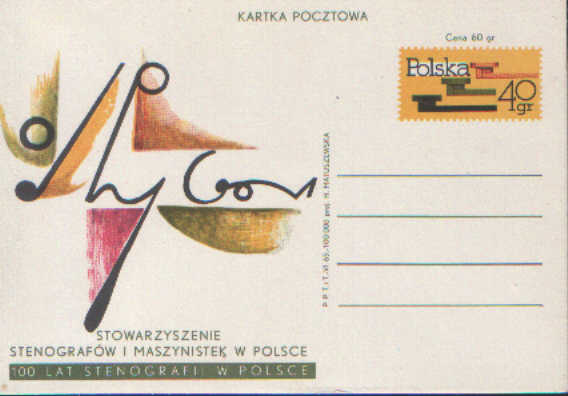

Stenografia miała swój udział w życiu codziennym, czym zasłużyła sobie,
żeby ją upamiętnić np. na znaczkach pocztowych. Upamiętnienie to
odbywało się znacznie intensywniej w krajach, w których doceniono wagę
stenografii bardziej, niż u nas.

  <!-- [{width="254" height="320"}]({cuba_Gregg-postmark.jpg)
  Kubański znaczek z portretem Johna Roberta Gregga -->



Na znaczku powyżej widać portret Johna Roberta Gregga. Znaczek wydany na
Kupie, z pewnością tej przedfidelowej. Cóż, była ona wtedy tym, czym
dziś jest Puerto Rico - zagłębiem turystycznym i kopalnią taniej siły
roboczej. Jednakoż JR. Gregg sfinansował tłumaczenie swojego systemu na
hiszpański, zapewne dzięki tak silnemu udziałowi USA w krajach Ameryki
Łacińskiej. I tak system Gregga stał się znaczącym konkurentem rodzimych
wynalazków, postępującym wraz amerykańskimi dolarami.

Znaczek rocznicowy, wydany w 1989 roku, ku pamięci Franciszka Ksawerego
Gabelsbergera, twórcy najdoskonalszego systemu stenograficznego na
świecie. Na bazie jego metody powstały systemy praktycznie dla
wszystkich języków europejskich, dobrze dopasowane i pozwalające na
stenografię korespondencyjną, czyli zapis możliwy do odczytania także
przez inne osoby. Innymi słowy stworzył podstawy nowej metody pisania,
która, niestety, w konkurencji z nowoczesnymi formami kursywnymi, które
tworzono na użytek szkół w połowie XIX wieku, w równym boju przegrała,
ponieważ odpowiedzialni za edukację totalną obawiali się, że przy pomocy
pisma stenograficznego pisać mogą tylko najzdolniejsi. Nie jest to
prawdą, kto nie wierzy, niech poczyta, z czego jest zbudowane i jak się
używa klasycznego pisma mongolskiego, a przekona się, że nie takie
łamańce potrafią wyczyniać zwykłe, codzienne abecadła.

Szacunek dla Gabelsbergera to nie żadna nowość, honorowano go już
pierwszymi, jeszcze niezbyt ładnymi znaczkami pocztowymi. Cóż, w
Niemczech liczba stenografów jego systemu przekroczyła na początku XX
wieku 200 tysięcy, a licząc z adeptami wszystkich systemów pochodnych,
mogła by, być może, sięgnąć pół miliona. Ludzie ci mieli wielki udział w
rozwoju nowoczesnych Niemiec, jako urzędnicy i naukowcy.

Kiedy Stowarzyszenie Stenografów i Maszynistek w Polsce doczekało się
wreszcie państwowego mecenatu, i ono nie zapomniało o stosownym
obchodzeniu rocznic. Oto pocztówka okolicznościowa z roku 1961, czyli
stulecia opublikowania najpopularniejszego polskiego systemu
stenograficznego - Gabelsbergera-Polińskiego.
