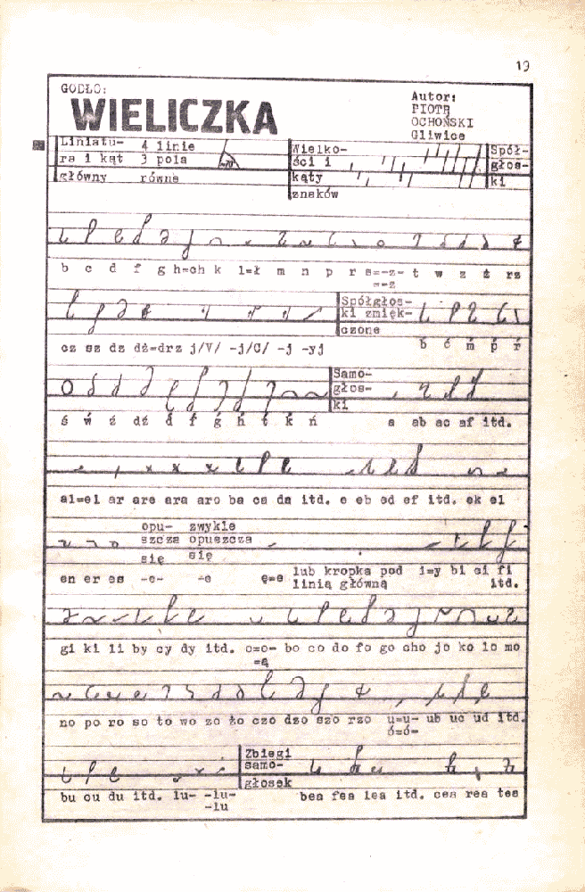
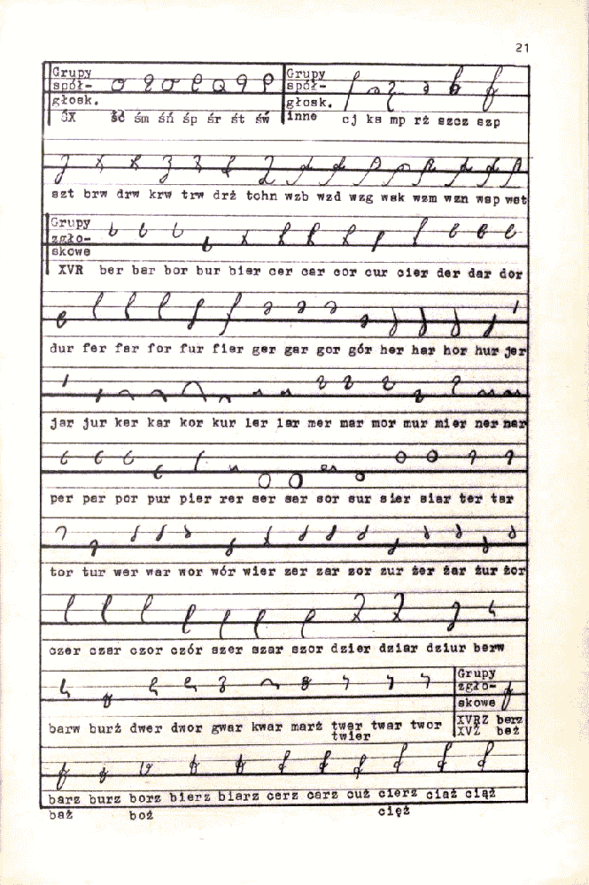
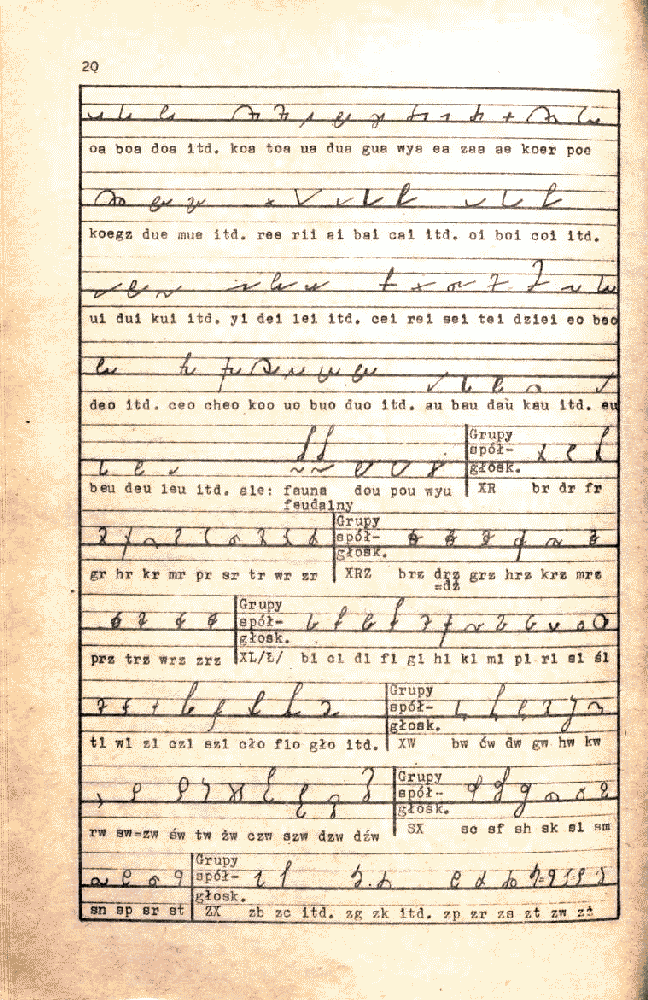
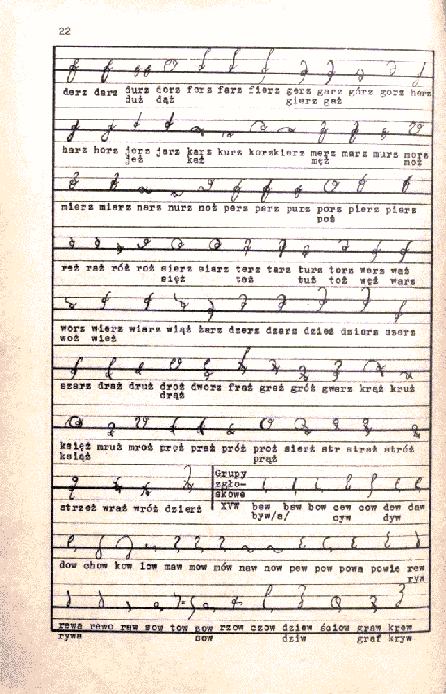
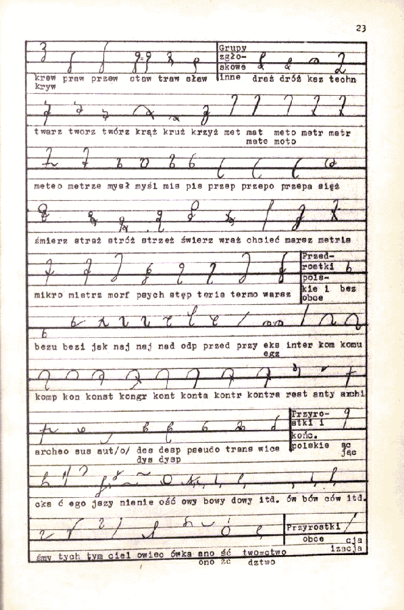
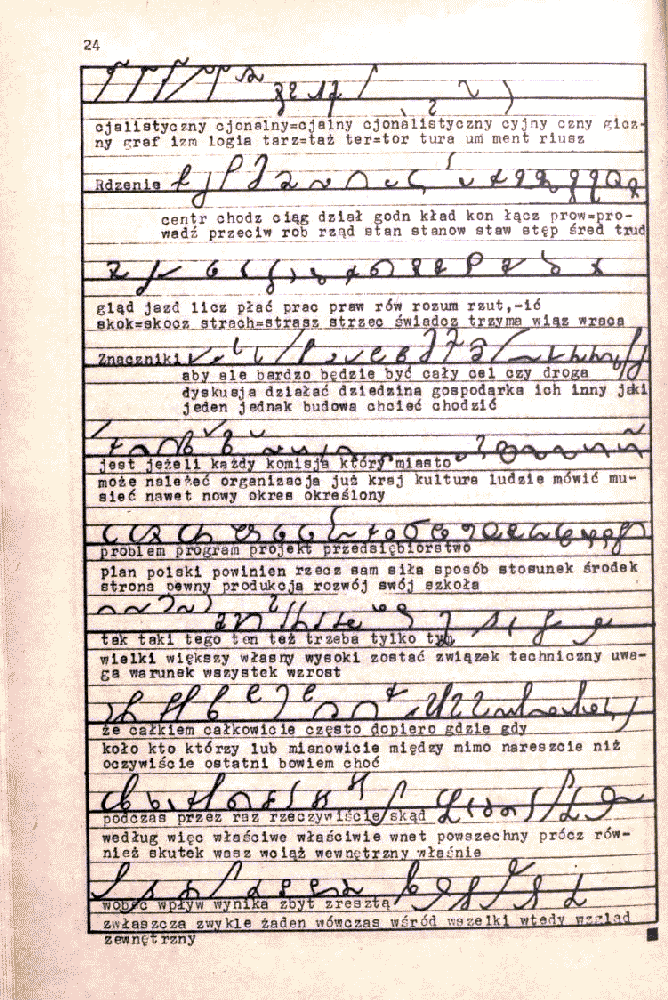

W roku (chyba) 1976 Stowarzyszenie Stenografów, Maszynistek i Sekretarek
złożyło pokłon przeszło odwiecznym staraniom swoich antenatów o
ustanowienie jednolitego i jedynego, doskonałego systemu
stenograficznego. W tym celu ogłosiło konkurs na tenże. Jeśli chcesz
wiedzieć więcej, sprawdź we wpisie z 16-go grudnia 2010.  
Poniżej prezentuję system Wieliczka.

