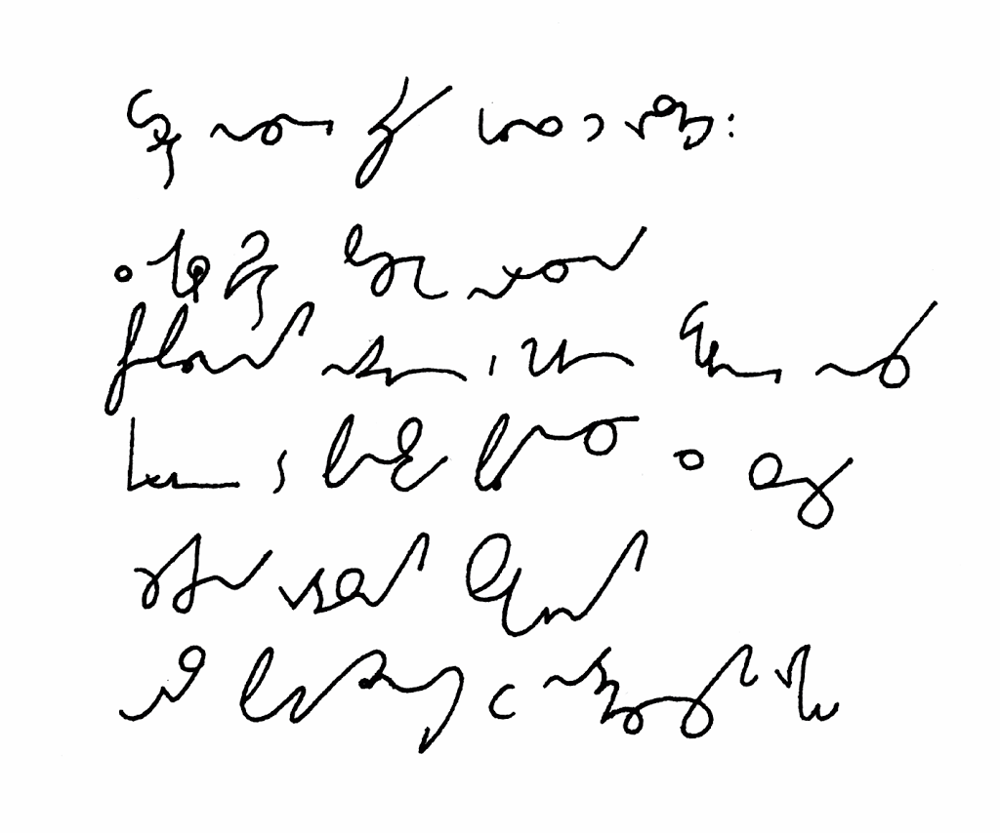

Jakież paradoksalne święto. Nie Boże Narodzenie, a Wigilia tegoż jest
dla większości z nas najważniejszym dniem w roku. Co tam wymiar
religijny, ważne są prezenty i Mikołaj, i lampki, i ten świąteczny,
pachnący choinką (tanenbaumem) nastrój.

Wśród nocnej ciszy głos się rozchodzi:

Z okazji świąt Bożego Narodzenia, przepełnionych nadzieją i magią wigilijnej nocy, kierujemy do Państwa płynące z serca życzenia radosnych, spokojnych świąt oraz pomyślności w nadchodzącym roku.

Pozostawiam więc Was przy świątecznym stole, przy którym niech
pozostanie jedno wolne nakrycie dla Samotnego Stenografa ;-)

<!-- {width="400" height="81"}]({filename}/wp-images/uploads/2010/12/Pitmans-NE-Merry-Christmas-and-Happy-New-Year-LLPS-Yellow-Teddy.gif)
  Merry Christmas and Happy New Year pisane systemem Pitmana -->
  
  