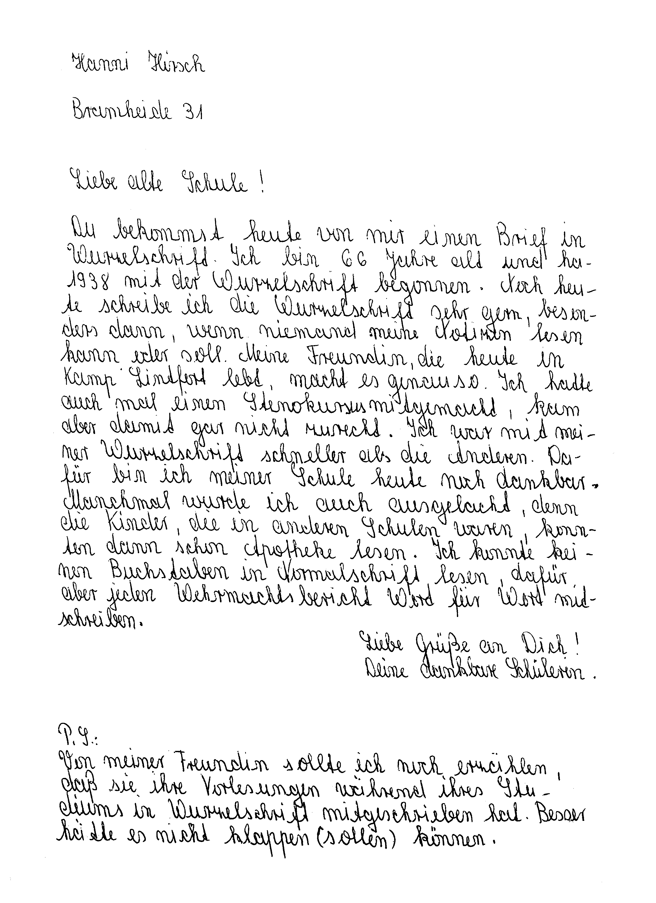

Dziś krótko. Od momentu przeczytania pierwszej wzmianki [o systemie
Kunowskiego](http://de.wikipedia.org/wiki/Felix_von_Kunowski), bez
powodzenia szukałem go po Internecie. Po prostu bałem się wchodzić na
strony niemieckie. Ale ile można siedzieć na stronach angielskich? Po
kilku miesiącach odważyłem się i znalazłem:

Prezentowany tutaj system to Wurzelschrift, abecadło nauczane
w Amtmann-Kreyenfeld-Schule w Bochum w latach 1936-1939 jako
eksperyment. Uzyskano większą prędkość opanowania alfabetu i później
pisania. Uważa się to za najprostszy kod zapisu po niemiecku. Piszę się
oczywiście od lewej do prawej, znaki łączy w słowa. Nie ma wielkich i
małych liter, znaki diakrytyczne nie są obowiązkowe, ale ułatwiają
czytanie. 
Oto przykładowe obrazki wprost ze strony
[Amtmann-Kreyenfeld-Schule](https://www.kreyenfeldschule.de/)[^1]:

[^1]: Skąd oczywiście zniknęły w potoku dziejów. Udało się je odzyskać dzięki https://web.archive.org

Ostatni niemiecki półkursywny system stenograficzny. Może ktoś spróbuje
dostosować go do języka polskiego?
