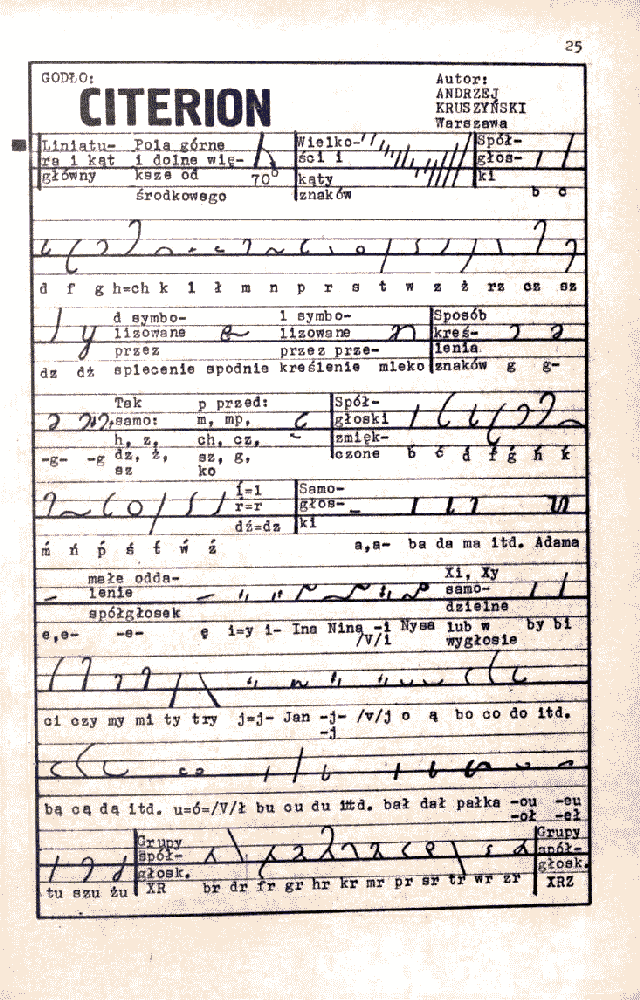
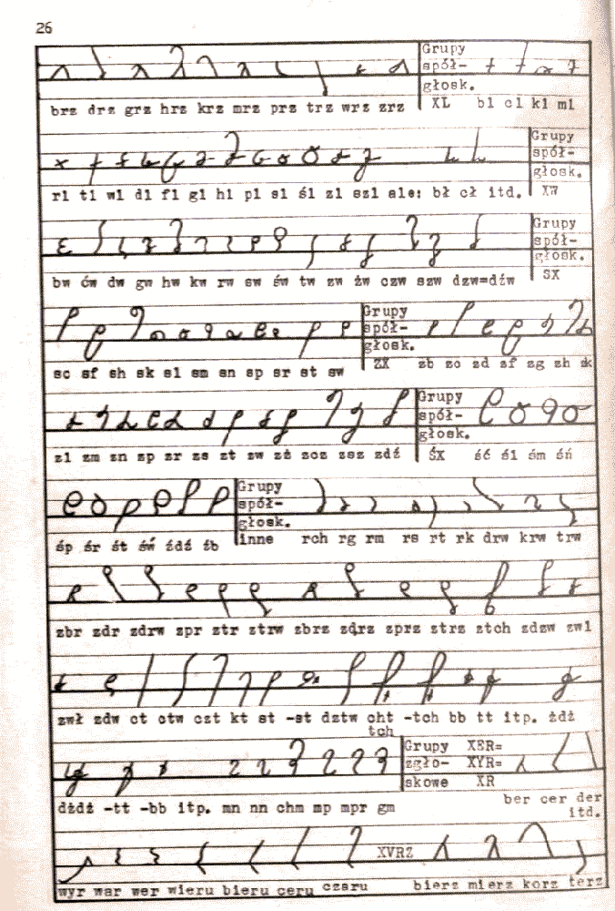
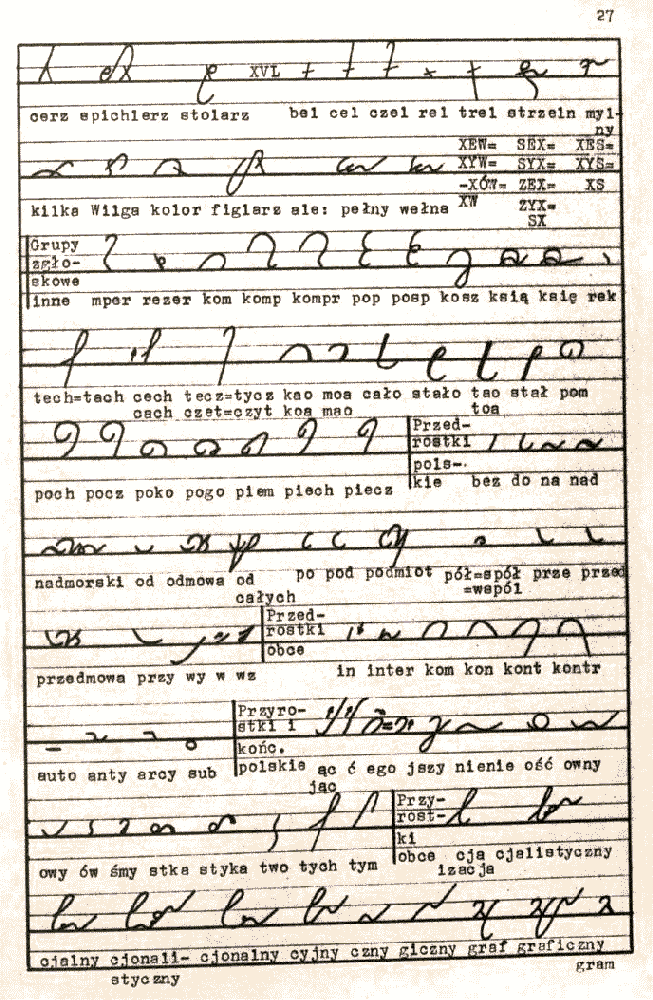
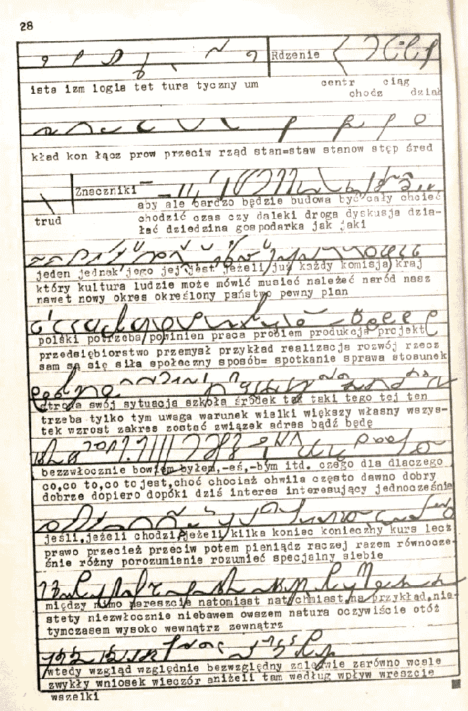

Jeśli się nie mylę, autor systemu Citerion w środowisku stenografów był
postacią ciekawą, gdyż po pierwsze nie zajmował się zawodowo
stenografowaniem, a po drugie, miał nietypowe dla reszty poglądy. Tym
bardziej interesujący dla mnie był system Citerion, szczególnie, że
autor obiecywał urzeczywistnić swoje poglądy poprzez ten projekt. W
następnej części "Konkursu" będzie można przeczytać opinię jury.

Osobiście trochę się zawiodłem na tej propozycji - jest to wyraźnie
prosty derywat starszych poprzedników, zwyczajnie, pismo dostosowane do
osobistych preferencji użytkownika.
