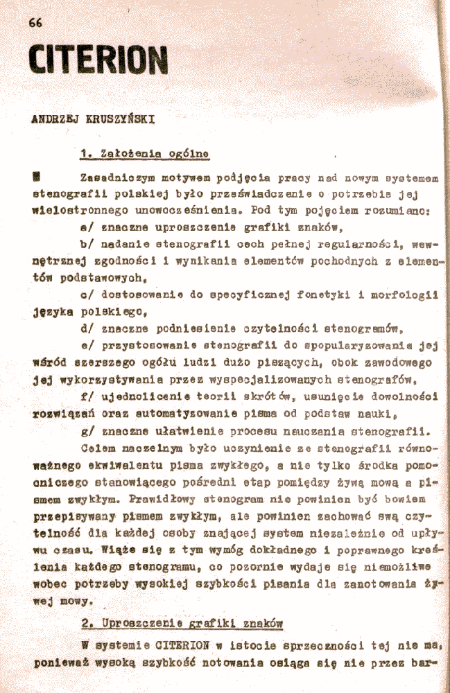
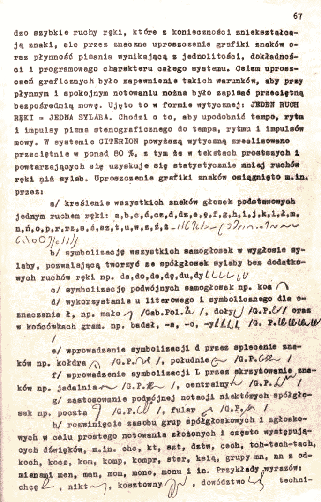
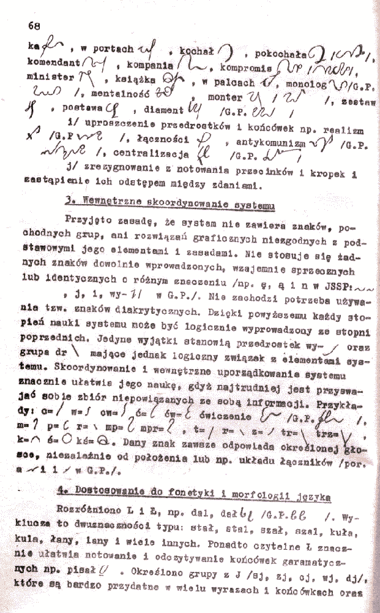
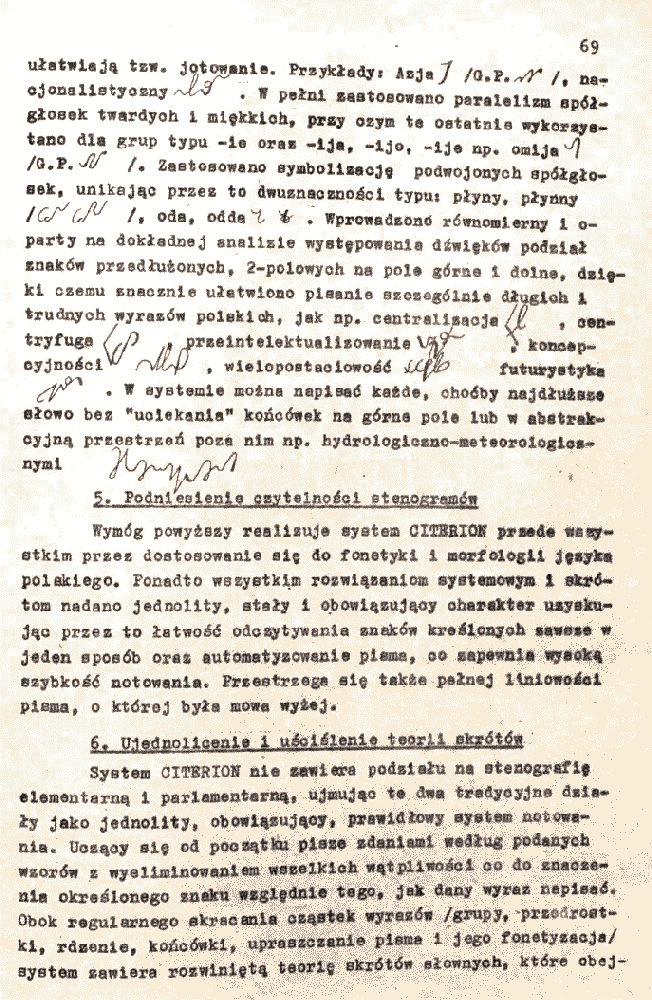
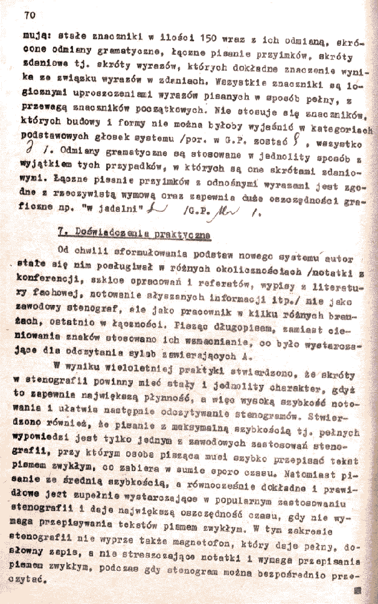
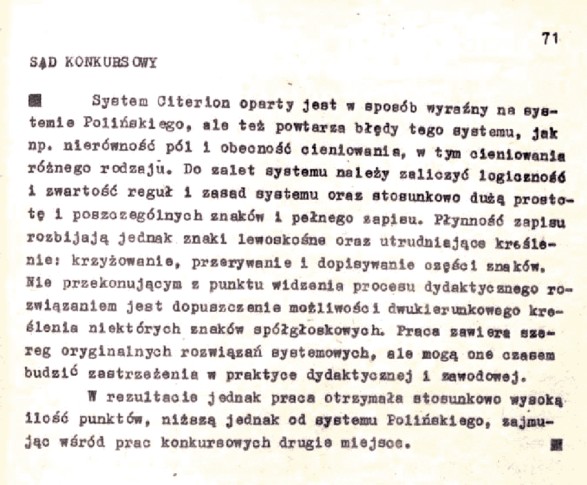

Druga część prezentacji systemu Citerion w ramach przedstawienia prac
konkursowych na nowy system stenografii, sporządzonych i przesłanych do
SSiM w 1976 roku.

I wreszcie opinia jury nt. tej pracy:

