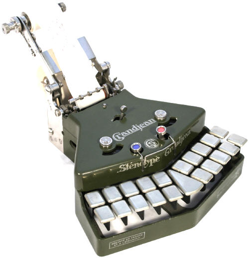
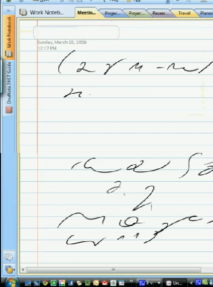

Plotka
głosi, że zaczyna się bal. Na portalach i blogach życzenia świąteczne i
noworoczne. Zatem i u nas z końcem roku pora na chwilę refleksji.

Co
się stanie ze stenografią? Czy zniknie, wyrzucona na śmietnik historii,
bezużyteczna, śmieszna umiejętność z przeszłości? Wzbudzająca nostalgię
sentymentalnych jajogłowych ze smutkiem obserwujących postęp klawiatur?

Wierzę, że tak się nie stanie. Stenografia jest sztuką, umiejętnością,
techniką liczącą sobie tyle lat, co pismo długie, bo powstała obok niego
i uzupełniała jego braki, tak jak pismo długie uzupełniało jej braki.
Życie wciąż się zmienia, a pismo pozostaje. Zmieniają się tylko
narzędzia piśmiennicze. Dlaczego miałoby być inaczej ze stenografią?

Wielu dziś nie ma nawet świadomości, że taka sztuka istnieje. Została
wyparta z zastosowań biznesowych i urzędowych. Nie ma już kursów
stenografii. Ostatni zawodowcy odchodzą na emerytury, choć nie wymyślono
jeszcze dla nich zastępstwa w pewnych niszowych zadaniach.

Można
pomyśleć, że skoro nie jest potrzebna zawodowo, może dobrze, że umrze? A
dlaczego tańce ludowe nie umarły i mają się w miarę dobrze? Dlaczego
rzeźbienie w drewnie, gra na gitarze, sztuka fechtunku mieczem nikogo
nie dziwią? Bo uważa się je za cenne umiejętności? Czy może lepiej
wymościły sobie gniazdko w ludzkiej świadomości? Czy stenografia nie
zasługuje też na swój, maleńki, kącik?

W naturze nic nie ginie, zmienia tylko formę lub przeznaczenie. Kto wie,
do czego może się w przyszłości przydać sztuka fechtunku, łucznictwo,
czy układanie bukietów? Umiejętności te przetrwają i może kiedyś
zakiełkują nowym zastosowaniem, może inspiracją dla wynalazców lub
artystów. A na razie funkcjonują obok rzeczywistości jako sztuki
wyzwolone, hobby praktykowane po godzinach.

Jeżeli już nikt nie widzi sensu w używaniu stenografii, niech przetrwa
przynajmniej jak sztuka miecza, czy malowania na szkle. 
**Niech nie zostanie zapomniana**, 
może jeszcze kiedyś się przyda, nie znamy
przyszłości.

Ocalić od zapomnienia. Po to powstała ta strona.

<!--
{width="320" height="228"}]({filename}/wp-images/uploads/2011/01/zyczenia_noworoczne.png)

  Wszystkiego najlepszego  
 z okazji Nowego Roku -->
 
 

**Tą nostalgiczną nutą składam Wam wszystkim najserdeczniejsze życzenia
Szczęśliwego Nowego Jorku numer już 2011, czyli Ostatniego Roku Przed
Końcem Świata Zdaniem Wielu Niszowych, co prawda mniej niż stenografia, Proroków.**
