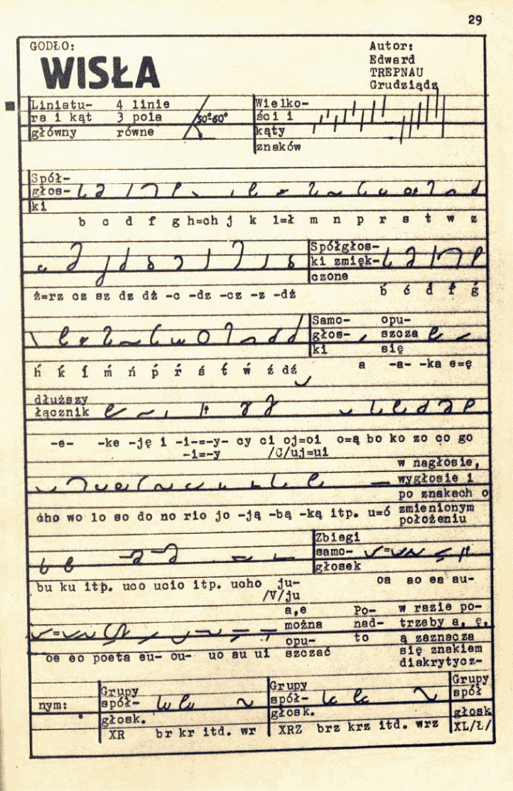
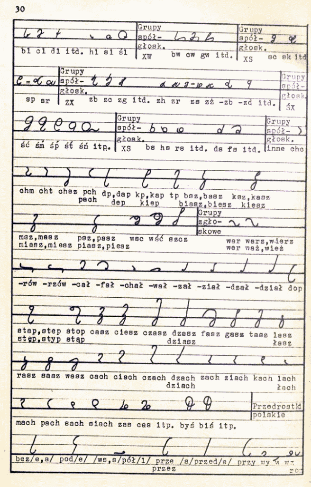
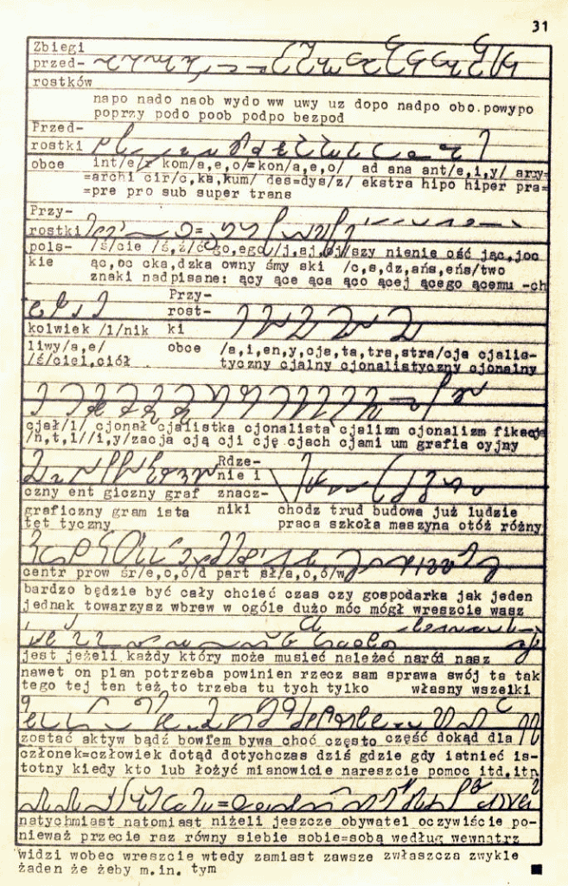

System stenograficzny złożony na konkurs autorstwa Edwarda Trepnaua -
jednego z zasłużonych w powojennej Polsce autorów podręczników i innych
opracowań z dziedziny stenografii.

W części drugiej oczywiście opis i zdanie jury konkursowego.

