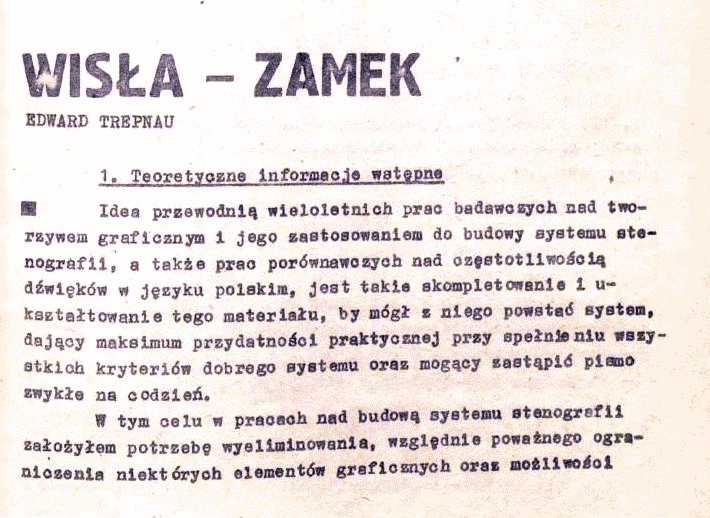
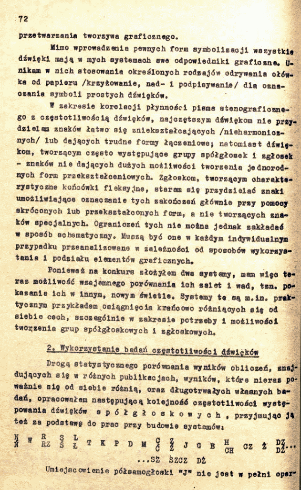
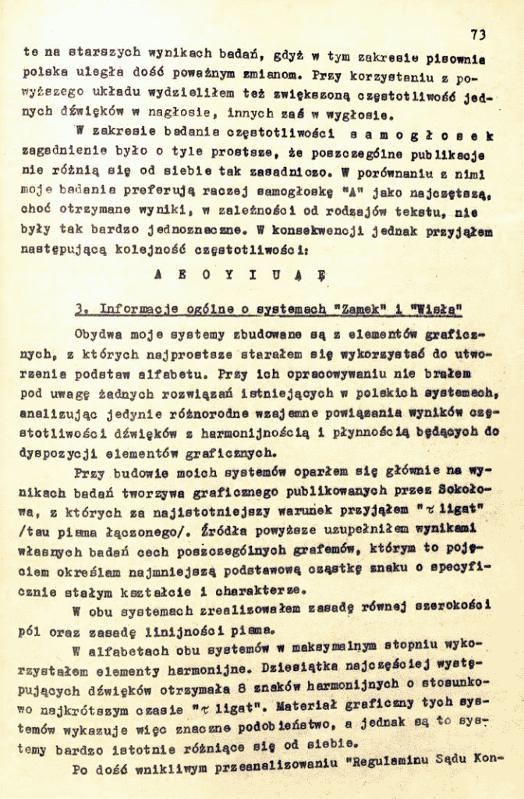
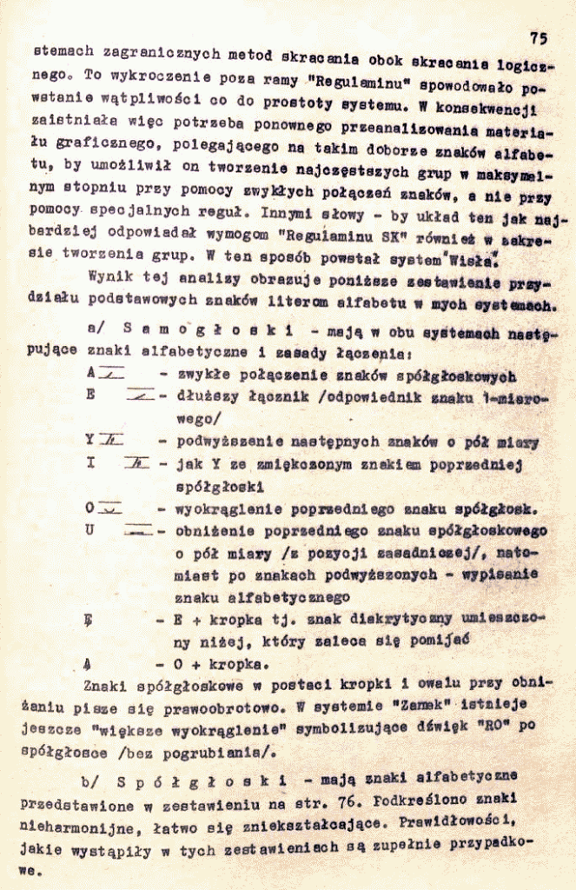
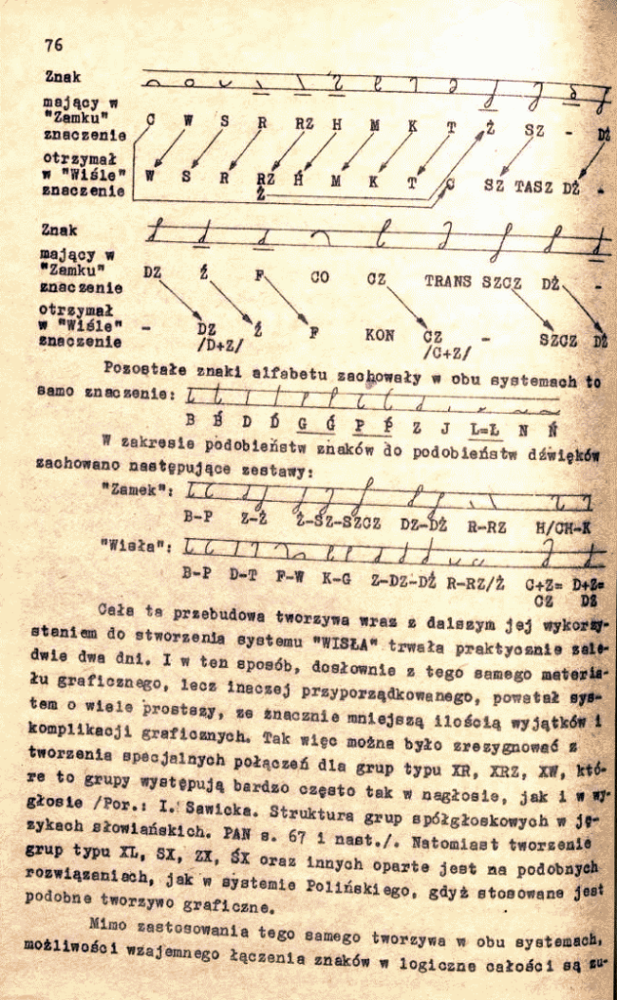
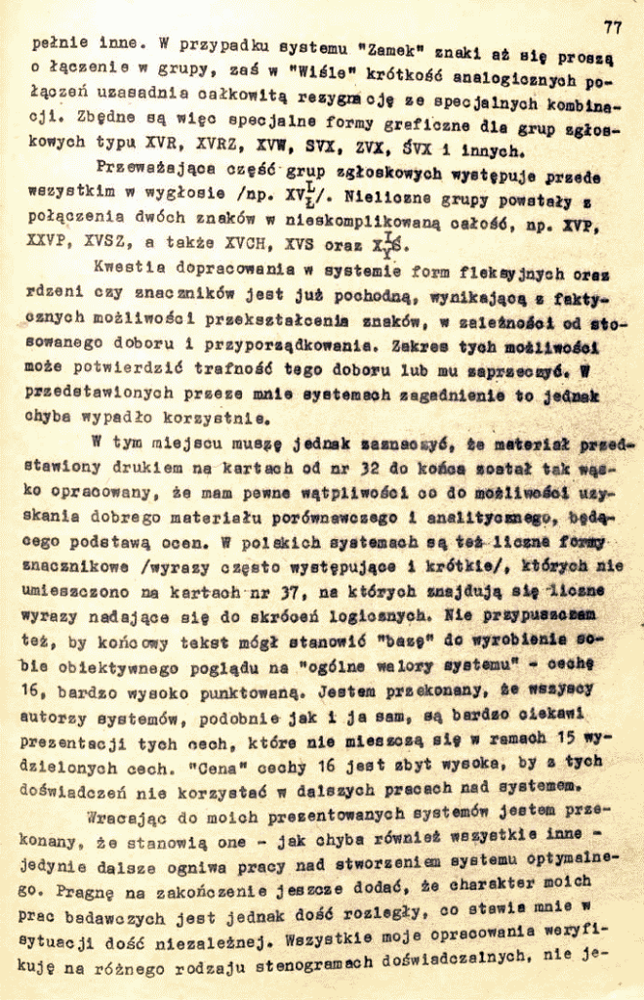
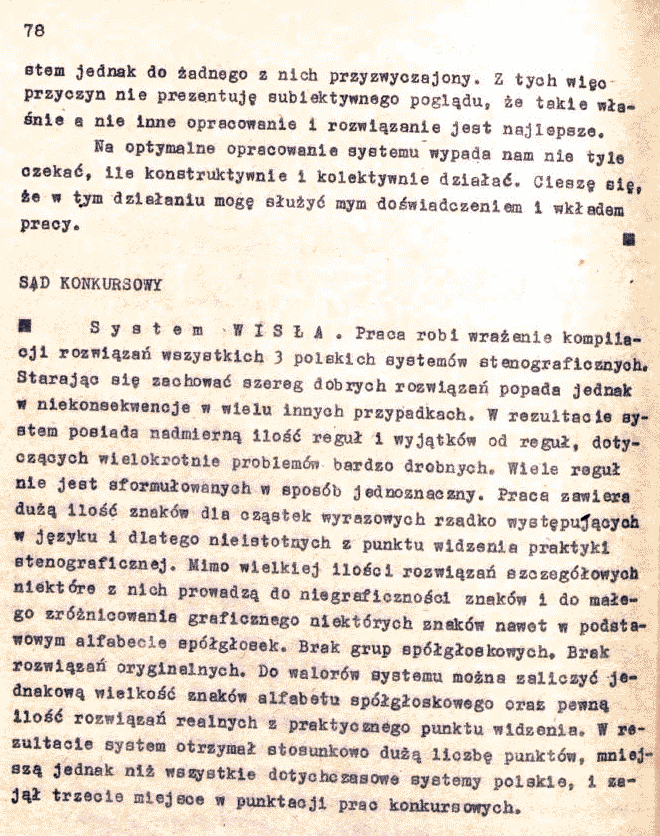

Opis systemu Wisła, połączony częściowo z systemem Zamek - Edward
Trepnau na ten konkurs złożył dwa projekty. System Zamek zostanie
zaprezentowany później.

I na końcu, jak zwykle, opinia konkursowego jury:

