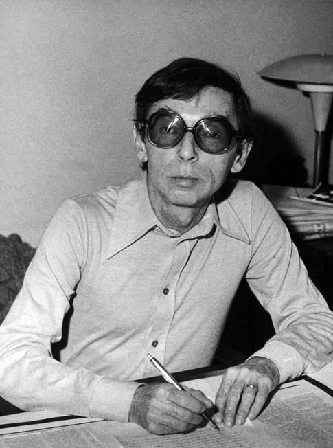

Urodził się 16 października 1923 roku we Lwowie. Przez całe swoje
zawodowe życie związany z gazetą "Dziennik Polski" z Krakowa, gdzie w
roku 1946 zaczynał karierę jako radiostenograf..

Sam o sobie: \
*po ukończeniu Instytutu Stenografii w Lublinie mogłem dostać etat w Radio-serwisie "Dziennika", a potem brać udział w konkursach krajowych i zagranicznych (Bułgaria, Niemcy, Szwajcaria), przez 17 lat "dzierżąc" tytuł mistrza Polski;*

  
  <!-- {width="320" height="248"}](sten-konkurs-55.jpg)
  Konkurs stenograficzny rok 1955 -->
  


 <!-- {width="320" height="222"}](sten-VI-og-pol-konkurs-1956.jpg)
  Konkurs stenograficzny rok 1956 -->



 <!-- {width="320" height="225"}](konfr-1959.jpg)
  Podczas stenografowania konferencji, rok 1959 -->
 



Zmarł w sobotę, 1 maja 2010 roku.
