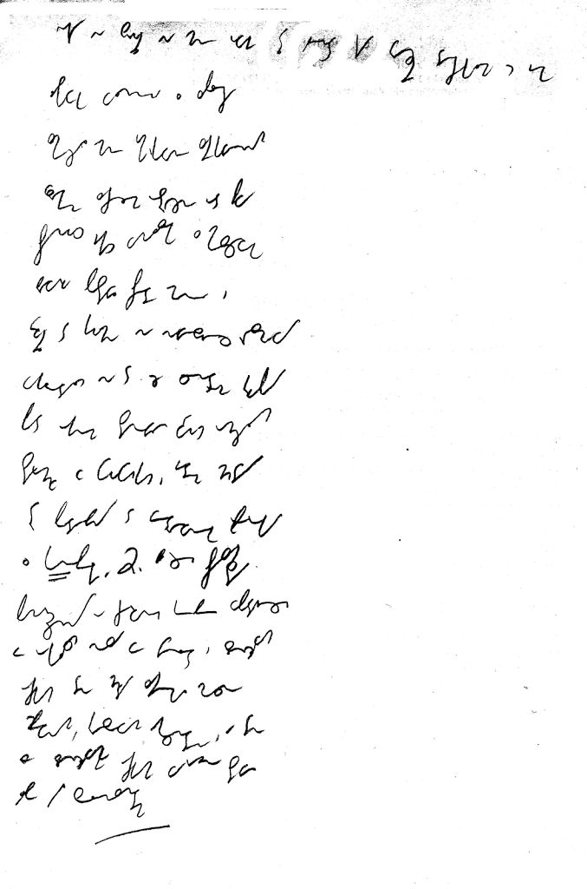

Podstawową metodą doskonalenia się w pisaniu, nie tylko stenograficznym,
jest dyktando. A to dlatego, że łączy ono w sobie wszystkie niezbędne
elementy dobrego treningu ręki i oka: odpowiedni poziom trudności,
wymuszenie prędkości (szybkość dyktowania), zaskoczenie - czyli jak w
życiu, kiedy sięgamy po pisak i papier, i nagle, niespodziewanie,
postanawiamy zrobić z siebie głupka i coś zanotować.  
I tak oto No-qanek swoją piękną dykcją i miękkim głosem nagrał krótkie
dyktando z prędkością 45spm czyli sylab na minutę. Udało mi się napisać
to już za pierwszym razem. Zwykle biegłem równo, ale w dwóch miejscach
zwolniłem i musiałem czekać, aż pojawi się jakiś popularny wyraz, żeby
nadgonić stracone 2-3 słowa. Takie opóźnienie przy tej prędkości jest
zupełnie dopuszczalne. Zawodowcy potrafili notować spóźnieni o jedno-dwa
zdania.  
Poniżej skan mojego pisania i treść dyktanda:

Jak widać, zacząłem pisać na całej szerokości kartki, później
przeszedłem na połowę szerokości - to znacznie ułatwia pisanie, bo
nadgarstek nie musi daleko podróżować. Zrobiłem to odruchowo, bo bałem
się, że nie zdążę - to pokazuje, że metoda ta nie jest tylko teoretyczną
radą, ale praktycznym, dobrym pomysłem: szybciej pisać węziej, w kilku
kolumnach, niż szeroko.

Oto treść dyktanda:

*Nikt nie
zwrócił na mnie uwagi. Tylko ajent, kiedy wreszcie doczekałem się jego
łaskawego wyłonienia z zaplecza, zmierzył mnie umiarkowanie
zaciekawionym wzrokiem. Zacząłem ostrożnie od piwa. Przyniósł jakiś
wynalazek z miejscowego browaru. Postawił przede mną i wrócił do kuchni,
nie nawiązując rozmowy. Wyglądało na to, że centrum grupy pod oknem
stanowiło dwóch omszałych staruchów w fufajkach. Jeden chudy, trochę
podobny do wędrownego proroka z "Konopielki". Drugi bardziej
przysadzisty, pomarszczony o czerwonej gębie wpadającej w okolicach nosa
we fiolet i złośliwych oczkach. Ten chudy zaciągał mocno śpiewnym,
kresowym akcentem. A ten ze złosliwymi oczkami wyraźnie stawiał albo był
solenizantem.*
