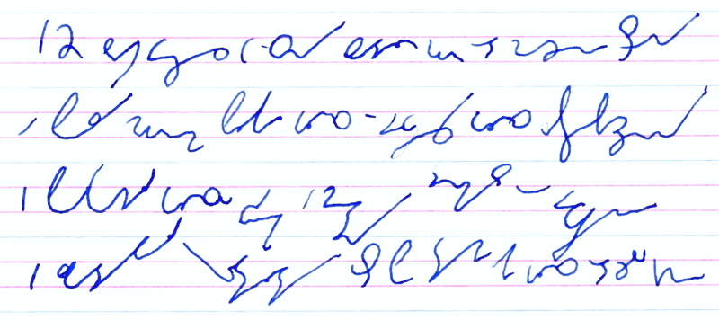

W XIX-wiecznej książce pt. "Shorthand execution" autor zwraca uwagę, że
nie ma żadnych technicznych przeszkód, by pisać tą drugą ręką. 
[Poleca nawet pisanie dwiema rękami równocześnie!](http://www.archive.org/stream/shorthandexecuti00fowliala#page/46/mode/2up) 
Zatem
spróbujmy. W moim wypadku druga ręka = prawa. Czyli jestem mańkut.
Szmaja. Lewsza. Leworęczny. Praworęczny inaczej, trzymając się
poprawności politycznej.

Tak przyszło mi do głowy napisać pierwsze wersy wiersza Bolesława
Leśmiana "Dziewczyna":

*Dwunastu braci, wierząc w sny, zbadało mur od marzeń strony \
A poza murem płakał głos, dziewczęcy głos zaprzepaszczony. \
I pokochali głosu dźwięk i chętny domysł o dziewczynie \
I zgadywali kształty ust, po tym, jak głos od żalu ginie.*

Tempo pisania na razie niewiele mniejsze niż lewą, może warto by się
uczyć równolegle obiema?
