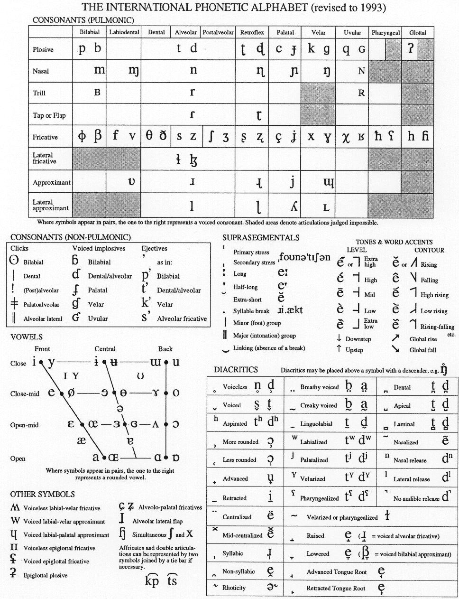

W ostatniej fazie ewolucji zmierzającej do homo sapiens modern, mózg
ludzki przechodził dynamiczne przemiany. Wraz z budową nowej jakości -
kultury - gwałtownie rosła liczba informacji do przetworzenia. Mogło to
zaowocować powtórzeniem znanego już chwytu - nadbudowaniem kory mózgowej
kolejną, nową warstwą. Jednak zmiany zachodziły o wiele szybciej niż
możliwości ewolucji genetycznej, zatem rozwiązaniem problemu musiały
zająć się już istniejące neurony.

Istnienie dwóch półkul mózgowych nie jest niczym nowym w świecie
zwierząt - nietypowe dla człowieka jest posiadanie nadzwyczaj
rozbudowanej kory oraz potężnego połączenia między półkulami.
Specjalizacja półkul mózgowych pozwoliła na zwiększenie zdolności
przetwarzania abstrakcyjnych informacji w nowym środowisku, już
niezupełnie naturalnym, a kulturowym, gdzie dwunożne zwierzę staje się
człowiekiem przez zdolność do posługiwania się rozlicznymi narzędziami,
posiadanie samoświadomości, zdolności do autorefleksji, samokontroli i
samoregulacji, wreszcie opanowania mowy oraz mnóstwa innych metod
wymiany informacji pomiędzy jednostkami.

Wynalazek mowy wprowadził do ludzkiego umysłu nową jakość. Nie tylko
możliwość komunikacji z innymi, ale też z samym sobą. Kot nie może
kontrolować swoich uczuć, ponieważ ich nie nazywa, a zatem nie są dla
niego rzeczą, którą może się posłużyć. Pojawienie się emocji jest
równoważne z podniesieniem ogona, czy też nastroszeniem sierści.
Człowiek nie tylko może kontrolować reakcje swojego ciała, ale poprzez
niesamowity interfejs, wywoływać je pozornie z niczego. Tym punktem
wejścia-wyjścia jest słowo (wyrażenie).

Mowa składająca się z dźwięków przekładających się na pojęcia jest
bardzo wygodną metodą zarządzania wewnętrzną i zewnętrzną informacją. A
jej wyższym poziomem, w którym zastosowanie symbolu ma jeszcze większe
znaczenie, jest - pismo. W świecie komputerów można je porównać do
wynalazku pamięci nieulotnej o szybkim czasie odczytu - niewielka
prędkość zapisu pierwotnie nie miała wielkiego znaczenia wobec
rewolucji, jaką była możność wielokrotnego dostępu do raz zapisanych
danych bez korzystania z pomocy żywego nośnika - człowieka -
gawędziarza. Informacja zapisana może być przechowywana w dużych
ilościach, przez bardzo długi czas (nie raz dłuższy niż kultura, która
dokonała zapisu).

Stąd ze wszech miar uzasadnione będzie użycie pojęcia języka pisanego
dla wszelkich form utrwalania informacji przy pomocy pisma, szczególnie,
że nie wszędzie na świecie język pisany stanowi zwierciadlane odbicie
języka mówionego.

Z jednej strony mowa, niczym z atomów, składa się z dźwięków - fonemów,
składanych w głoski, zgłoski, słowa. Z drugiej strony mowa jest przecież
nośnikiem pojęć, które te dźwięki kodują. Język pisany, jako nowy sposób
kodowania, może zostać utworzony zatem jako pochodna fonemów, lub pojęć.
Historia pokazuje, że ta druga metoda jest pierwotna, zaś kodowanie
pismem fonetycznym stanowi wtórne, nowocześniejsze podejście do języka
pisanego.

U Europejczyków funkcje związane z mówieniem, czytaniem i pisaniem
ulokowane są w lewej półkuli mózgowej. Przeciwnie u Azjatów z Dalekiego
Wschodu, którzy pismo, czytanie i mówienie mają w półkuli prawej.
Zostało to potwierdzone w raportach lekarzy wojskowych, którzy
stwierdzili, że Azjata z uszkodzoną lewą półkulą mózgu nie traci
zdolności komunikacyjnych, w przeciwieństwie do Europejczyka. I
odwrotnie, uszkodzenie prawej półkuli bardziej szkodzi Azjacie. Ot,
ciekawostka. Czyżby położenie funkcji komunikatywnych zależało od
przyjętego w narodzie alfabetu? Czym wytłumaczyć taką różnicę? Nie
prowadzę jednakowoż stron o neurologii, więc nie tym tutaj się będziemy
zajmować.

Rzeczywiście, jedyną nie-wspólną cechą systemów komunikacyjnych kultury
europejskiej i z Dalekiego Wschodu jest pismo: u nas posługujemy się
alfabetami, czyli odtwarzamy dźwięki, oni używają pochodnej pisma
obrazkowego i zapisują pojęcia. Czyli pisanie alfabetyczne lokalizuje
mowę, komunikację, pamięć w lewej półkuli, a hieroglificzne - w prawej.
Czy wpływa to też na sposób myślenia (Europejczycy myśleliby wtedy
pojęciami i schematami, Azjaci obrazami)?

Alfabety dźwiękoodwórcze (czyli tutejsze) wyewoluowały z hieroglifów
egipskiego pisma: alfabety fenickie, greckie, hebrajskie, od których
narodziło się mnóstwo pochodnych, aż do dzisiejszych czasów. Odtwarzanie
brzmienia mowy stało się wskazówką dla przyszłych twórców systemów
stenograficznych - osiągnąć prędkość artykulacji języka pisanego równą
językowi mówionemu. Konwersja audio-video. Jak to zrobić? Przez symbole
pojęciowe. Z lewej półkuli do prawej. Z powrotem z sekwencyjnego zapisu
mowy do pojęciowego - podstawą szybkiej stenografii są symboliczne
znaczniki zastępujące pojęcia, a pismo szybkie, dźwiękoodtwórcze
uzupełnia zapis o słowa rzadziej spotykane. W ten sposób mamy połączone
względną łatwość uczenia się pisma z wielką jego prędkością. Odczyt
znaków symbolicznych, dla kogoś, kto dobrze je opanował, jest prosty i
szybki, a jednocześnie pozbawiony wątpliwości.

Wynikałoby z powyższych swobodnych rozważań, że stenografia jest
szczytowym połączeniem znanych technik pisania, znacznie przewyższającym
zarówno pismo ideograficzne z Dalekiego Wschodu, jak i abecadła basenu
Morza Śródziemnego. Nic, tylko z mnóstwa dostępnych systemów wybrać ten
możliwie uniwersalny (lub zapewnić jego uniwersalność innymi metodami,
podobnie jak od niedawna dzieje się to z alfabetem łacińskim -&gt; patrz
np. pismo IPA) i dokonać rewolucji.

Oczywiście, dziś to już (jeszcze?) niemożliwe. W modę weszły komputery,
urządzenia klikane i stukane, znaki alfabetyczne dostajemy w formie
czcionek, których kształt nie budzi żadnych wątpliwości. Na razie
obserwujemy zmierzch pisma odręcznego. Z drugiej strony, alfabet
łaciński zdobywa sobie kolejne przyczółki - każdy wykształcony człowiek
na całym świecie winien znać przynajmniej jego zakres objęty tablicą
ASCII. A w większości języków opracowano "ortografię" pisania literami
ASCII, co samo w sobie stanowi przyczynek do uniwersalnej stenografii
maszynowej.

Jak to będzie, zobaczymy. Skoro już mowa była o mózgu, jego półkulach i
piśmie, na koniec warto zamieścić wzmiankę, którą rozwinę w innych
artykułach:

W USA przeprowadzono badanie na milionach maturzystów. Okazało się, że
ci, którzy nie zapomnieli, jak się pisze odręcznie, otrzymywali wyższe
noty z wypracowań na egzaminie maturalnym, zwrócono uwagę na lepszą
logikę wywodu, słownictwo, stylistykę i poprawność zapisu. Młodzież
wytresowana już tylko do klikania, na pisemnym wypracowaniu posługiwała
się literami "drukowanymi" i wyraźnie uzyskiwała gorsze wyniki. Bardziej
szczegółowo na ten temat w innym artykule.

Pa.
