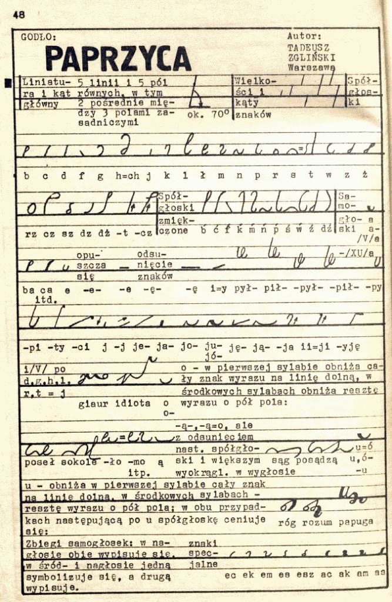
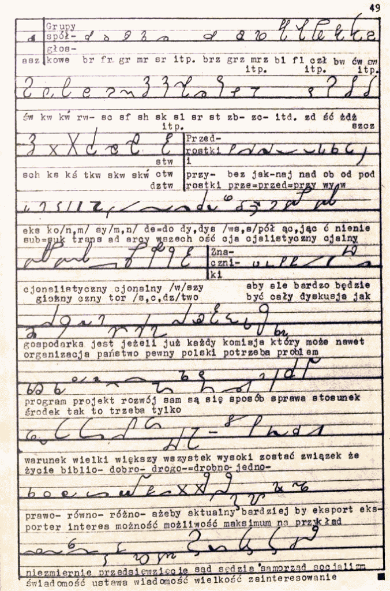
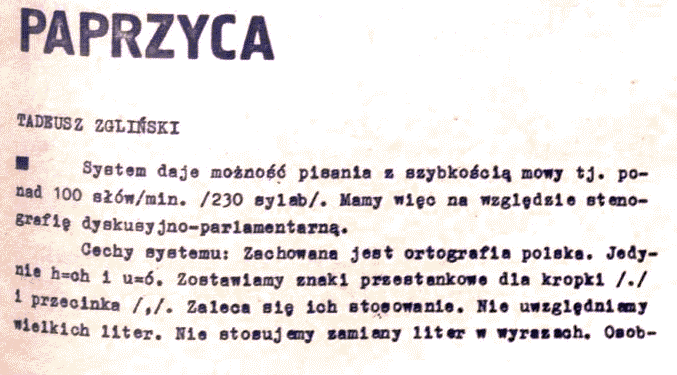
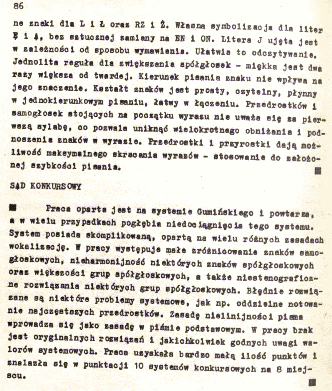

Dziś, proszę wycieczki, prezentujemy system wybitnego działacza ruchu
stenograficznego w Polsce przed- i powojennej, Tadeusza Zglińskiego -
voila, system Paprzyca:

Ponieważ i ten autor nie miał wiele do powiedzenia o swoim systemie,
całość materiałów prezentuję w jednym wpisie.

Powyższa ocena jury konkursowego, aczkolwiek zapewne uzasadniona,
pokazuje, że sędziowie mieli ustalone poglądy, jak powinien wyglądać
idealny polski system stenograficzny: zapewne miał być udoskonaloną
wersją systemu Polińskiego, ewentualnie miał ich zaskoczyć czymś
zupełnie nowym.

Długo nad tym myślałem i wymyśliłem: dlatego właśnie
[Gabelsberger](https://en.wikipedia.org/wiki/Franz_Xaver_Gabelsberger)
był geniuszem, bo zaproponował coś zupełnie nowego. Pozostali to
naśladowcy, epigoni, choć ich systemy nie powtarzały jego błędów. Ale
bazowały na jego podstawowym odkryciu.

Takoż i powyżej, mamy system propagatora stenografii, który czynił to
przez lat wiele, ze szczególnym naciskiem na system Gumińskiego, którego
się był wyuczył i którego nauczał. Zatem i swój projekt oparł na tym, co
znał najlepiej. Jednocześnie, widząc swoją własną rękę zasuwającą po
papierze z naddźwiękową prędkością, miał zapewne poważną trudność z
wyobrażeniem sobie dla niej jakiejś zupełnie innej, nowatorskiej trasy.
Skoro teraz już pięknie zasuwa, po co to zmieniać?

