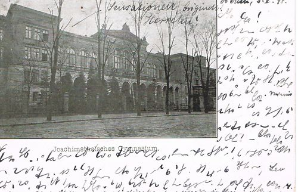
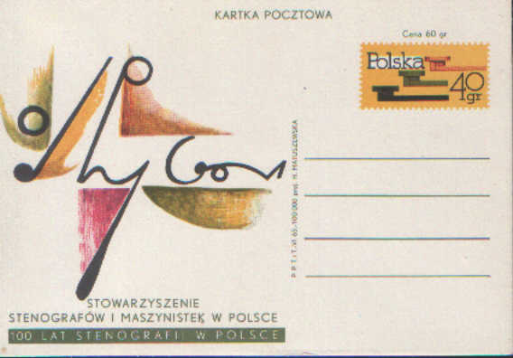

A tajemnic na każdym kroku tyle czeka, że nic, tylko się potykać. Ot,
ledwo opublikowałem tekst o jednej kartce, a już na e-baju natknąłem się
na następną, może kiedyś nawet uda się ją odszyfrować?

Z kartek po polsku na razie trafiłem tylko na taką:

Jej treść jest łatwa do odszyfrowania: "100 lat stenografii polskiej" -
karteczka rocznicowa.

Sezamie! Otwórz się!