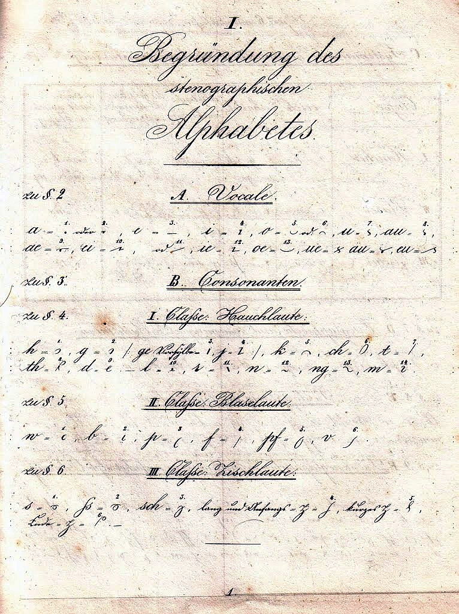
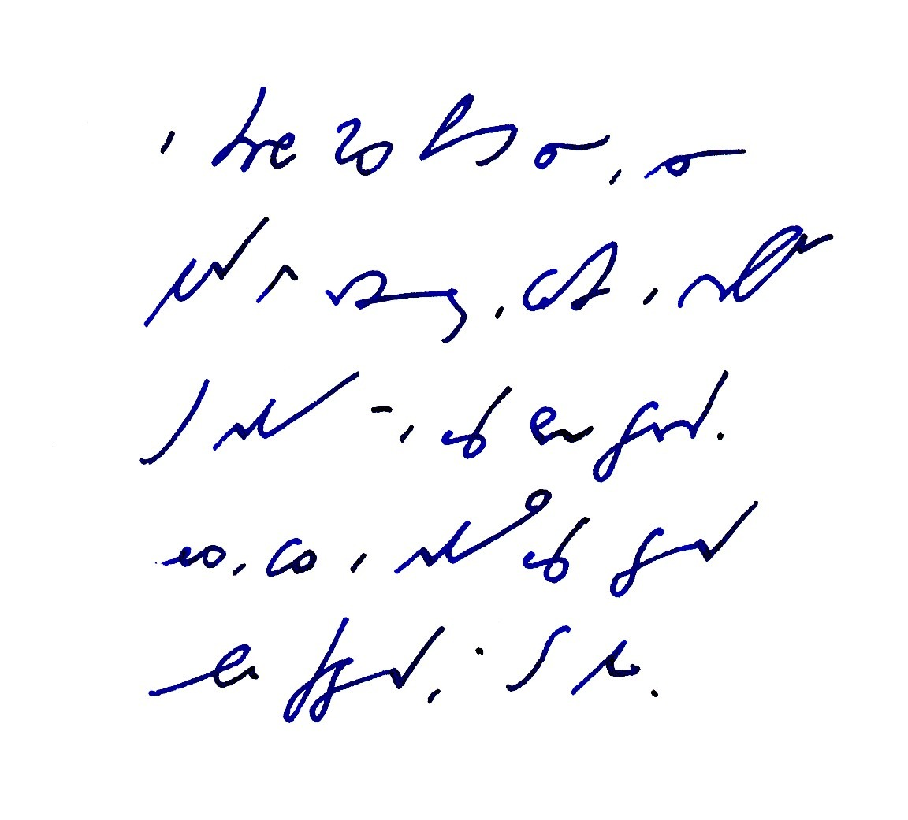
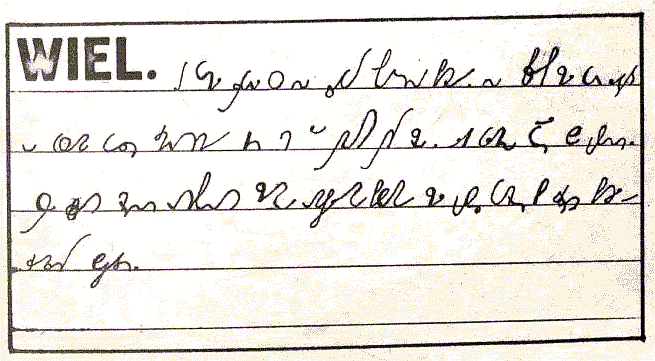

Kilka słów na koniec prezentacji prac konkursowych sprzed lat bez mała
czterdziestu...

Najpierw dygresja: Gabelsberger opublikował swój **Anleitung zur
deutschen Redezeichenkunst oder Stenographie** w roku 1834. Poliński
pierwszą wersję swojego systemu, będącego adaptacją reguł i wielu
gotowych elementów systemu Gabelsbergera - w roku 1861. A zatem raptem
27 lat później. Biorąc poprawkę na ówczesne tempo rozchodzenia się
informacji, można przyjąć, że polski system opóźnił się o dekadę
względem pierwowzoru. Tymczasem ja prezentuję Państwu materiały odległe
od nas o bez mała dwa pokolenia. Czy nie zmieniło się więcej w naszym
życiu, technologii, metodach obróbki informacji, podejściu do tegoż? Z
pewnością. Minęły całe epoki. Koniec tej dygresji.

Można było zauważyć, że prezentowane systemy rzeczywiście przedstawiały
bardzo różny poziom, niektóre były wręcz śmieszne. Zastanawiające.
Drugie spostrzeżenie, to fakt, że autorzy niezbyt daleko odbiegali od
swoich pierwowzorów, których wpływ był wyraźnie widoczny. Złożyłbym to
na karb faktu, iż byli to praktyczni stenografowie, dobrze wyuczeni
swoich systemów, a zatem przekonani o ich wyższości, skoro sprawdzonej w
praktyce. W rzeczywistości prezentowali tylko swoje własne "ulepszenia",
które zapewne już od jakiegoś czasu stosowali na własny użytek, bo tak
im było łatwiej, prościej, bo ja wiem?

Poza systemami Ryszarda Trepnaua (Kopernik, Znak), czy też Andrzeja
Kruszyńskiego (Citerion), nie było tam dokonań innych zainteresowanych
teorią i naukowym podejściem do stenografii. Prace pozostałych to prace
praktyków.

Przeważały systemy, w których nie usunięto cieniowania, jeżeli
cieniowanie występowało w pierwowzorze, ani pozycyjności, takoż.

W większości propozycji nie znać było poszukiwania jednolitego obrazu
znaków oddającego powiązania pomiędzy nimi, a zatem podobieństwo
dźwięcznych do bezdźwięcznych, miękkich do twardych, szczelinowych do
wybuchowych itp., co przecież znacznie ułatwiłoby naukę tak wielu
znaków. Jednocześnie większość propozycji miała wiele znaków mało
zróżnicowanych, wymagających chirurgicznej precyzji podczas pisania.

  
  
  TRANSKRYPCJA ([system Wieliczka]../2010-12-20_konkurs-na-system-stenografii-cz-1-wieliczka-cz-1/)): Wielki portal wspierał się na słupach z czerwonej cegły. Naszczycie stała para lwów o psim pysku, z terakoty, jak to było w modzie w tych stronach. Aleja platanów prowadziła do budynku. W środku dużego trawnika otoczonego starymi, omszałymi cedrami stała budowla piętrowa, cała z różowych cegieł i rzymskich dachówek.
 

Choć jury konkursowe wypowiedziało się dość surowo o większości prac,
muszę się zgodzić z ich werdyktem - te projekty nie miały szansy
zastąpić już istniejących, których główną i niezbywalną przewagą były
używalność i popularność.

Ot, tyle.
