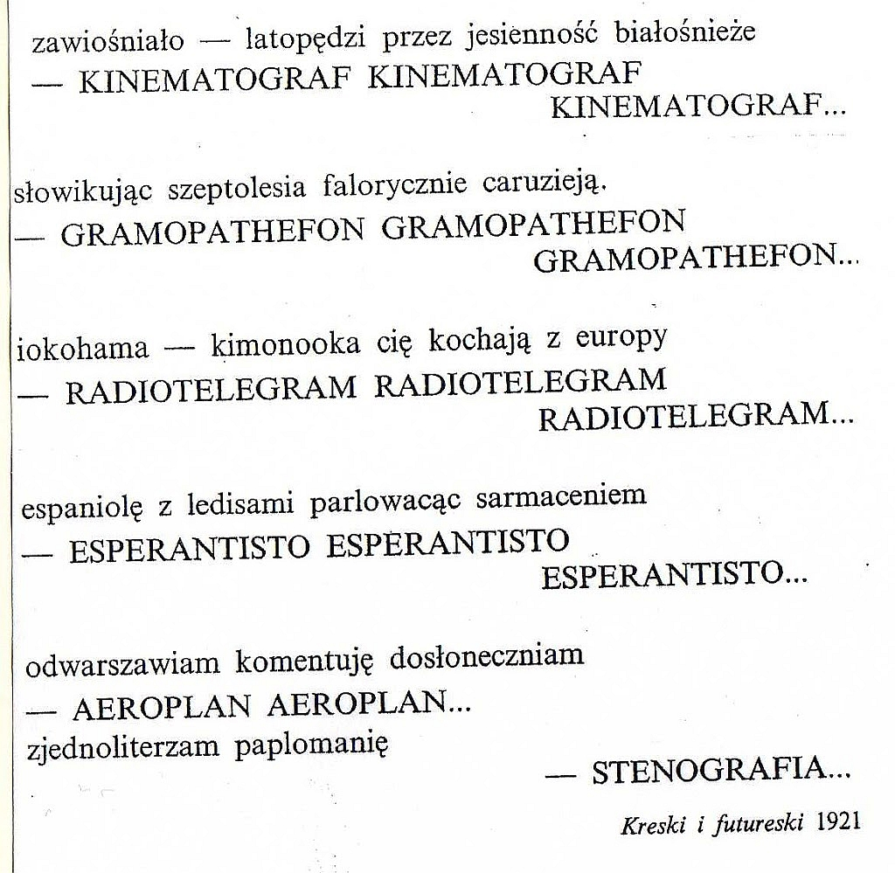

Kiedyś tam, w pierwszej połowie XX wieku, byli sobie futuryści. A oto,
co przesłał mi No-qanek, co postaram się przedstawić w formie strawnej
opowiastki:

<!--

**Stanisław
Młodożeniec**  
-->



„XX wiek”   
  
zawiośniało - latopędzi przez jesienność białośnieże \
- KINEMATOGRAF KINEMATOGRAF \
KINEMATOGRAF... \
słowikując szeptolesia falorycznie caruzieją \
- GRAMOPATHEFON GRAMOPATHEFON \
GRAMOPATHEFON... \
iokohama - kimonooka cię kochają z europy \
- RADIOTELEGRAM RADIOTELEGRAM \
RADIOTELEGRAM... \
espaniolę z lejdisami parlowacąc sarmaceniem \
- ESPERANTISTO ESPERANTISTO \
ESPERANTISTO... \
  
odwarszawiam komentuję dosłoneczniam \
- AEROPLAN AEROPLAN... \
**zjednoliterzam paplomanię \
- STENOGRAFIA...** 

[Cyprian Kamil Norwid pozwolił sobie rzucić cytatem](http://pl.wikisource.org/wiki/Zwolon): 

***Sztuka stenografii... Czasowi kradnie myśli upuszczanych złoto. ***
  
Ale to był staroć. Dziadek. Zgred. Oto myśl świeża jak białe kłęby
benzyny auta pędzącego z furkotem szala po damskie milieu zajęte
dyskusją o sztuce z butem w butonierce...

**Zjednoliterzam paplomanię - stenografia.**

Najkrótsze możliwe ujęcie podstawowego, technicznego sensu stenografii.
Jak najmniejszą liczbą znaków ująć myśl, nieraz długą i skomplikowaną.
Zrozumieć swój język ojczysty, jego brzmienie, poddać obróbce, znaleźć
taki kod, który sprawi nam możliwie największą przyjemność podczas
pisania.

A dalsza część tej opowieści w następnym wpisie.
