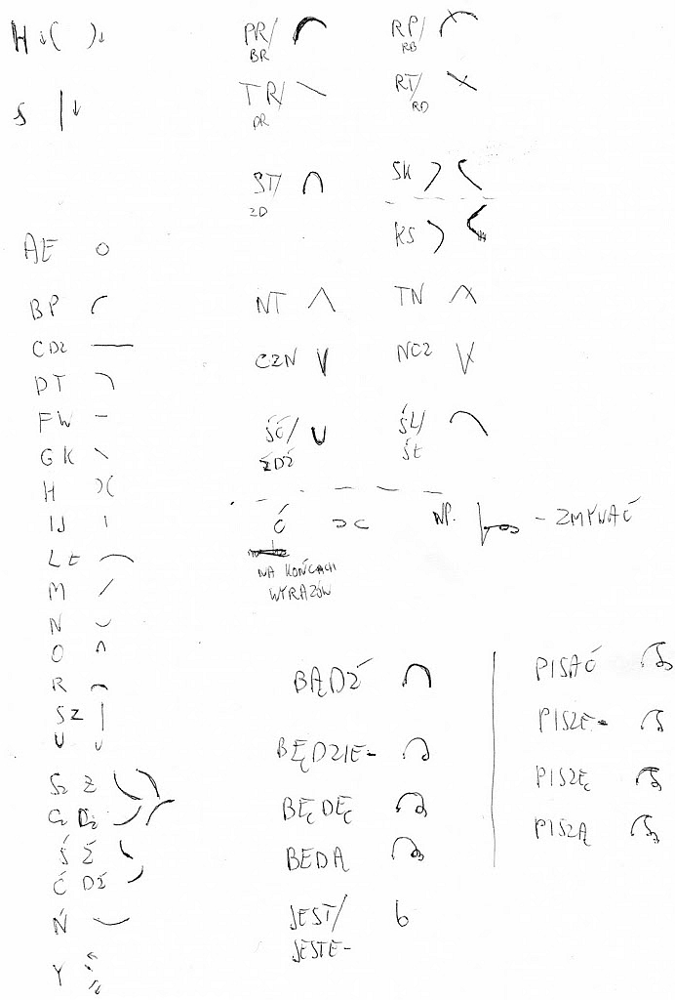

No-qanek nie skończył na prostej prezentacji wiersza Młodożeńca. Oto
aktywnie zaprezentował stenografię na bodaj najszerszym forum od wielu
lat (piszę nie bez kozery, sam wygłosiłem dotychczas dwie prelekcje, na
jedną przyszło osób 7, na drugą chyba 12, z czego 4 urwały się po
pierwszych słowach). A oto, co mi opowiedział:

> Przy interpretacji wiersza [^1] zostałem wywołany do tablicy, jako ten co stenografią umie się posługiwać, żeby rzucić światło na tę tajemniczą sztukę. 
> Napisałem wielkie "*Oto przykładowy zapis stenograficzny*" (wielkość trochę przyćmiła istotę stenografii, bo jedno zdanie zajęło pół tablicy :P).
> Ludzie uznali, że w ogóle nie mogą znaleźć miejsca zaczepienia, więc
wyjaśniłem każdą literkę i złożenie po kolei, widać idea "jeden znak -
jeden ruch" okazała się całkiem niespodziewaną ;-) 
> A przy okazji wyjaśniania (wodziłem kredą po gotowym napisie i odczytywałem litery) zasłyszałem wyrażone z zadziwieniem budujące stwierdzenie, że piszę, jak mówię (w sensie tempa). \
> Miło jest przedstawiać ludziom wdzięki stenografii :)

Zgadzam się. Miło jest.

A oto system, jakim No-qanek posłużył się pisząc wyżej wzmiankowane
zdanie na tablicy:

[^1]: [Młodożeńca pt. "XX wiek"](../2011-02-11_paplomania/), przyp. aut.