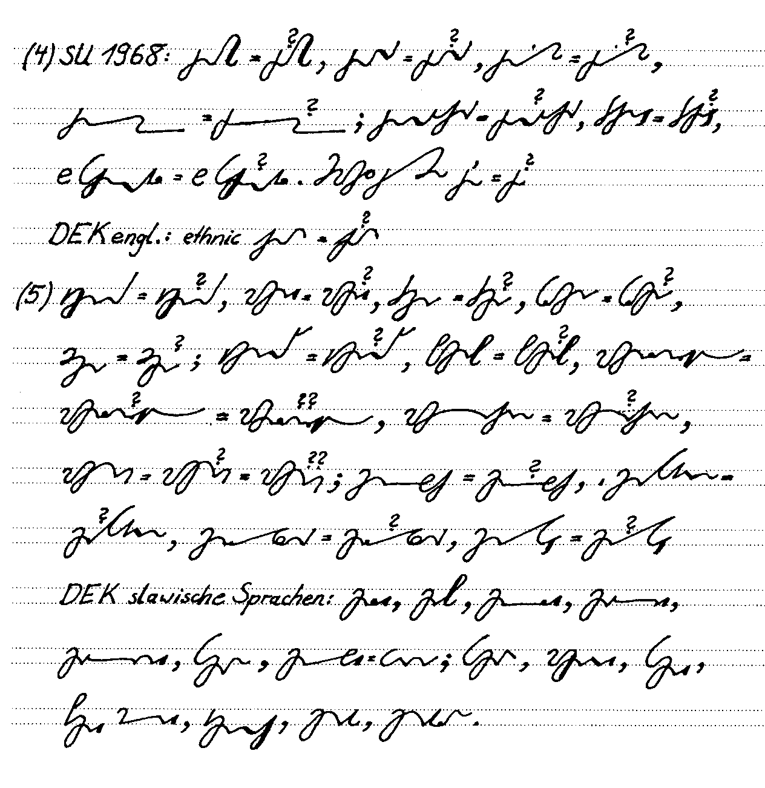
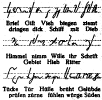
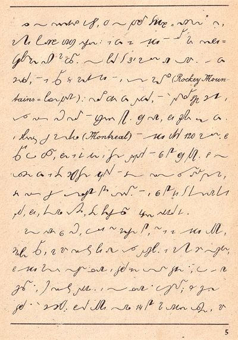

Podczas moich prywatnych studiów i poszukiwań związanych z szeroko
rozumianą stenografią i szybkopisaniem przewertowałem być może już setki
obcojęzycznych podręczników i dziesiątki polskich. Niektóre
przestudiowałem uważniej. Jedną ze wspólnych cech niemal wszystkich
(których to nie dotyczy, powiem może później) tych książek są obietnice
typu gruszki na wierzbie ich autorów. Otóż zaklinają się oni, że
stenografii można nauczyć się już w kilka godzin (o tak!)! Biegłość w
tydzień, mistrzostwo w miesiąc. Słodkie marzenia uciętej... ręki.

Nie ma lekko. Sam może nie jestem dobrym przykładem, bo jednocześnie
uczę się i tworzę system, więc zakładam, że idzie mi znacznie wolniej,
niż gdybym podążał dobrze wybrukowaną ścieżką, którą przede mną
wypróbowali niezliczeni mistrzowie... Co z tego, kiedy i tak pewne
rzeczy dostrzegam, a o jednej z nich właśnie tu chcę powiedzieć:

Szybkie pisanie nie wydarzy się szybciej niż nasz umysł zaakceptuje
fakt, że szybko piszemy.

Innymi słowy, w pewnym momencie, np. kiedy piszę zdanie składające się z
samych prostych skrótów (np. To gdzie oni są?), nagle czuję, że nie mam
o czym pisać. Wszystko, co przed chwilą wyprodukował umysł, już
przeniosło się na papier, a następna porcja jeszcze się nie pojawiła.
Cóż w głowie wykonujemy mnóstwo różnych czynności, nie tylko myślimy w
danym momencie, co napisać. Kontrolujemy też tekst już napisany, żeby
daleko nie szukać (dlatego tak ważne jest czytanie wszystkiego, co
napisaliśmy, umiejętność czytania nie może być gorzej rozwinięta niż
pisania).

Konkludując, choćbym posiadł wielką wprawę w stenografowaniu, mój umysł
musi odnaleźć w sobie to samo, co już umie, kiedy klepię w klawiaturę:
szybkie myślenie nad tekstemi. Żeby szybko pisać, przedtem trzeba szybko
myśleć.

(Albo pozostanie nam szybkie zapisywanie cudzych myśli.)