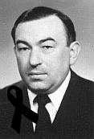

Za Wikipedią: 

Władysław Szostak (ur. 6 kwietnia 1943, zm. 6 czerwca 2010) – polski
politolog i prawnik, profesor zwyczajny, doktor habilitowany, nauczyciel
akademicki.

Za jego stroną (zdjęcie kopiuję, nie linkuję):

Był stenografem konferencyjnym od 1967 roku, dyplomowanym nauczycielem
stenografii od roku 1974. Nauczał stenografii oraz technik biurowych na
różnych kursach przez 30 lat, przez 4 lata był lektorem stenografii na
Uniwersytecie Jagiellońskim (lata 1977/78 - 1986/87). Poza praktyką
stenograficzną interesował się się także systemami stenograficznymi,
fonotypią oraz komputerowym redagowaniem tekstu. Był członkiem Komisji
Systemowej Zarządu Głównego Sto­wa­rzyszenia Stenografów Maszynistek i
Sekretarek (do spraw systemów stenograficznych) latach 1973-83. Był
także Przewod­niczącym Komisji ds. Kształcenia i Wydawnictw ZG SSMiS i
zasiadał we władzach tego Stowarzyszenia aż do jego rozwiązania.

Publikacje z zakresu stenografii:

-   Stenografia i cybernetyka. Stenograf Polski, Wydanie specjalne,
    1969, str. 35-40,
-   Skrócenia w stenografii. W: Zeszyty Teoretyczne SSiM, nr
    10/1977, str. 47-55,
-   Zasady skracania i stałe skróty w stenografii. W: Zeszyty
    Teoretyczne SSiM nr 13/1979, str. 64-87,
-   Informatyka a... pisanie na maszynie. Stenograf Polski nr
    4/1980, str. 23/24,
-   Stenotypia i fonotypia - zakresy zastosowań. W: Zeszyty Teoretyczne
    SSiM nr 14/1980, str. 64-84,
-   Podstawowe słownictwo stenograficzne. (Opracowanie dla potrzeb
    dydaktyki stenografii). W: Zeszyty Teoretyczne SSiM nr 15/1981, str.
    57-68,
-   Recenzja: T. Łazarska, R. Łazarski, Stenofonotypia. WSiP, Warszawa
    1980, zamieszczona w: Zeszyty Teoretyczne SSiM nr 15/1981, str.
    89-91,
-   Proponowane zmiany w systemie stenografii St. Korbla. Stenograf
    Polski nr 9/1981, str. 5-8,
-   Stenotypia i fonotypia w nowoczesnej administracji. O-M-T nr
    10/1981, str. 32-35,
-   **Współautor podręcznika stenografii: K. Walaszkowa, W.
    Masłowski, W. Szostak, Stenografia według systemu Polińskiego.
    Katowice-Kraków 1982, stron 253. Piszę na komputerze. Podręcznik,
    Warszawa-Kraków 1996, stron 101 (ETHOS).**

Władysław Szostak zmarł 6 czerwca 2010 roku.

