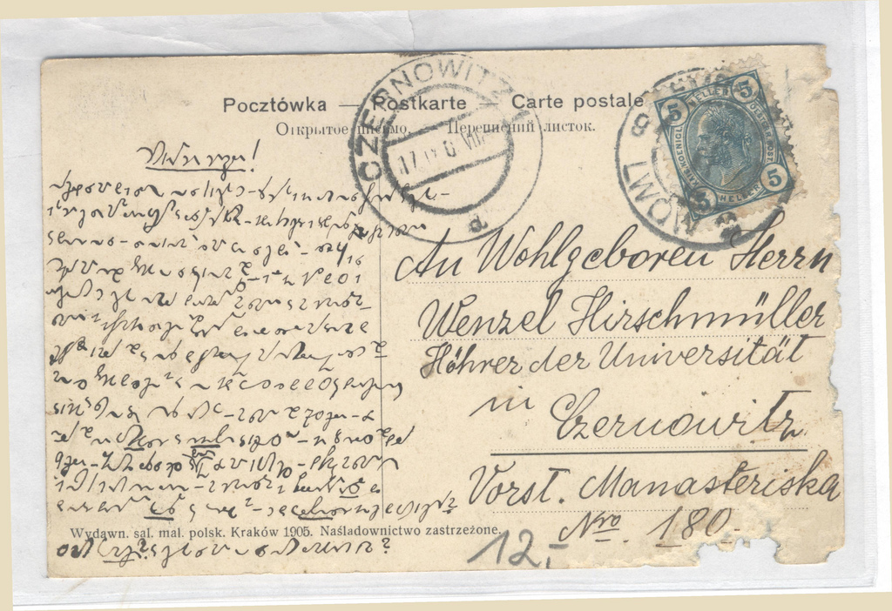

Tłumaczenie tajemniczej kartki pocztowej, [o której pisałem onegdaj (a
nawet nieco wcześniej)](../2010-11-28_tajemnicza-kartka-pocztowa/), doczekało się
radosnego finału. Poniżej prezentuję jej pełną treść.

## treść

> (1) Hochgeehrter Herr Hirschmüller! \
> (2) Entschuldigen Sie mir, dass ich solange an Sie nicht geschrieben
habe. Erst jetzt bin ich in der Lage, an Sie diese Karte zu schreiben. \
> (3) Ich bin hier schon sehr mit dem Lehren beschäftigt und lese viele
gute Bücher. Jeden Tag schaue ich über das Fenster zum großen Seminar \
> (3) und denke an Sie. Sehr angenehm wäre es mir, wenn Sie schon da
wären. Deshalb bat ich Sie \
> (4) höflichst mir Kunde zu geben, ob Sie aufgenommen sind. Ich will
Ihnen jetzt das, was ich \
> (5) versprochen habe, schreiben, namentlich die Verhältnisse am Seminar
und am Gymnasium. \
> (6) Das Seminar ist in diesem Jahr sehr schön restauriert worden, da
alle Säle mit Ausnahme der \
> (7) Schlafzimmer gemalt sind und anstelle der Ziegelöfen mit Kachelöfen
versehen sind. \
> (8) Man muss zugeben, dass alles schön ist, aber ein jeder weiß es, dass
das, was auf die Verschönerung \
> (9) ausgegeben wurde, sich an unserer Kost rächen wird. Am Seminar sind
70 Schüler. Von \
> (10) den alten sind nur &lt;personal name&gt; und Kinczek (? personal
name) ausgeschlossen worden. In der 8. Klasse sind die alten \
> (11) 9 Schüler. &lt;Lit… personal name&gt; lässt Sie grüßen aus Dank für
den von mir gebrachten Gruß. Die Stämme am Seminar konnte \
> (12) ich noch nicht ganz recht kennen lernen. - Am Gymnasium in
Stellvertreter Ressal &lt;? personal name&gt;, da \
> (13) der neue Direktor &lt;personal name&gt; auf Urlaub ist - Hat Dr.
Welczenski (?personal name) Ihnen schon das Buch geschickt? \
> (14) Was macht &lt;personal name&gt;? Und schreiben Sie mir, ob Sie nach
Lemberg kommen?

Na odwrocie kartki:

> Mit schönstem Gruß von Ihrem alten Freund aus Lemberg \
> Ignaz Kukiles \
> Lemberg, am 16. September 1905

Wszystko dzięki uprzejmości pewnego [filologa z Niemiec](http://www.unilang.org/memberlist.php?mode=viewprofile&u=22350),
który, choć nie specjalista, zdołał odcyfrować zapis i opublikować na
odpowiednim wątku[Unilang](http://www.unilang.org/).

## tłumaczenie

> (1) Drogi Panie Hirschmüller! \
> (2) Proszę mi wybaczyć, że tak długo nie pisałem. Dopiero teraz mam chwilę, aby napisać do Pana tę kartkę. \
> (3) Jestem teraz bardzo zajęty nauczaniem i czytam dużo dobrych książek. Każdego dnia wyglądam przez okno na wielki budynek seminarium \
> (4) i myślę o Panu. Byłbym szczęśliwy, gdyby Pan już tu był. Stąd moje uprzejme pytanie \
> (5) czy został Pan przyjęty. Teraz napiszę, co obiecałem, \
> (6) czyli warunki w seminarium i gimnazjum. \
> (7) Seminarium pięknie odrestaurowano w tym roku, tak że wszystkie sale za wyjątkiem \
> (8) sypialni zostały pomalowane i mają piece kaflowe zamiast ceglanych. \
> (9) Trzeba przyznać, że wszystko wygląda pięknie, ale każdy wie, że wydatki na upiększanie \
> (10) zemszczą się na naszej diecie. W seminarium jest 70 uczniów. 
> (11) Tylko <imię własne> i Kinczek <imię własne> zostali wykluczeni ze starych. W 8 klasie starych \
> (12) jest 9 uczniów. Lit... <imię własne> przesyła pozdrowienia oprócz podziękowań za życzenia, które przekazałem. Układów plemiennych w seminarium \
> (13) nie zdołałem jeszcze dobrze poznać. W gimnazjum zastępca Ressal <imię własne> od \
> (14) kiedy nowy dyrektor <imię własne> jest na urlopie - czy dr Welczenski <imię własne> przysłał już książkę? \
> (15) Co porabia <imię własne>? I czy napisze Pan do mnie, jeżeli przyjeżdża do Lwowa?

Na odwrocie kartki:

> Z najlepszymi życzeniami od Pańskiego starego przyjaciela ze Lwowa
> Ignaz Kukiles \
> Lemberg, wrzesień 16, 1905

Zwróćmy uwagę, jak dużo treści zmieściło się na jednej, małej kartce
pocztowej. *Stenografia* oznacza właście "ścisły, ciasny" - czyli mamy
kolejną jej zaletę: więcej treści na mniejszej powierzchni.

## Podsumowanie

Ciekawostka, co potrafi inteligentna wyszukiwarka, kiedy pewne dane
zostaną przepisane do Internetu. Otóż tłumaczowi powyższej kartki udało
się dotrzeć do strzępów informacji o korespondentach. 

Wenzel Hirschmüller prawdopodobnie zdał maturę we Lwowie i wstąpił na
Uniwersytet w Czerniowcach, który ukończył, a później został na nim
wykładowcą.  

W archiwum [http://www.pbc.rzeszow.pl](http://www.pbc.rzeszow.pl/) można
znaleźć zeszyty rocznych zestawień uczniów lwowskich obergimnazjów
(czyli zapewne szkół przeduniwersyteckich, maturalnych), gdzie dla hasła
wyszukiwania "Wenzel Hirschmüller" pojawią się wpisy, że ów Wenzel w
roku 1902 był uczniem klasy VI, za to w 1903 już klasy VII. Ponieważ
drugiego takiego tam nie ma, można przypuszczać, że chodzi właśnie o
tego chłopca. To by dobrze pasowało do dat, gdyż w takim razie
rzeczywiście mógłby w 1905 być już immatrykulowanym studentem
Uniwersytetu w Czerniowcach. 
 
W
materiałach <http://czernowitz.ehpes.com/new/hauster/Cz1914Total.html> z
roku 1913 można wyszukać osobę Wenzel Hirschmüller zamieszkałą w
kwartale Monasteryska pod numerem 180, którą tytułuje się profesorem.

Z treści listu zatem można by wnioskować, że Ignaz Kukiles mógł być jego
zaprzyjaźnionym kolegą - nauczycielem. Jego nazwiska nie udało mi się na razie
namierzyć.

Oto kolejne, pasjonujące zastosowanie stenografii, choć trudno sobie
wyobrazić bardziej niszowe: małe śledztwa, odczytywanie utajnionej
stenograficznie korespondencji i prywatnych, starych zapisków.
