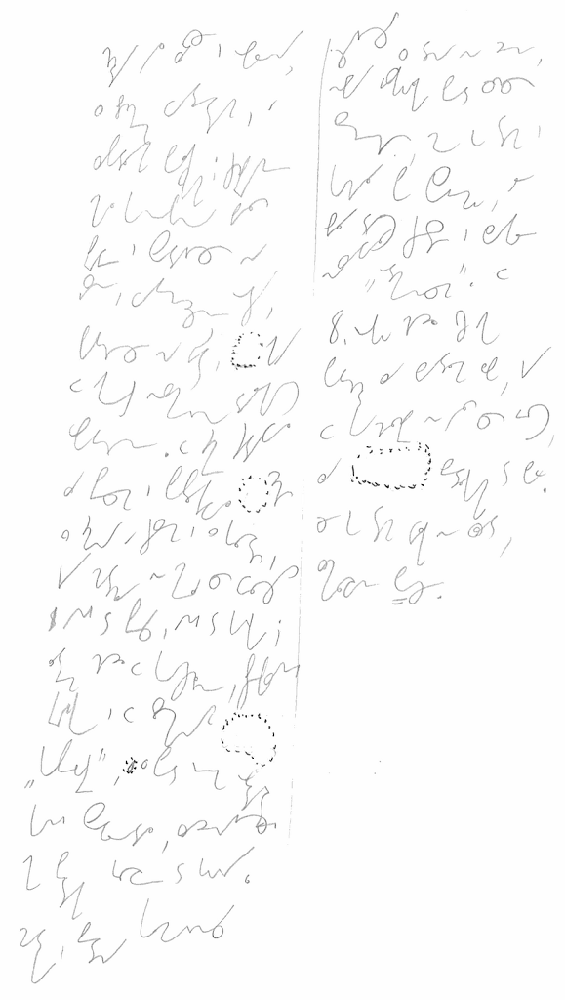

Pisane na kolanie, dlatego trochę przekrzywione. Odciąłem lewą część
kartki, bo tam opierał się mój (lewy, piszący) nadgarstek. Pisane w
ostatniej wersji systemu **Ste*Mi***, nad którym pracuję już prawie rok.

Poniżej transkrybcja. Nie mam przy sobie oryginału, zatem w ten sposób
można sprawdzić, czy zapis jest wystarczająco czytelny. Transkrybcję
przedstawiam z identycznym podziałem na wiersze, jak ktoś będzie chciał,
może przymierzyć jedno do drugiego i ocenić, czy system ma sens.

*Chudy był zawsze i opalony, \
z brzuchem wydętym, a \
zapadłymi policzkami; czuprynę \
miał konopną, białą \
prawie i spadającą na \
jasne, wytrzeszczone oczy, \
patrzące na świat, jakby\
w jakąś niezmierną dalekość\
wpatrzone. W zimie siadywał\
za piecem i popłakiwał cicho\
z zimna a czasem i z głosu,\
gdy matula nie mieli co cłożyć\
ani do pieca, a ni do garnka;\
latem chodził w koszulinie, przepasanej \
krajką i w słomianym\
"kapelusie", z pod którego obdartej\
kani spoglądał, zadzierając\
jak ptak głowę do góry.\
Matka, biedna komornica*

*żyjąca z dnia na dzień,\
niby jaskółka pod cudzą\
strzechą, może go tam i\
kochała po swojemu, ale\
biła dość często i zwykle\
nazywała "odmieńcem". W\
8. roku codził już jako\
potrzódka za bydłem lub, gdy\
w chałupie nie było co jeść,\
za bedłkami do boru.\
Że go tam wilk nie zjadł, \
zmiłowanie Boże.*

Pisałem wczoraj po południu, w zasadzie pamięć krótkotrwała powinna już
zaniknąć, ale podczas transkrybcji wyraźnie mi tekst stawał przed
oczami. Stąd pewny odczyt rzadkich słów, jak bedłki, potrzódka, kań.
Trzeba będzie poćwiczyć z tygodniowym, a może i dłuższym odstępem.
