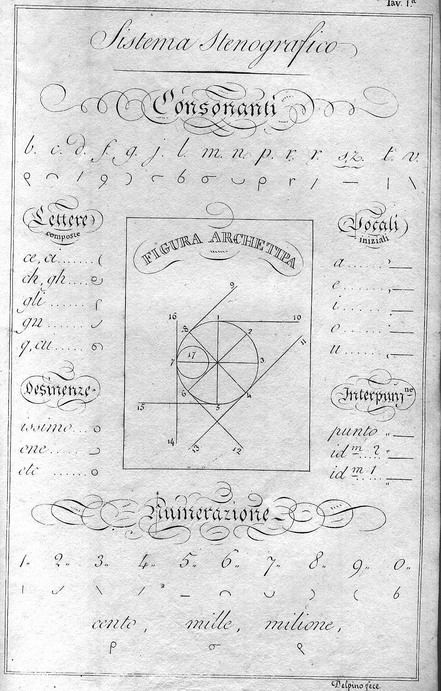
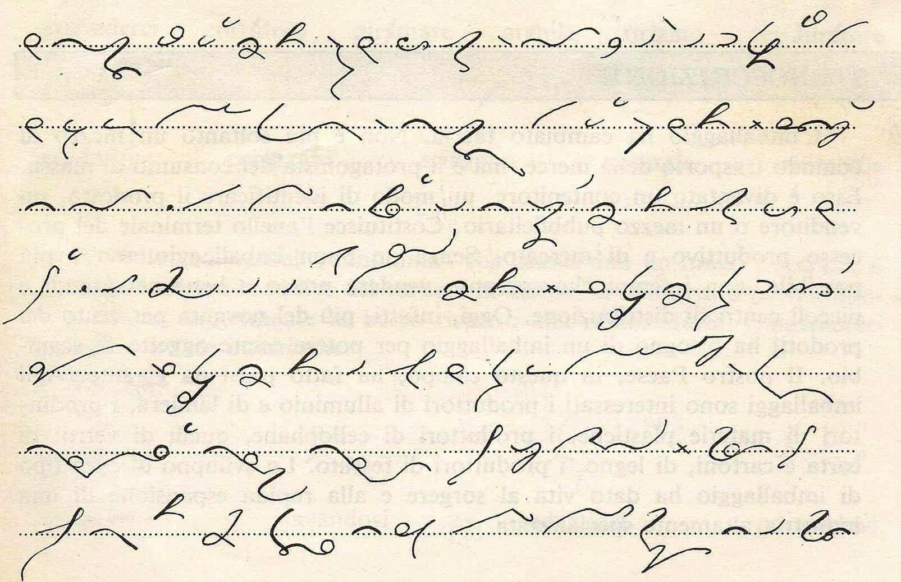

Już się nie mogę doczekać. Odbudowa domu po powodzi trwa znacznie dłużej
niż sama powódź. Akurat u nas budowla nastręcza parę problemów
technicznych, a do tego trzeba to zrobić po taniości, bo ubezpieczyciel
sypać kasą nie chce.  

  <!-- [{width="204" height="320"}](delpinoalfabetoyx6.jpg)
  Stenograwia włoska systemu Delpino -->
  


Ale do rzeczy: zbieram materiały i technikę, żeby napisać dokument
systemowy, czyli coś w rodzaju podstawowego podręcznika do
opracowywanego przeze mnie systemu stenograficznego. Sprawa nie jest
prosta, bo trzeba wygenerować być może z tysiąc ilustracji, wszystkie
opatrzyć opowiednim komentarzem, a cały system ująć w punkty i
podpunkty, aby widać było na pierwszy rzut oka, że w zasadzie jest
logiczny i prosty, a sukces kryje się w ćwiczeniu ręki i oka.  

<!--  [{width="320" height="206"}](STENOGRAFIA_CIMA_Autografia.jpg)
  Stenografia włoska systemu Cima -->



Tak sobie myślę, że znalazłem sobie hobby na emeryturę, do której co
prawda daleko, a ona sama niepewna, ale coś na stare lata robić trzeba.
Na razie nie spotykam wielu ludzi zainteresowanych stenografią, a
jeszcze mniej chętnych do prac odkrywkowych przy jej digitalizacji i
zapisywaniu w Internet. Czyli roboty mam wiele dla samego siebie - po
prostu huk. Czyli do śmierci może wystarczyć.

O, na pewno.

PS. Nie przejmujcie się ilustracjami. Że nie na temat, na przykład. Ale
są, a to się liczy. Popatrzeć zawsze miło.
