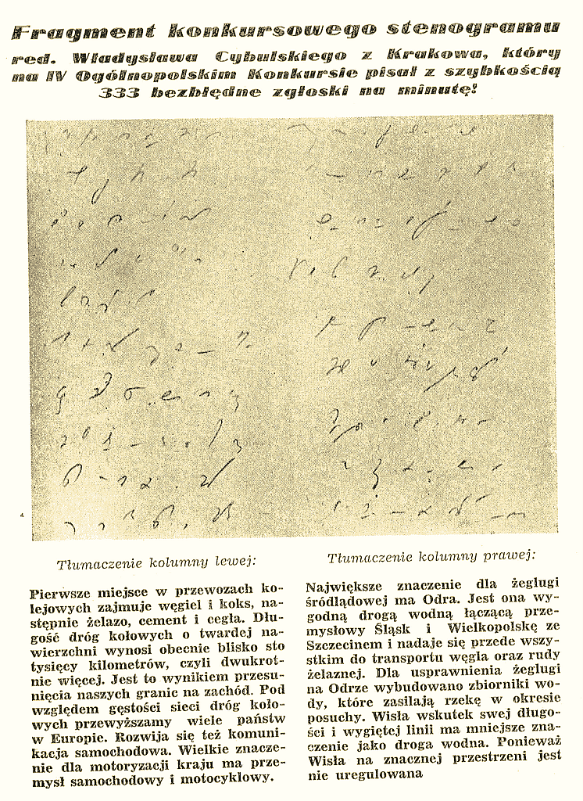

23 maja 1954 roku odbył się wielki konkurs stenografii i maszynopisania
w Polsce. Najszybszym stenografem okazał się [Władysław Cybulski, o
którym już wcześniej pisałem](../2011-01-06_wladyslaw-cybulski-dziennikarz-i-mistrz-stenografii/).
Zamieszczam niżej skan zwycięskiego stenogramu - dla zaspokojenia
ciekawości, jakżesz to może wyglądać takie cudo, że umie człowiek pisać
333 sylaby na minutę, czyli mniej więcej 800 znaków pisarskich, co
klepaczowi w klawiaturę kazałoby stukać 13 razy na sekundę (a to sporo):

Ważne niezwykle jest rozumieć, że pomiar prędkości stenografii nie
polega wyłącznie na pisaniu. Autor później musi jeszcze swoje bazgroły
przeczytać. To dopiero przecież - ponowny odczyt danych - czyni dany
system zapisu tychże danych użytecznym.
