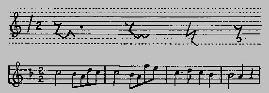
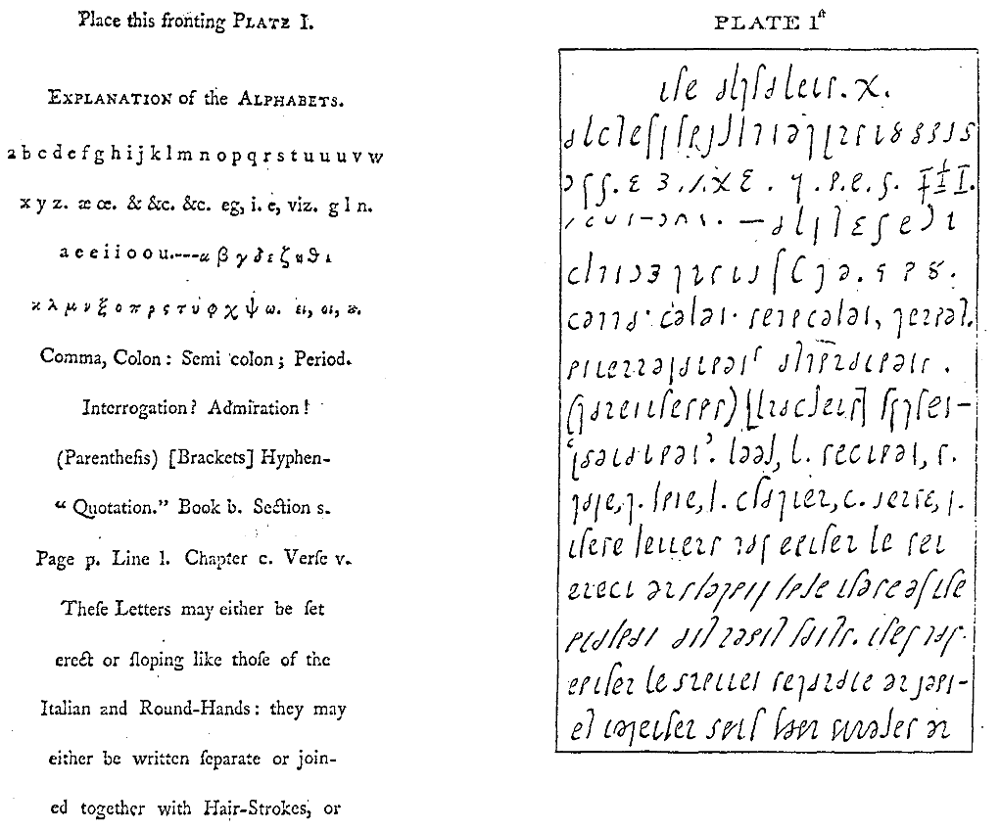

Okazuje się, że poszukiwania szybkiego zapisu nie obejmowały tylko mowy
(wiązanej, czy swobodnej), lecz także i muzykę. Oto link do 
[artykułu z przedwojennej encyklopedii Gutenberga](http://www.gutenberg.czyz.org/word,73846), w którym pokrótce wyłożono temat.

Ośmielę się tylko zauważyć, że prace takie miały miejsce nie tylko we
Francyi. Np. Szymon Bordley, faktyczny wynalazca stenografii kursywnej,
[w swojej książce](http://docs.google.com/viewer?a=v&pid=sites&srcid=c3Rlbm9ncmFmaWEucGx8c3Rlbm9ncmFmaWF8Z3g6NGE1MjIwZWYyNDE1Y2MzZg)
zamieścił także propozycję zapisu muzycznego.

