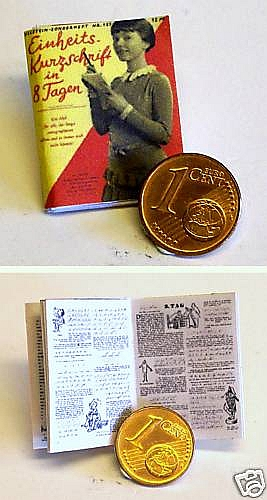

Dokładność modelarzy czasem poraża, a czasem przeraża. Oto przykład,
który wygrzebałem z czeluści aukcji na e-bay: podręcznik do stenografii
niemieckiej w wersji hiper-mikro  na wyposażenie domków dla lalek.

I nie ma w środku żadnego pitu-pitu, to prawdziwy podręcznik. Deutsche
Einheitskurzschrift, czyli DEK, czyli Zunifikowana Stenografia
Niemiecka. Żadnej lypy.
