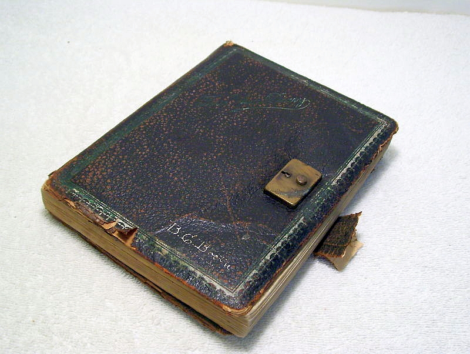
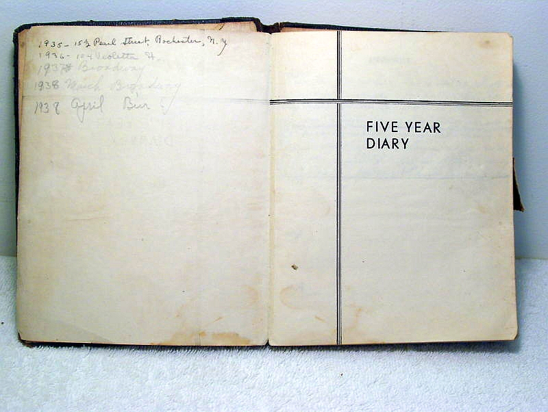

Mam nastawione stałe wyszukiwacze informacji nt. stenografii. Oto, co
przyszło z ebaja. Na sprzedaż wystawiono stary pamiętniczek, w którym
autor, czy też autorka, przeplatał/a pismo długie znaczkami
stenograficznymi.

<!-- {width="320" height="240"}](hwdiary02.jpg)
  Widać stenografię w ostatniej linijce tekstu -->
  

  

To jest tak zwana różność. Różność od czasów dzisiejszych, kiedy piszemy
blogi, a nie pamiętniki.

