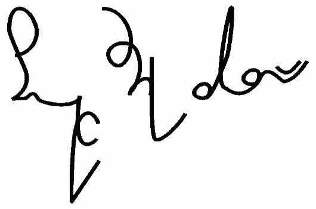

Napisałem do sieciowego periodyku miłośników fantastyki (sic!) pt.
*Fahrenheit* artykuł popla... popularyta... populazyta...
popularyzatorski o stenografii, pod tytułem **"Stenografia, sztuka
zapoznana"**. Wyłożyłem w nim, na ok. 40 tysiącach znaków to, co można
znaleźć na [stronie głównej i okolicach](http://www.stenografia.pl/),
ale treściwiej i chyba lepiej - zawszeć to człowiek lepiej się stara,
jak wie, że jego tekst zostanie zrecenzowany.

[Zapraszam do lektury.](http://www.fahrenheit.net.pl/archiwum/f70/12.html) 
[Można go przeczytać tutaj.](http://www.fahrenheit.net.pl/archiwum/f70/12.html)

