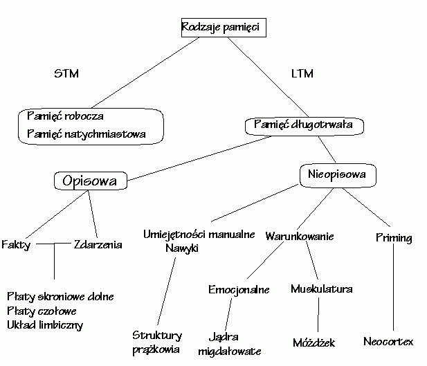
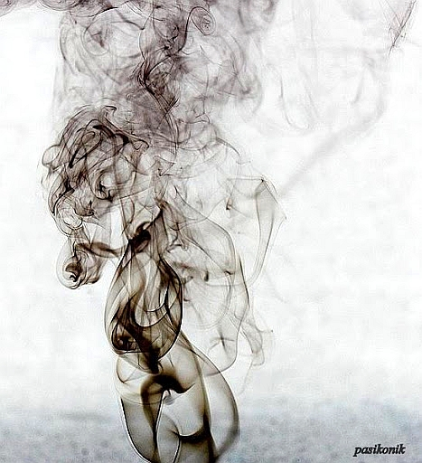

***Przedmowa: Autor bloga zapewnia, że poglądy niżej prezentowane
zaczerpnął z Internetu i sam się z nimi nie zgadza. To znaczy, uważa, że
kwestia pamięci krótkotrwałej jest o wiele bardziej złożona, dużo
złożeńsza, a sama pamięć, odpowiednio ćwiczona i uodporniona, zdoła
oprzeć się atakom nikotyny.***

Proces stenografowania związany jest z pamięcią krótkotrwałą, która,
niczym RAM w komputerze, służy do chwilowego przechowywania właśnie
analizowanych informacji. W tym wypadku oznacza to, że przechowuje ona
podręczny "słownik" znaczników i skrótów, niezbędnych do szybkopisania.
Podobnie, jak to się ma z innymi skomplikowanymi umiejętnościami, jak
np. gra na instrumentach muzycznych, dłuższa przerwa w praktykowaniu
sztuki wymaga później dłuższej lub krótszej chwili na ćwiczenia
podstawowe, żeby "ręce sobie przypomniały" - to jest właśnie "ładowanie"
odpowiednich komponentów do pamięci krótkotrwałej.

Palenie papierosów często ma związek z fiksacją oralną, czyli
pozostałościami odruchu ssania piersi matki (w dużym uproszczeniu).
Niemowlę, po zakończeniu karmienia, zasypia. Sen oznacza odłączenie
pamięci krótkotrwałej i jej wymazanie. U wielu palaczy zatem "dymek"
wywołuje podobny efekt: wyuczone i właśnie potrzebne do stenografowania
odruchy, które z mozołem jakiś czas temu uruchomiliśmy, trzeba będzie
ładować od nowa. Znowu pierwsze kilka akapitów przyjdzie nam z mozołem
wykuwać, zanim "ręce sobie przypomną".

Z drugiej strony, wymazywanie pamięci krótkotrwałej ma pozytywne skutki
dla samego procesu uczenia się. Stąd zalecenia, aby podczas intensywnych
studiów nie zaniedbywać snu.

Zatem - palacze, jeżeli chcecie sprawnie i miło stenografować,
przenieście dymek na "po robocie".

***Posłowie: Gdyby to wszystko była prawda, to bym chodził na czworaka i
śliniąc się bełkotał bez ładu i składu. Fakt, że samodzielnie prowadzę
bloga skłania mnie do zachowania pewnego dystansu wobec powyższych
poglądów.***
