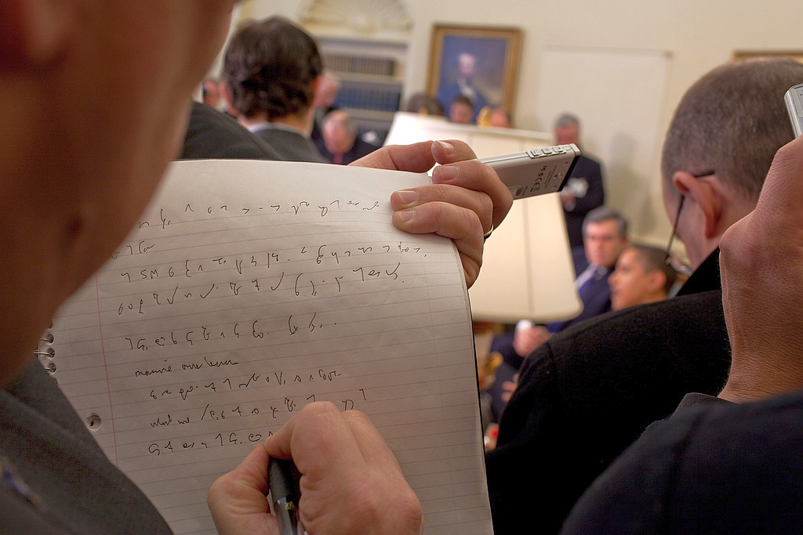

Po wielu miesiącach, zupełnie przypadkiem udało mi się odkopać z
przepastnych czeluści Internetu to oto zdjęcie:

Żeby być w zgodzie z prawem, zamieszczam link do miejsca, gdzie
pracownicy Białego Domu to zdjęcie opublikowali -- bo jest to fotka
oficjalna:  

http://www.flickr.com/photos/whitehouse/3484016753/

Komentarz pod zdjęciem: 

*A reporter takes notes while President Barack Obama and Prime Minister
Gordon Brown of the United Kingdom speak to the press in the Oval
Office, March 3, 2009. (Official White House Photo by Pete Souza)*

*Reporter notuje podczas konferencji prasowej w Pokoju Owalnym Prezydenta
Baraka Obamy i Premiera Gordona Browna z Wielkiej Brytanii.*

O wiele "**ciekawsze"** są komentarze pod zdjęciem: 

 -- Cóż to za symbole tam yyy? \
 -- Stenografia... nigdy bym nie
przypuszczał, że wciąż tego używają. \
 -- Uczą stenografii? Studiuję
dziennikarstwo prasowe i nikt mnie tego nie uczył. \
 -- Ten facet wygląda jakby staro \
 -- To jest Gregg Shorthand! \
 -- Umiesz to przeczytać? \
 -- Nie, mój poprzedni szef umiał. Co by tam
zresztą miało być napisane? Świńska grypa, zła gospodarka, chcemy
odcinać kupony, chciwe korporacje... itp. \
 -- Moja mama uczyła stenografii. Ja się
nigdy nie nauczyłem. \
 -- Po hiszpańsku to się nazywa stenografia
i jest naprawdę egzotyczne. \
 -- Łojezu, ktoś używa stenografii? To Gregg
lub Pitman. \
 -- Łojezu, UFO w Białym Domu! \
 -- Chłopie, skończyłem studia dziennikarskie i nigdy nas nie uczyli steno. Czuję się oszukany. \
 -- Nigdy nie jest za późno: http://gregg.angelfishy.net \
 -- On jest w trybie bełkotu \
 -- Uczyłem się steno przez 3 lata -- na dodatek -- po niemiecku! \
 -- Łojezu, to super popieprzone umieć coś
takiego! \
 -- Zlinkowałem tę fotografię 
[na moim blogu z opisem "To jest dziwne i fajne"](http://prog.livejournal.com/933372.html) i dostałem najdłuższy
ciąg komentarzy od dawna. Okazało się, że paru moich kumpli znało steno
z czasów dzieciństwa lub wczesnej młodości i myśleli, że wszyscy inni
też to znają (jak często o tym się mówi w nowoczesnej konwersacji?).
Naprawdę niezła rzecz. \
 -- Dzia, nie miałem pojęcia, że ludzie
wciąż używają stenografii. Pamiętam, że moi rodzice mieli książkę o tym,
kiedy byłem bardzo mały, ale  to było przed czasami komputerów i
mikronagrywarek, automatycznej transkrybcji itp. Teraz korzystam ze
skrótów wikipedii :) \
 -- Nie, nie łapiesz... To po klingońsku! 
 -- Lol, sup fa. \
 -- Czy ktoś potrafi przetłumaczyć steno? Co tam jest napisane? \
 -- Miałam steno w liceum i to przypomina
naukę nowego języka, praca domowa codziennie, a jedyne, co pamiętam, to
jak napisać stenograficznie "Szanowny panie". \
 -- Pamiętam naukę steno z liceum. Naprawdę
lubiłem to. Niestety, używałem tego tylko przez parę lat w pracach
sekretarskich. Później pojawił się dyktafon. \
-
Pokręcone.

No cóż, geniusze anglojęzyczni. W rzeczywistości ten pan pisał w
systemie [Teeline](http://en.wikipedia.org/wiki/Teeline_Shorthand), co
każde dziecko rozpozna ;-) Czy zdołam to odczytać? Tak, jeżeli dacie mi
dwa tygodnie wolnego i dobrze zapłacicie. W końcu angielski to nie jest
mój ojczysty język, więc musiałbym pracować z podręcznikiem i
słownikiem. Ale dałoby się.
