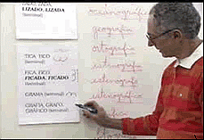
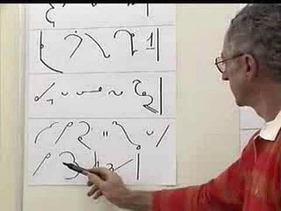
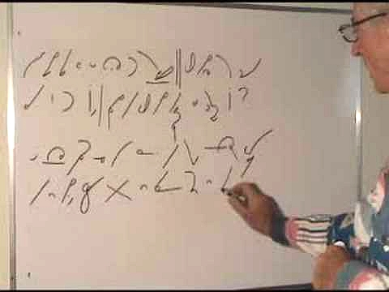
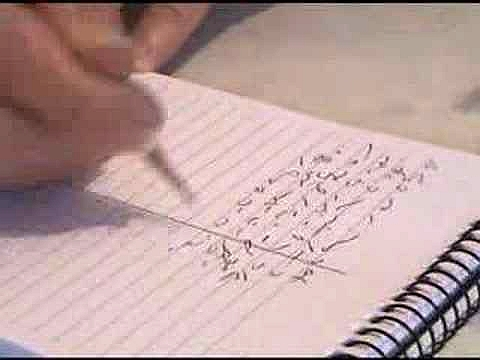

Poniżej
prezentuję chropawe tłumaczenie FAQ nt. postawy i przygotowania
nauczyciela stenografii zebrane przez prof. Waldira Cury.
  

Na wstępie
pragnę tylko zaznaczyć, że od oryginału bezwstydnie odbiegałem tam,
gdzie dotyczyło to szczególnie techniki stenografowania [systemem Maron,
którego naucza Pan Cury](http://www.taquigrafiaemfoco.com.br/).
  

<!--  
  prof. Waldir Cury -->
  
  

  

  

**Często zadawane pytania na temat nauczania stenografii**

   

 
zebrane przez

profesora
Waldira Cury, emerytowanego stenografa/rewizora Zgromadzenia
Legislacyjnego Rio de Janeiro, nauczyciela stenografii, członka Komitetu
Edukacyjnego INTERSTENO.

   

**Pytanie:**
Co jest potrzebne, by uczyć stenografii?

***Odpowiedź:***
Poznaj do perfekcji system, którego zamierzasz uczyć. Dobrze, jeśli w
ogóle lubisz i masz zdolności do nauczania, szczególnie korzystna jest
skłonność do postrzegania technicznych detali nauczanego przedmiotu. Mam
wielu uczniów stenografii, którzy sami są nauczycielami innych
przedmiotów. Mogą skorzystać ze swojego doświadczenia przy nauczaniu
stenografii. W Brazylii potrzeba ich wielu! Naprawdę, bardzo brakuje nam
ludzi oddanych nauce tej sztuki.

**Pyt:**
Czy tylko ci, którzy wcześniej pracowali jako stenografowie mogą uczyć
stenografii?

***Odp:***
Nauczyciel stenografii sam nie musi być, ani teraz, ani w przeszłości,
zawodowym, praktycznym stenografem. Powinien bardzo dobrze znać system,
mieć inklinacje do uczenia - to wystarczy, żeby zostać dobrym
nauczycielem.

**Pyt:**
Czy aby uczyć stenografii, samemu należy umieć pisać z odpowiednią
prędkością?

***Odp:***
Nie. Najważniejsza jest doskonała znajomość systemu i umiejętność
klarownego jego prezentowania i tłumaczenia zawiłości. Poprawne
przekazywanie wiedzy - to jest najważniejsze.

**Pyt:**
Która cecha nauczyciela stenografii powinna być uznana za
najważniejszą?

***Odp:***
Dobre pytanie. Każda osoba z doświadczeniem udzieli zapewne innej
odpowiedzi. Poza doskonałą znajomością systemu i umiejętnościami
dydaktycznymi, sądzę, że najważniejsza jest cierpliwość. I to nie tylko
u nauczyciela stenografii, dotyczy to wszystkich. Nauczyciel nigdy nie
powinien okazywać zniecierpliwienia wobec pomyłek ucznia, lub kiedy
słyszy pytanie, na które już udzielił odpowiedzi. Nigdy nie powinien
odpowiadać "Na ten temat już mówiłem".

**Pyt:**
A jeśli uczeń pyta się 20 razy o to samo?

***Odp:***
To powinien otrzymać 20 razy taką samą, poprawną odpowiedź, bez śladu
zniecierpliwienia. Mam tu dobry przykład: pewna studentka uczyła się
niemieckiego. Miała zwyczaj zadawać mnóstwo pytań podczas lekcji.
Pewnego dnia nauczyciel się zdenerwował i odpowiedział: "Zadajesz zbyt
wiele pytań!". I ona już nigdy się go o nic nie zapytała. Nauczyciel
kazał się studentce zamknąć. To wyrażone innymi słowami "zamknij się"
jest najgorszym, co może się wydarzyć w procesie nauczania. Nie można
sobie na to pozwolić, czy to podczas zajęć stacjonarnych, czy
korespondencyjnych. Nauczyciel powinien być zawsze otwarty i odpowiadać
na wszelkie pytania tak często, jak to konieczne.

**Pyt:**
Zatem co uznamy za drugą najważniejszą cechę nauczyciela
stenografii?

***Odp:***
Powinien umieć stymulować uczniów do wysiłku. Powinien zachęcać, dodawać
energii, odwagi, stymulować i wywoływać entuzjazm. Czytałem kiedyś
fragment angielskiej książki o dydaktyce, gdzie nauczyciela
przedstawiono jako "oswajacza" procesu uczenia się. Powiedziano tam, że
nie nauczyciel uczy, lecz uczeń sam siebie, nauczyciel jedynie proces
ten stymuluje.

**Pyt:**
Jak powinna wyglądać pierwsza lekcja stenografii? Co powinno się na niej
przekazać?

***Odp:***
Każdy nauczyciel opracuje tu swoją strategię. Ja mogę tylko zasugerować,
by zacząć od zagajenia, czym w rzeczy samej jest stenografia, wyjaśnić
etymologię pojęcia, różnicę pomiędzy zwykłymi notatkami ze skrótami a
stenografią. Dobrze też napisać kilka odpowiednich symboli, by pokazać,
skąd się wziął nauczany system. Myślę, że pięć do dziesięciu minut
takiej prezentacji mogłoby być interesujące. Następnie powinno się
pokazać znaki z pierwszej lekcji i natychmiast ich użyć do zapisania
odpowiednich słów. Następnie od razu przejść do dyktanda w bardzo
powolnym tempie, na które złożą się właśnie zaprezentowane słowa, które
uczniowie od razu nauczą się pisać stenograficznie.

W
systemie Marona zwykle pokazuję na początku osiem znaków, tych
najpotrzebniejszych. Na następnych studenci otrzymują zaledwie po dwa
znaki na lekcję.

Zatem
na pierwszych zajęciach uczeń otrzymuje tabelkę z pierwszymi ośmioma
znakami i objaśnieniem, jak powinny być napisane. Skoro nie miał czasu
dobrze się ich nauczyć, podczas dyktanta oczywiście może korzystać ze
ściągi. Najważniejsze na pierwszej lekcji jest spowodowanie, by student
poczuł, że naprawdę może pisać słowa przy pomocy innego pisma, niż
przywykł od dziecka.

**Pyt:**
Co jeszcze powinno się wydarzyć na pierwszej lekcji?

***Odp:***
To zależy od kreatywności nauczyciela. Należy zwrócić uwagę na reakcje
studentów wobec każdego napisanego znaku, to znaczy, czy nie wyglądają
dla nich zbyt obco, czy nie wydają się trudne do nauczenia. Można
napisać kilka słów dodatkowo jako ciekawostkę, można pokazać, jak należy
je czytać, zachęcić do zapisania ich. Zadanie, jakie studenci naprawdę
lubią, to dopasowywanie. Piszę w jednej kolumnie słowa stenograficznie,
w drugiej pismem długim. Uczniowie powinni je do siebie dopasować. Na
początek to daje pozytywne efekty.

Ideałem
byłoby przekształcić każdą lekcję w radosne, zabawne doświadczenie.
Bardzo ważne jest zwracanie uwagi studentom na właściwą postawę ciała
podczas pisania. Dobrze jest zachęcać ich do poprawnego trzymania
pisaka, nie przyciskania zbyt mocno do papieru. Wady postawy i chwytu
mogą przynieść wiele bólu podczas długich sesji stenografowania, nie
wspominając już o zmniejszeniu prędkości.

**Pyt:**
Jeżeli uczeń ma poważne trudności już na pierwszej lekcji, czy ma sens
przechodzenie z nim do drugiej lekcji?

***Odp:***
Tak, ponieważ na następnej, wedle mojej metody, dostanie tylko dwa
następne znaki. Poza tym na drugiej lekcji przecież w użyciu będą nie
tylko te dwa znaki, ale i osiem z pierwszej. W ten sposób nauka się
kumuluje. Osiem znaków z pierwszej lekcji zostanie użyte na drugiej,
osiem z pierwszej i dwa z drugiej na trzeciej i tak dalej.
Najważniejsze, na co trzeba zwrócić uwagę, to właściwe dozowanie wiedzy
na każdych zajęciach. Nie należy forsować nauki. W wypadku stenografii
przetrenowanie nie przynosi korzyści. Właściwe dawkowanie wiedzy jest
kluczem do nauki szybkopisania.

**Pyt:**
Jeżeli student ma poważne trudności z przyswojeniem danego znaku, co
należy zrobić?

***Odp:***
Zdarza się to czasami, zwykle w przypadku bardzo podobnych znaków i
różnych znaczeniach, lub brzmieniach. W takim wypadku nauczyciel
powinien zaproponować jakąś "mnemoniczną sztuczkę", która pomoże
studentowi odróżnić i nauczyć się znaków, lub ostatecznie należy
wyznaczyć więcej ćwiczeń zawierających znaki powodujące
trudności.

Oto
przykład takiej "mnemonicznej sztuczki": w systemie Marona mamy dwa
znaki, które mogą sprawić kłopot, są to "g" i "d". Pierwszy jest
półokręgiem lewym, drugi prawym. Jeżeli zamkniemy półokrąg "d" prostą
kreską, pokaże się nam drukowane, wielkie "D". W ten sposób można
sprzedać klucz do rozwiązania problemu.

**Pyt:**
Niektórzy studenci nie mają żadnych problemów ze stenografowaniem, lecz
bardzo słabo wychodzi im czytanie i tłumaczenie stenogramów. Co w takim
wypadku należy zrobić?

***Odp:***
To bardzo częste. Bardzo korzystne będzie rozpoczęcie ćwiczeń z czytania
już na pierwszej lekcji, nawet jeśli dotyczyć to będzie pojedynczych
słów. Zwykle daję takie ćwiczenie: piszę dwa znaki obok siebie i proszę
studentów, by spróbowali wywnioskować, ile z takiego zestawienia można
odczytać słów. Na przykład napiszę stenograficzne "b" i "t". Ponieważ w
systemie Marona nie używa się samogłosek wewnątrz wyrazów, proszę
uczniów o ich uzupełnienie, by nadać tym znakom pełne brzmienie. W ten
sposób można z dwóch znaków stworzyć słowa: bat, bit, but, byt...
Poprzez taką zabawę mam szansę pobudzić ciekawość uczniów i dać
satysfakcję z wypełnionego zadania. Im więcej zabaw tego rodzaju, tym
lepiej.

**Pyt:**
A kiedy uczeń zakończy kurs teoretyczny systemu, jaką najlepiej przyjąć
strategię ćwiczenia prędkości?

***Odp:***
Jest na to kilka sposobów i każdy nauczyciel pozna je wszystkie, polubi
jedną. Ja zmieniałem metodykę kilka razy, poszukując tej najlepszej, a
wreszcie ułoży kilka z nich po kolei, jak kroki na ścieżce. Moja
pierwsza metoda polega na przepisywaniu tekstów. Kopie poprawiam, a
jeżeli jest w nich dużo błędów, to uczeń pisze dany tekst jeszcze raz i
jeszcze raz, aż do skutku. To trwa około miesiąca. Zaraz później
zaczynam minutowe dyktanda. Na początku prowadziłem je z prędkością 40
słów na minutę. Z biegiem czasu zmniejszyłem prędkość pierwszych dyktand
do 30 słów na minutę i zwiększałem stopniowo prędkość od 30, przez 35,
do 40 słów na minutę.

Później
zdecydowałem się jeszcze spowolnić pierwsze dyktando - do 20 słów na
minutę. Studentom bardzo się to podobało, a ja zauważyłem, że piszą
dokładniej, ładniej i z mniejszym napięciem. Tę metodę utrzymuję do
dziś, uzupełniłem ją tylko o, jak je nazwałem, "audio-przepisywanki". Są
to bardzo powolne dyktanda, z prędkością 15 słów na minutę. To
praktycznie przepisywanie tekstu, lecz przecież uczeń pisze ze słuchu, a
to poważna różnica.

**Pyt:**
Co studenci myślą o Twojej metodzie?

***Odp:***
Naprawdę im się podoba. Bo naprawdę działa! Osiągnięcie dużej prędkości
stenografowania odbywa się przez długi szereg "małych zwycięstw". Kiedy
zadanie jest łatwiejsze, "bitwa" prostsza, "zwycięstwo" jest
pewne.

To
bardzo istotne, by uczeń dużo powtarzał słów trudnych, przepisywał
wszelkie skróty i znaczniki, uczył się ich na pamięć, zanim podejdzie do
pierwszej "audio-przepisywanki", lub innego dyktanda. Do każdego powinno
być oddzielne przygotowanie. W ten sposób student stopniowo rozwinie
prędkość nie tracąc precyzji i opanowania zasad systemu.

**Pyt:**
Czy lepiej jest stopniować prędkość pisania co pięć, czy co dziesięć
słów na minutę?

***Odp:***
O wiele lepsze jest zwiększanie prędkości o pięć słów niż o dziesięć. W
ten sposób stopniujemy prędkość od 20wpm (słów na minutę, words per
minute), przez 25wpm, 30wpm i tak dalej. Dlaczego nie stopniować co
dziesięć słów? Zachodzi tutaj pewien paradoks: prędkość stenografowania
wynika z pracy mózgu. Uczeń słyszy słowo i zapisuje je stenograficznie -
najpierw w umyśle, a dopiero później, przez koordynację ręka-oko, jego
ręka pisza na papierze właściwe znaki, które wcześniej musiał
wyprodukować umysł. Zręczność manualna z precyzją ruchów ręki zależy
wprost od móżdżku. Zatem kiedy student ćwiczy 20wpm, jego mózg wytwarza
odpowiednie "połączenia" pomiędzy neuronami, by sprostać zadaniu. Po
kilku takich treningach mózg jest gotów do stenografowania z prędkością
20wpm. Zmiana prędkości o 5 słów, do 25wpm, wymaga tylko niewielkiej
korekty już utrwalonych "ścieżek". Zmiana nagła, o 10 słów, do 30wpm z
20wpm, to mała rewolucja grożąca przetrenowaniem. W ciągu
pięciominutowego dyktanda oznacza to różnicę 50 słów więcej! To zbyt
wiele!

**Pyt:**
Zatem lepiej jest dozować przyspieszenie powoli?

***Odp:***
Dokładnie. Lepiej pracować małymi porcjami, ale stale, w odmierzonych,
codziennych odcinkach. W ten sposób właśnie żółw może prześcignąć
zająca.

**Pyt:**
Jak wiele czasu potrzeba, by przekroczyć kolejną granicę
prędkości?

***Odp:***
Bardzo to zależy od studenta i, oczywiście, od czasu, który poświęca na
codzienne ćwiczenia.

**Pyt:**
Skąd wiesz, kiedy należy rozpocząć ćwiczenia z większą
prędkością?

***Odp:***
Zwykle korzystam z następującego planu: Jeżeli student ćwiczy z
prędkością 60wpm, proszę go napisanie i odczytanie trzech testowych
dyktand z tą prędkością, każde innego dnia. Jeżeli zda wszystkie trzy
"egzaminy" z liczbą błędów poniżej 10%, może zacząć ćwiczyć 65wpm.
Dlaczego trzy testy, a nie jeden? Ponieważ gdybym użył zaledwie jednego
dyktanda, mógłbym dać się zmylić. Może dane dyktando było akurat dla
niego zbyt łatwe? Zatem trzy różne testy zwiększają precyzję pomiaru.
Dają pewność, że uczeń jest naprawdę gotowy przejść do następnego
etapu.

**Pyt:**
Czy to prawda, że przekroczenie każdej kolejnej granicy prędkości
zajmuje coraz więcej czasu?

***Odp:***
To prawda. Przejście od 20wpm do 25wpm jest o wiele łatwiejsze niż ze
120wpm do 130wpm. To wynika z rachunków:

W
pięciominutowym dyktandzie z prędkością

- 20wpm zawiera się 100 słów
- 30wpm zawiera się 150 słów
- 120wpm zawiera się 600 słów
- 130wpm zawiera się 650 słów

do
napisania stenograficznie. Zauważcie, że liczba słów do przetworzenia
przez umysł z prędkością 130wpm jest fantastyczna, odpowiada ponad dwóm
słowom na sekundę!

Możemy
to porównać do wspinaczki po drabinie, gdzie każdy kolejny szczebel stoi
w większej odległości od poprzedniego. Im wyżej wejdziemy, tym więcej
wysiłku musimy włożyć w każdy kolejny krok.

**Pyt:**
Co z wkuwaniem, powtarzaniem słówek? Czy to naprawdę konieczne?

***Odp:***
To bardzo ważne, podstawowe ćwiczenie! Po każdym dyktandzie ćwiczebnym
uczeń musi pokazać i zaznaczyć słowa i znaczniki, które sprawiają mu
największą trudność. Następnie powinien je wypisać oddzielnie i ćwiczyć
przez kilka następnych dni. To pozwala zmniejszyć liczbę potknięć
podczas pisania. Wahanie bardzo zmniejsza prędkość pisania, z powodu
jednego słowa tracimy całe dyktando.

**Pyt:**
Kiedy student kończy naukę stenografii?

***Odp:***
Nigdy. Ćwiczenie stenografii to jak gra na instrumencie muzycznym - musi
być stale kultywowana, ciągle trzeba ćwiczyć i rozwijać umiejętności.
Nie ma tutaj punktu końcowego.

---------------

 
Na koniec linkuję jeden z filmików, które
profesor umieścił w Internecie, żeby wszyscy mogli zobaczyć skuteczność
metody Maron. Czy to po portugalsku, czy po polsku, efekt i tak
poraża.

